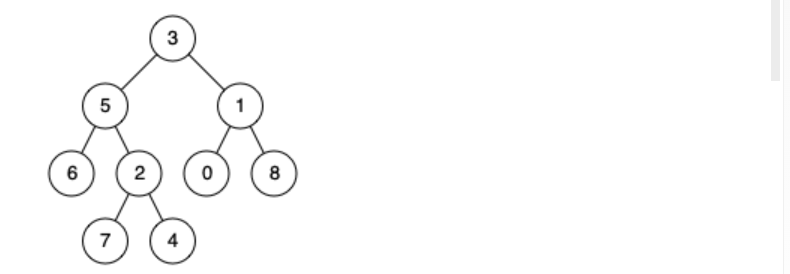

给定一个二叉树, 找到该树中两个指定节点的最近公共祖先。

百度百科中最近公共祖先的定义为：“对于有根树 T 的两个结点 p、q，最近公共祖先表示为一个结点 x，满足 x 是 p、q 的祖先且 x 的深度尽可能大（一个节点也可以是它自己的祖先）。”

例如，给定如下二叉树:  root = [3,5,1,6,2,0,8,null,null,7,4]

## 示例 1：

~~~
输入: root = [3,5,1,6,2,0,8,null,null,7,4], p = 5, q = 1
输出: 3
解释: 节点 5 和节点 1 的最近公共祖先是节点 3。

~~~

## 思路：

~~~ java

public TreeNode lowestCommonAncestor(TreeNode root, TreeNode p, TreeNode q) {
        
        if (root == null)
            return null;
        
        if (root.val > p.val && root.val > q.val)
            return lowestCommonAncestor(root.left, p, q);
        if (root.val < p.val && root.val < q.val)
            return lowestCommonAncestor(root.right, p, q);

        return root;
    }
~~~