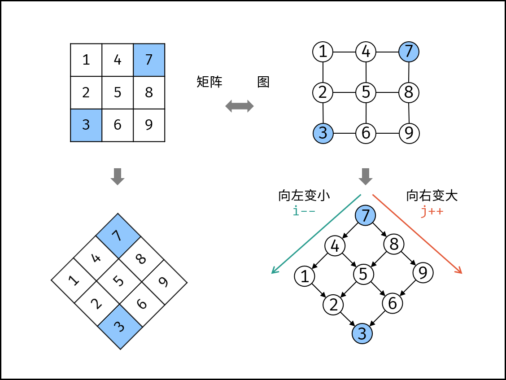

在一个 n * m 的二维数组中，每一行都按照从左到右 非递减 的顺序排序，每一列都按照从上到下 非递减 的顺序排序。请完成一个高效的函数，输入这样的一个二维数组和一个整数，判断数组中是否含有该整数。

## 示例 1：

~~~
现有矩阵 matrix 如下：
[
  [1,   4,  7, 11, 15],
  [2,   5,  8, 12, 19],
  [3,   6,  9, 16, 22],
  [10, 13, 14, 17, 24],
  [18, 21, 23, 26, 30]
]
~~~

## 思路1：
站在右上角看。这个矩阵其实就像是一个搜索二叉树

~~~ java
    public static boolean findNumberIn2DArray(int[][] matrix, int target) {
        int i = matrix.length - 1, j = 0;
        while(i >= 0 && j < matrix[0].length)
        {
            if(matrix[i][j] > target) i--;
            else if(matrix[i][j] < target) j++;
            else return true;
        }
        return false;
    }

    public static void main(String[] args) {
        int[][] matrix = {
                {1, 4, 7, 11, 15},
                {2, 5, 8, 12, 19},
                {3, 6, 9, 16, 22},
                {10, 13, 14, 17, 24},
                {18, 21, 23, 26, 30}
        };
        int target = 5;
        boolean numberIn2DArray = findNumberIn2DArray(matrix, target);
        System.out.println(numberIn2DArray);
    }
~~~

## 思路2:
二分法:因为每一行都是单调递增的,采用二分法

~~~ java
 public boolean findNumberIn2DArray(int[][] matrix, int target) {
        for (int[] row : matrix) {
            int index = search(row, target);
            if (index >= 0) {
                return true;
            }
        }
        return false;
    }

    public int search(int[] nums, int target) {
        int low = 0, high = nums.length - 1;
        while (low <= high) {
            int mid = (high - low) / 2 + low;
            int num = nums[mid];
            if (num == target) {
                return mid;
            } else if (num > target) {
                high = mid - 1;
            } else {
                low = mid + 1;
            }
        }
        return -1;
    }
~~~