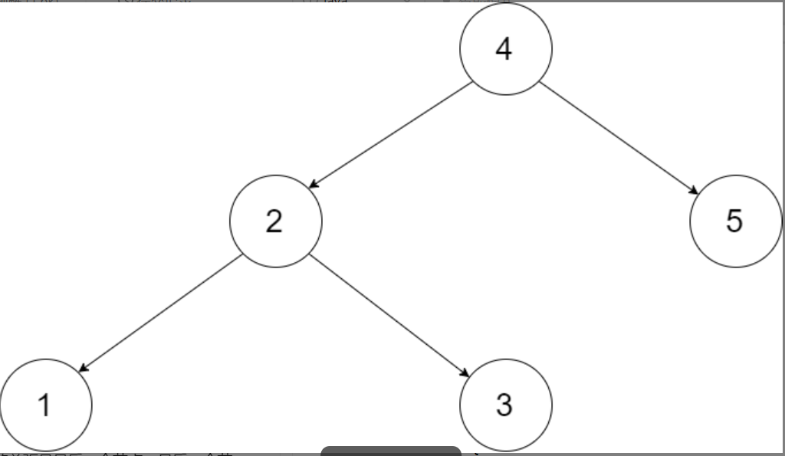
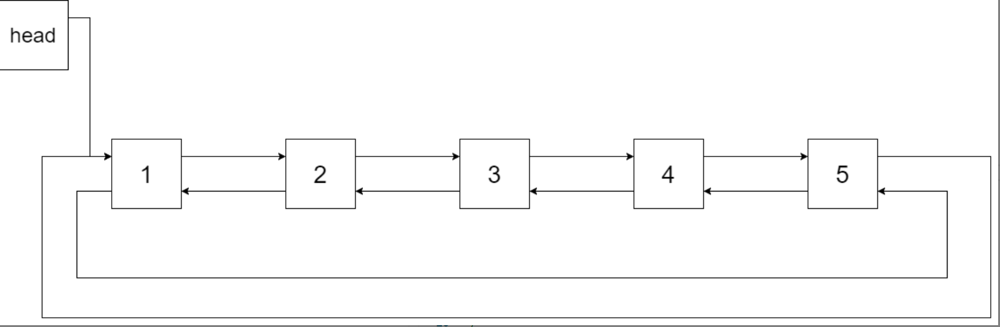

输入一棵二叉搜索树，将该二叉搜索树转换成一个排序的循环双向链表。要求不能创建任何新的节点，只能调整树中节点指针的指向。

为了让您更好地理解问题，以下面的二叉搜索树为例：

我们希望将这个二叉搜索树转化为双向循环链表。链表中的每个节点都有一个前驱和后继指针。对于双向循环链表，第一个节点的前驱是最后一个节点，最后一个节点的后继是第一个节点。

下图展示了上面的二叉搜索树转化成的链表。“head” 表示指向链表中有最小元素的节点。

特别地，我们希望可以就地完成转换操作。当转化完成以后，树中节点的左指针需要指向前驱，树中节点的右指针需要指向后继。还需要返回链表中的第一个节点的指针。
## 示例 1：

~~~
输入：
[2, 3, 1, 0, 2, 5, 3]
输出：2 或 3 
~~~

## 思路：

~~~ java

class Solution {
    // 1. 中序，递归，来自解题大佬
    Node pre, head;
    public Node treeToDoublyList(Node root) {
        // 边界值
        if(root == null) return null;
        dfs(root);

        // 题目要求头尾连接
        head.left = pre;
        pre.right = head;
        // 返回头节点
        return head;
    }
    void dfs(Node cur) {
        // 递归结束条件
        if(cur == null) return;
        dfs(cur.left);
        // 如果pre为空，就说明是第一个节点，头结点，然后用head保存头结点，用于之后的返回
        if (pre == null) head = cur;
        // 如果不为空，那就说明是中间的节点。并且pre保存的是上一个节点，
        // 让上一个节点的右指针指向当前节点
        else if (pre != null) pre.right = cur;
        // 再让当前节点的左指针指向父节点，也就连成了双向链表
        cur.left = pre;
        // 保存当前节点，用于下层递归创建
        pre = cur;
        dfs(cur.right);
    }
}
~~~