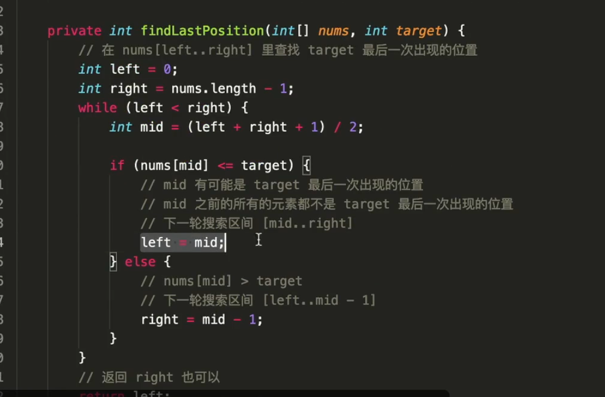
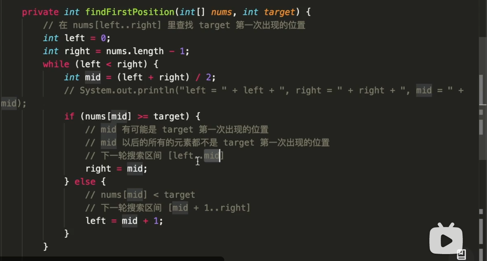

把一个数组最开始的若干个元素搬到数组的末尾，我们称之为数组的旋转。

给你一个可能存在 重复 元素值的数组 numbers ，它原来是一个升序排列的数组，并按上述情形进行了一次旋转。请返回旋转数组的最小元素。例如，数组 [3,4,5,1,2] 为 [1,2,3,4,5] 的一次旋转，该数组的最小值为 1。  

注意，数组 [a[0], a[1], a[2], ..., a[n-1]] 旋转一次 的结果为数组 [a[n-1], a[0], a[1], a[2], ..., a[n-2]] 。

## 示例 1：
~~~ 
输入：numbers = [3,4,5,1,2]
输出：1
~~~

## 思路1：

## 二分法模板

~~~ java
 public int minArray(int[] numbers) {
        int len = numbers.length;
        if (len == 1) {
            return numbers[0];
        }

        int left = 0;
        int right = len - 1;
        while (left < right) {
            int mid = (left + right) / 2;
            if (numbers[mid] < numbers[right]) {
                // 下一轮搜索区间 [left..mid]
                right = mid;
            } else if (numbers[mid] > numbers[right]) {
                // 下一轮搜索区间 [mid + 1..right]
                left = mid + 1;
            } else {
                // numbers[mid] == numbers[right]
                right--;
            }
        }
        // left 与 right 重合
        return numbers[left];
    }
~~~
