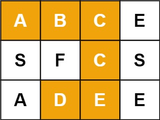

给定一个 m x n 二维字符网格 board 和一个字符串单词 word 。如果 word 存在于网格中，返回 true ；否则，返回 false 。

单词必须按照字母顺序，通过相邻的单元格内的字母构成，其中“相邻”单元格是那些水平相邻或垂直相邻的单元格。同一个单元格内的字母不允许被重复使用。

 

例如，在下面的 3×4 的矩阵中包含单词 "ABCCED"（单词中的字母已标出）。

## 示例 1：
~~~ 
输入：board = [["A","B","C","E"],["S","F","C","S"],["A","D","E","E"]], word = "ABCCED"
输出：true
~~~

## 思路1：
dfs + 回溯:
使用二维布尔数组记录之前的位置是否已经被访问过，如果已经被访问过的话，则在 dfs 的过程中，直接 return false 即可。也就是说，此路已经不通了；
如果当前遍历到的字符不等于 board[i][j] 位置上的字符，那么说明此路也是不通的，因此返回 false；
至于递归结束的条件：如果指针 start 能够来到 word 的最后一个字符，那么说明能够在矩阵 board 中找到一条路径，此时返回 true；
在遍历到当前 board[i][j] 的时候，首先应将该位置的 visited[i][j] 设置为 true，表明访问过；
然后，递归地去 board[i][j] 的上下左右四个方向去找，剩下的路径；
在 dfs 的过程当中，如果某条路已经不通了，那么那么需要回溯，也就是将 visited[i][j] 位置的布尔值重新赋值为 fasle；
最后，返回 ans 即可

~~~ java
 public boolean exist(char[][] board, String word) {
        if (board == null || board.length == 0 || board[0].length == 0) {
            return false;
        }

        char[] chars = word.toCharArray();
        boolean[][] visited = new boolean[board.length][board[0].length];
        for (int i = 0; i < board.length; i++) {
            for (int j = 0; j < board[0].length; j++) {
                // 从 (0, 0) 点开始进行 dfs 操作，不断地去找，
                // 如果以 (0, 0) 点没有对应的路径的话，那么就从 (0, 1) 点开始去找
                if (dfs(board, chars, visited, i, j, 0)) {
                    return true;
                }
            }
        }
        return false;
    }

    private boolean dfs(char[][] board, char[] chars, boolean[][] visited, int i, int j, int start) {
        if (i < 0 || i >= board.length || j < 0 || j >= board[0].length
                || chars[start] != board[i][j] || visited[i][j]) {
            return false;
        }
        if (start == chars.length - 1) {
            return true;
        }
        visited[i][j] = true;
        boolean ans = dfs(board, chars, visited, i + 1, j, start + 1)
                || dfs(board, chars, visited, i - 1, j, start + 1)
                || dfs(board, chars, visited, i, j + 1, start + 1)
                || dfs(board, chars, visited, i, j - 1, start + 1);
        visited[i][j] = false;
        return ans;
    }
~~~
