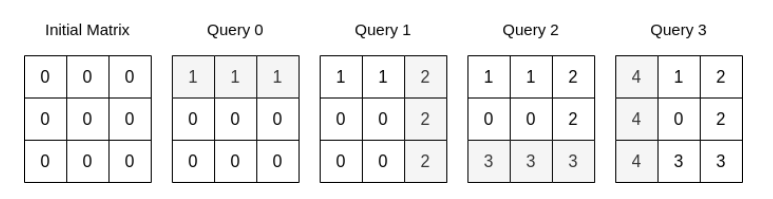
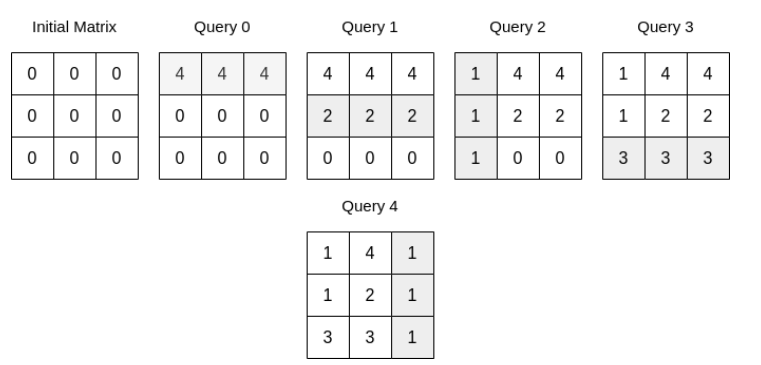

给你一个整数 n 和一个下标从 0 开始的 二维数组 queries ，其中 queries[i] = [typei, indexi, vali] 。

一开始，给你一个下标从 0 开始的 n x n 矩阵，所有元素均为 0 。每一个查询，你需要执行以下操作之一：

如果 typei == 0 ，将第 indexi 行的元素全部修改为 vali ，覆盖任何之前的值。
如果 typei == 1 ，将第 indexi 列的元素全部修改为 vali ，覆盖任何之前的值。
请你执行完所有查询以后，返回矩阵中所有整数的和。

## 示例 1：

~~~
输入：n = 3, queries = [[0,0,1],[1,2,2],[0,2,3],[1,0,4]]
输出：23
解释：上图展示了每个查询以后矩阵的值。所有操作执行完以后，矩阵元素之和为 23 。
~~~

## 示例 2：

~~~
输入：n = 3, queries = [[0,0,4],[0,1,2],[1,0,1],[0,2,3],[1,2,1]]
输出：17
解释：上图展示了每一个查询操作之后的矩阵。所有操作执行完以后，矩阵元素之和为 17 。
~~~

## 思路：
后面的操作会覆盖前面的操作，当行操作后，列操作就少了一个需要增加的；同理，列操作也相同

~~~python
class Solution:
    def matrixSumQueries(self, n: int, queries: List[List[int]]) -> int:
        ans = 0
        vis = [set(), set()]
        for type, index, val in reversed(queries):
            if index not in vis[type]:  # 后面（>i）没有对这一行/列的操作
                # 这一行/列还剩下 n-len(vis[type^1]) 个可以填入的格子
                ans += (n - len(vis[type ^ 1])) * val
                vis[type].add(index)  # 标记操作过
        return ans
~~~

~~~java
class Solution {
    public long matrixSumQueries(int n, int[][] queries) {
    int len = queries.length;
    long res = 0;
    boolean[] row = new boolean[n];
    boolean[] col = new boolean[n];
    long r = n;
    long c = n;
    for (int i = len - 1; i >= 0; i--) {

      int t = queries[i][0];
      int j = queries[i][1];
      int v = queries[i][2];
      if (t == 0) {
        if (row[j]) {
          continue;
        }
        res += v * c;
        row[j] = true;
        r--;
      } else {
        if (col[j]) {
          continue;
        }
        res += v * r;
        col[j] = true;
        c--;
      }
    }
    return res;
  }
}
~~~