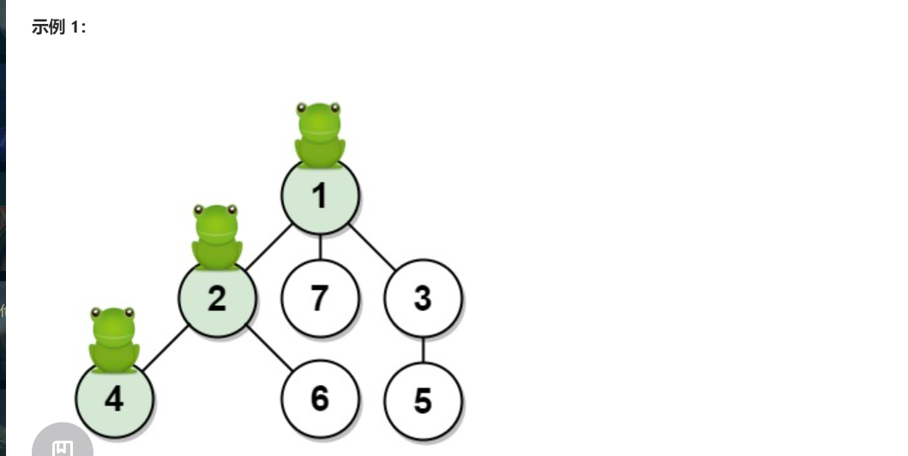

给你一棵由 n 个顶点组成的无向树，顶点编号从 1 到 n。青蛙从 顶点 1 开始起跳。规则如下：

在一秒内，青蛙从它所在的当前顶点跳到另一个 未访问 过的顶点（如果它们直接相连）。
青蛙无法跳回已经访问过的顶点。
如果青蛙可以跳到多个不同顶点，那么它跳到其中任意一个顶点上的机率都相同。
如果青蛙不能跳到任何未访问过的顶点上，那么它每次跳跃都会停留在原地。
无向树的边用数组 edges 描述，其中 edges[i] = [ai, bi] 意味着存在一条直接连通 ai 和 bi 两个顶点的边。

返回青蛙在 t 秒后位于目标顶点 target 上的概率。与实际答案相差不超过 10-5 的结果将被视为正确答案。

## 示例 1：

~~~
输入：n = 7, edges = [[1,2],[1,3],[1,7],[2,4],[2,6],[3,5]], t = 2, target = 4
输出：0.16666666666666666 
解释：上图显示了青蛙的跳跃路径。青蛙从顶点 1 起跳，第 1 秒 有 1/3 的概率跳到顶点 2 ，然后第 2 秒 有 1/2 的概率跳到顶点 4，因此青蛙在 2 秒后位于顶点 4 的概率是 1/3 * 1/2 = 1/6 = 0.16666666666666666 。 
~~~

## 思路：

~~~ java
public class Solution {
    public double frogPosition(int n, int[][] edges, int t, int target) {
        List<Integer>[] G = new ArrayList[n + 1];
        for (int i = 1; i <= n; ++i)
            G[i] = new ArrayList<>();
        for (int[] e : edges) {
            G[e[0]].add(e[1]);
            G[e[1]].add(e[0]);
        }
        boolean[] seen = new boolean[n + 1];
        return dfs(G, seen, 1, t, target);
    }

    private double dfs(List<Integer>[] G, boolean[] seen, int i, int t, int target) {
        int nxt = i == 1 ? G[i].size() : G[i].size() - 1;
        if (t == 0 || nxt == 0) {
            return i == target ? 1.0 : 0.0;
        }
        seen[i] = true;
        double ans = 0.0;
        for (int j : G[i]) {
            if (!seen[j]) {
                ans += dfs(G, seen, j, t - 1, target);
            }
        }
        return ans / nxt;
    }
}
~~~