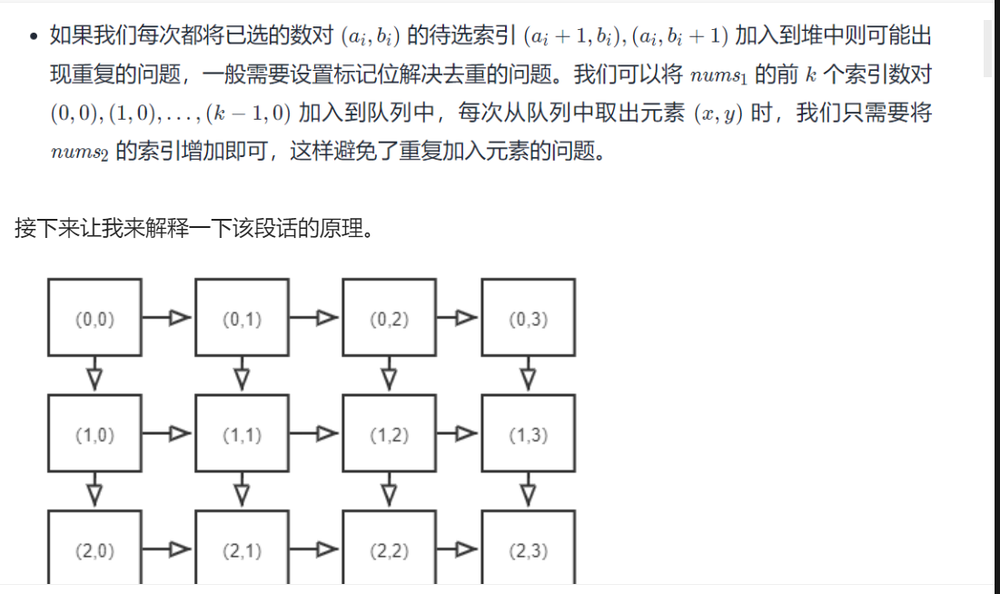
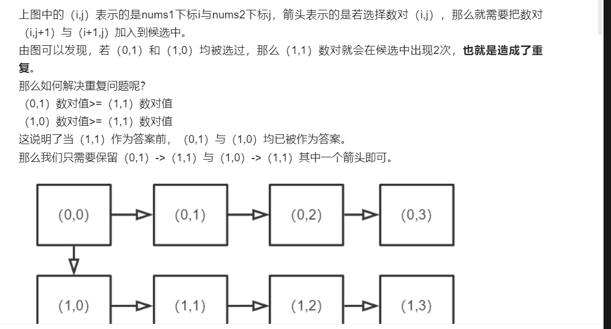

给定两个以 升序排列 的整数数组 nums1 和 nums2 , 以及一个整数 k 。

定义一对值 (u,v)，其中第一个元素来自 nums1，第二个元素来自 nums2 。

请找到和最小的 k 个数对 (u1,v1),  (u2,v2)  ...  (uk,vk) 。
## 示例 1：

~~~
输入: nums1 = [1,7,11], nums2 = [2,4,6], k = 3
输出: [1,2],[1,4],[1,6]
解释: 返回序列中的前 3 对数：
     [1,2],[1,4],[1,6],[7,2],[7,4],[11,2],[7,6],[11,4],[11,6]
~~~

## 示例 2：

~~~
输入: nums1 = [1,1,2], nums2 = [1,2,3], k = 2
输出: [1,1],[1,1]
解释: 返回序列中的前 2 对数：
     [1,1],[1,1],[1,2],[2,1],[1,2],[2,2],[1,3],[1,3],[2,3]
~~~

## 思路1：
2个升序排列的数组num1、num2,最小的数对一定为(0,0),最大的数对为(num1.length-1,num2.length-1)。本题要求找到最小的k个数对，本题要求找到最小的 k 个数对，最直接的办法是可以将所有的数对求出来，然后利用排序或者 TopK 解法求出最小的 k 个数对即可。实际求解时可以不用求出所有的数对，只需从所有符合待选的数对中选出最小的即可。假设当前已选的前 n 小数对的索引分别为(a1,b1),(a2,b2)...(an,bn),则推出下一个数对的索引为(a1+1,b1),(a1,b1+1),
(a2+1,b2),(a2,b2+1)...(an+1,bn),(an,bn+1),假设我们利用堆的特性可以求出待选范围中最小数对的索引为(ai,bi),同时将新的待选的数对(ai+1,bi),(ai,bi+1)加入堆中。

~~~ java

class Solution {
    public List<List<Integer>> kSmallestPairs(int[] nums1, int[] nums2, int k) {
        PriorityQueue<int[]> pq = new PriorityQueue<>(k, (o1, o2) -> {
            return nums1[o1[0]] + nums2[o1[1]] - nums1[o2[0]] - nums2[o2[1]];
        });
        List<List<Integer>> ans = new ArrayList<>();
        int m = nums1.length;
        int n = nums2.length;
        for (int i = 0; i < Math.min(m, k); i++) {
            pq.offer(new int[]{i, 0});
        }
        while (k-- > 0 && !pq.isEmpty()) {
            int[] idxPair = pq.poll();
            List<Integer> list = new ArrayList<>();
            list.add(nums1[idxPair[0]]);
            list.add(nums2[idxPair[1]]);
            ans.add(list);
            if (idxPair[1] + 1 < n) {
                pq.offer(new int[]{idxPair[0], idxPair[1] + 1});
            }
        }

        return ans;
    }
}
~~~

## 思路2
第k个数字对的和必然在nums1[0]+nums2[0]和nums1[n-1]+nums2[m-1]之间，所以可以用二分找出第k个数字对的和，再把数字对和小于等于k的加入答案中。

~~~java
class Solution {
    public List<List<Integer>> kSmallestPairs(int[] nums1, int[] nums2, int k) {
        int m = nums1.length;
        int n = nums2.length;

        /*二分查找第 k 小的数对和的大小*/
        int left = nums1[0] + nums2[0];
        int right = nums1[m - 1] + nums2[n - 1];
        int pairSum = right;
        while (left <= right) {
            int mid = left + ((right - left) >> 1);
            //统计小于等于mid的数对数量
            long cnt = 0;
            int start = 0;
            int end = n - 1;
            //左上到右下统计
            while (start < m && end >= 0) {
                if (nums1[start] + nums2[end] > mid) {
                    end--;
                } else {
                    cnt += end + 1;
                    start++;
                }
            }
            if (cnt < k) {
                left = mid + 1;
            } else {
                pairSum = mid;
                right = mid - 1;
            }
        }

        List<List<Integer>> ans = new ArrayList<>();
        int pos = n - 1;
        /*找到小于目标值 pairSum 的数对*/
        for (int i = 0; i < m; i++) {
            while (pos >= 0 && nums1[i] + nums2[pos] >= pairSum) {
                pos--;
            }
            for (int j = 0; j <= pos && k > 0; j++, k--) {
                List<Integer> list = new ArrayList<>();
                list.add(nums1[i]);
                list.add(nums2[j]);
                ans.add(list);
            }
        }

        /*找到等于目标值 pairSum 的数对*/
        pos = n - 1;
        for (int i = 0; i < m && k > 0; i++) {
            int start1 = i;
            while (i < m - 1 && nums1[i] == nums1[i + 1]) {
                i++;
            }
            while (pos >= 0 && nums1[i] + nums2[pos] > pairSum) {
                pos--;
            }
            int start2 = pos;
            while (pos > 0 && nums2[pos] == nums2[pos - 1]) {
                pos--;
            }
            if (nums1[i] + nums2[pos] != pairSum) {
                continue;
            }
            //总共等于目标值 pairSum 的数对
            int count = (int) Math.min(k, (long) (i - start1 + 1) * (start2 - pos + 1));
            for (int j = 0; j < count && k > 0; j++, k--) {
                List<Integer> list = new ArrayList<>();
                list.add(nums1[i]);
                list.add(nums2[pos]);
                ans.add(list);
            }
        }
        return ans;
    }
}

~~~