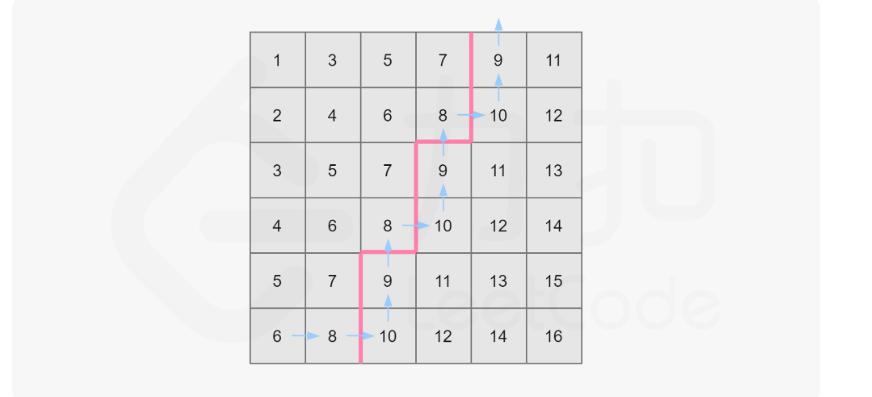

给你一个 n x n 矩阵 matrix ，其中每行和每列元素均按升序排序，找到矩阵中第 k 小的元素。
请注意，它是 排序后 的第 k 小元素，而不是第 k 个 不同 的元素。

你必须找到一个内存复杂度优于 O(n2) 的解决方案。

## 示例 1：

~~~
输入：matrix = [[1,5,9],[10,11,13],[12,13,15]], k = 8
输出：13
解释：矩阵中的元素为 [1,5,9,10,11,12,13,13,15]，第 8 小元素是 13
~~~

## 示例 2：

~~~
输入：matrix = [[-5]], k = 1
输出：-5
~~~

## 思路：归并排序
由题目给出的性质可知，这个矩阵的每一行均为一个有序数组。问题即转化为从这 n 个有序数组中找第 k 大的数，可以想到利用归并排序的做法，归并到第 k 个数即可停止。

~~~ java

class Solution {
    public int kthSmallest(int[][] matrix, int k) {
        PriorityQueue<int[]> pq = new PriorityQueue<int[]>(new Comparator<int[]>() {
            public int compare(int[] a, int[] b) {
                return a[0] - b[0];
            }
        });
        int n = matrix.length;
        for (int i = 0; i < n; i++) {
            pq.offer(new int[]{matrix[i][0], i, 0});
        }
        for (int i = 0; i < k - 1; i++) {
            int[] now = pq.poll();
            if (now[2] != n - 1) {
                pq.offer(new int[]{matrix[now[1]][now[2] + 1], now[1], now[2] + 1});
            }
        }
        return pq.poll()[0];
    }
}

~~~

## 思路2：二分法

~~~java
class Solution {
    public int kthSmallest(int[][] matrix, int k) {
        int n = matrix.length;
        int left = matrix[0][0];
        int right = matrix[n - 1][n - 1];
        while (left < right) {
            int mid = left + ((right - left) >> 1);
            if (check(matrix, mid, k, n)) {
                right = mid;
            } else {
                left = mid + 1;
            }
        }
        return left;
    }

    public boolean check(int[][] matrix, int mid, int k, int n) {
        int i = n - 1;
        int j = 0;
        int num = 0;
        while (i >= 0 && j < n) {
            if (matrix[i][j] <= mid) {
                //竖着1列的个数
                num += i + 1;
                j++;
            } else {
                i--;
            }
        }
        return num >= k;
    }
}
~~~