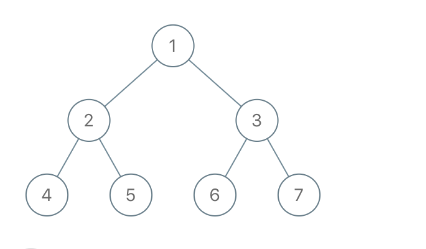

给出二叉树的根节点 root，树上每个节点都有一个不同的值。

如果节点值在 to_delete 中出现，我们就把该节点从树上删去，最后得到一个森林（一些不相交的树构成的集合）。

返回森林中的每棵树。你可以按任意顺序组织答案。

## 示例 1：

~~~
输入：root = [1,2,3,4,5,6,7], to_delete = [3,5]
输出：[[1,2,null,4],[6],[7]]
~~~

## 思路：

~~~ java

/**
 * Definition for a binary tree node.
 * public class TreeNode {
 *     int val;
 *     TreeNode left;
 *     TreeNode right;
 *     TreeNode() {}
 *     TreeNode(int val) { this.val = val; }
 *     TreeNode(int val, TreeNode left, TreeNode right) {
 *         this.val = val;
 *         this.left = left;
 *         this.right = right;
 *     }
 * }
 */
class Solution {
    public List<TreeNode> delNodes(TreeNode root, int[] toDelete) {
        var ans = new ArrayList<TreeNode>();
        var s = new HashSet<Integer>();
        for (int x : toDelete) s.add(x);
        if (dfs(ans, s, root) != null) ans.add(root);
        return ans;
    }

    private TreeNode dfs(List<TreeNode> ans, Set<Integer> s, TreeNode node) {
        if (node == null) return null;
        node.left = dfs(ans, s, node.left);
        node.right = dfs(ans, s, node.right);
        if (!s.contains(node.val)) return node;
        if (node.left != null) ans.add(node.left);
        if (node.right != null) ans.add(node.right);
        return null;
    }
}
~~~