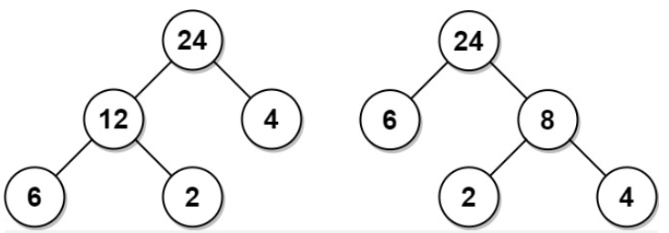

给你一个正整数数组 arr，考虑所有满足以下条件的二叉树：

- 每个节点都有 0 个或是 2 个子节点。
- 数组 arr 中的值与树的中序遍历中每个叶节点的值一一对应。
- 每个非叶节点的值等于其左子树和右子树中叶节点的最大值的乘积。
在所有这样的二叉树中，返回每个非叶节点的值的最小可能总和。这个和的值是一个 32 位整数。

如果一个节点有 0 个子节点，那么该节点为叶节点。

## 示例 1：

~~~
输入：arr = [6,2,4]
输出：32
解释：有两种可能的树，第一种的非叶节点的总和为 36 ，第二种非叶节点的总和为 32 。
~~~

## 思路1：动态规划

~~~ java
class Solution {
    public int mctFromLeafValues(int[] arr) {
        //1. 状态:左右子树叶节点的个数;选择:节点划分（哪些属于左子树/哪些属于右子树）
        //2. dp[i][j]=x; i数组下标起始点，j表示数组下标终点
        int len = arr.length;
        int[][] dp = new int[len][len];
        //3. base case
        /*由于非叶节点的值是左右子树分别最大叶节点的值乘积，所以需要知道各个区间内最值*/
        /*由于要求最小代价生成树，所以期望每个非叶节点都尽可能小，所以需要对dp初始化*/   
        int[][] maxVal = new int[len][len];
        for (int i = 0;i < len;i++)
            maxVal[i][i] = arr[i];
        for (int i = 0;i < len; i++){
            for (int j = i+1; j < len; j++){
                maxVal[i][j] = Math.max(maxVal[i][j-1],arr[j]);
                dp[i][j] = Integer.MAX_VALUE;
            }
        }
        //4. 状态转移
        for (int l = 1; l < len; l++){//l=j-i （长度）
            for (int i = 0; i < len-l; i++){//起始点i,终点i+l-1
                for (int k = i; k < i+l; k++){//中间分割点（根）
                    dp[i][i+l] = Math.min(dp[i][i+l],dp[i][k] + dp[k+1][i+l] + maxVal[i][k] * maxVal[k+1][i+l]);
                }
            }

        }

        return dp[0][len-1];
    }
}
~~~

## 思路2：单调栈

~~~java
class Solution {
    public int mctFromLeafValues(int[] arr) {
        //1. 如果栈顶元素比当前元素小，弹出栈顶元素，
        //   栈顶元素与当前元素和栈顶下一个元素中得最小值组合
        //2. 如果栈顶元素比当前元素大，入栈
        Stack<Integer> stack = new Stack<>();
        stack.push(Integer.MAX_VALUE);//哨兵
        int ans = 0;
        for (int i = 0; i < arr.length; i++){
            while (stack.peek() < arr[i])
                ans += stack.pop()*Math.min(arr[i],stack.peek());
            stack.push(arr[i]);
        }

        while(stack.size() > 2)
            ans += stack.pop()*stack.peek();
        
        return ans;
    }
}
~~~