## 声明式导航

### 调整到tabBar页面
~~~ html
<navigator url="/pages/home/home" open-type="switchTab">导航到主页</navigator>
~~~

### 跳转到非tabBar页面
~~~ html
<navigator url="/pages/info/info" open-type="navigate">导航到info(非tabBar页面)</navigator>
~~~
### 后退
~~~ html 
<navigator open-type="navigateBack">后退</navigator>
~~~

## 编程式导航
### 导航到tabBar页面
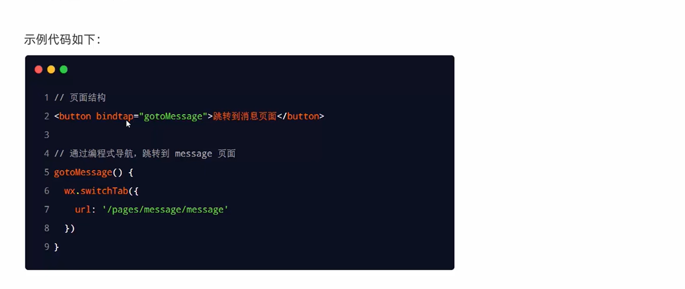
### 导航到非tabBar页面
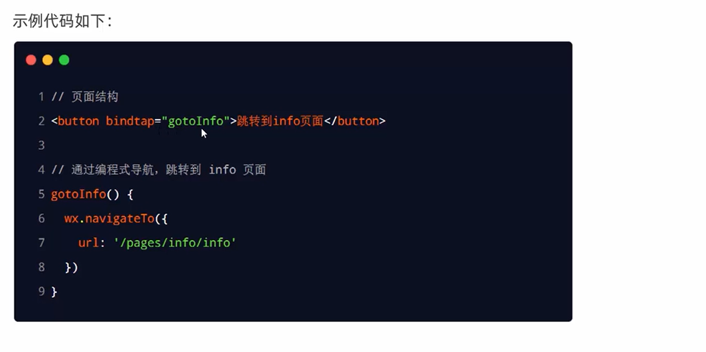
### 后退导航
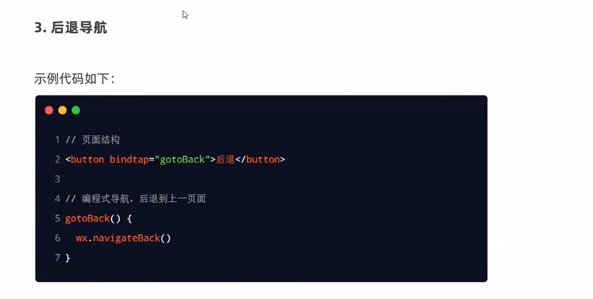

##导航传参

### 声明传参
~~~ html
<navigator url="/pages/info/info?name=lzm&age=24">跳转到info</navigator>
~~~

### 编程传参

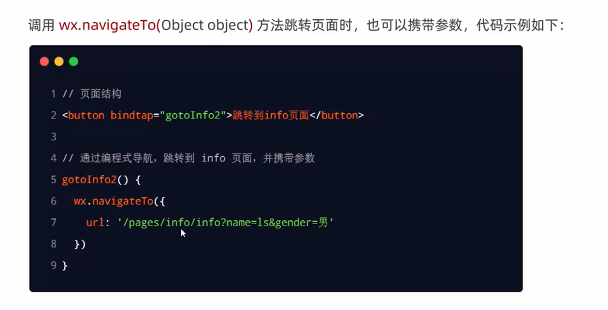

### onLoad 接受参数
~~~ js
  data: {
    //导航传递参数
    query:{}
  },

  /**
   * 生命周期函数--监听页面加载
   */
  onLoad(options) {
    console.log(options)
    this.setData({
      query:options
    })
  },
~~~

## 下拉刷新事件
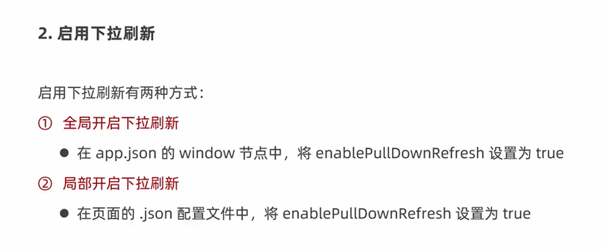

~~~ json
  "enablePullDownRefresh": true,
  //下拉背景
  "backgroundColor": "#efefef",
    //下拉loading 
  "backgroundTextStyle": "dark"
~~~

~~~ js
  /**
   * 页面相关事件处理函数--监听用户下拉动作
   */
  onPullDownRefresh() {

  },
~~~

## 上拉触底

~~~ js
  /**
   * 页面上拉触底事件的处理函数
   */
  onReachBottom() {

  },
  ~~~

  ~~~ json
 //触底距离
"onReachBottomDistance": 150
  ~~~

##上拉触底案例

### 1.随机获取颜色
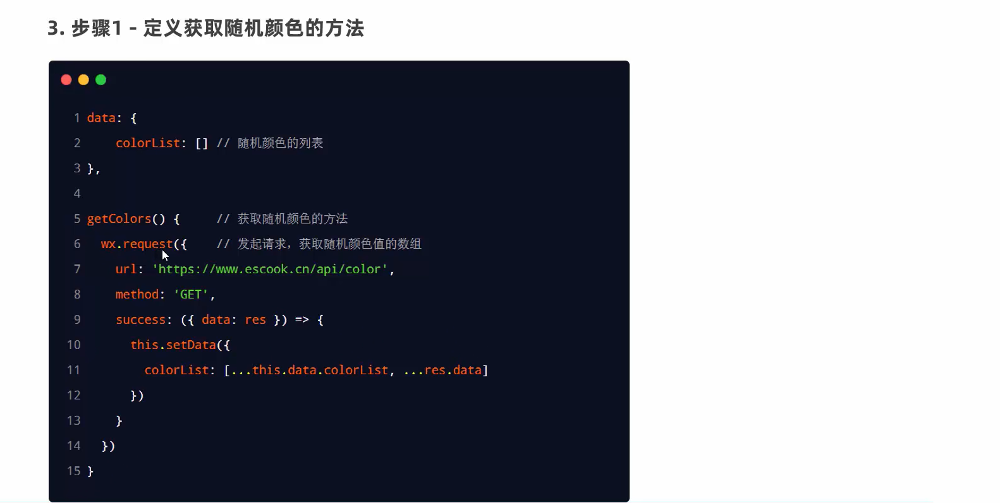

### 2.监听事件获取初始数据

~~~ js
  /**
   * 生命周期函数--监听页面加载
   */
  onLoad(options) {
    console.log(options)
    this.getColors()
  },
~~~

### 3.渲染页面
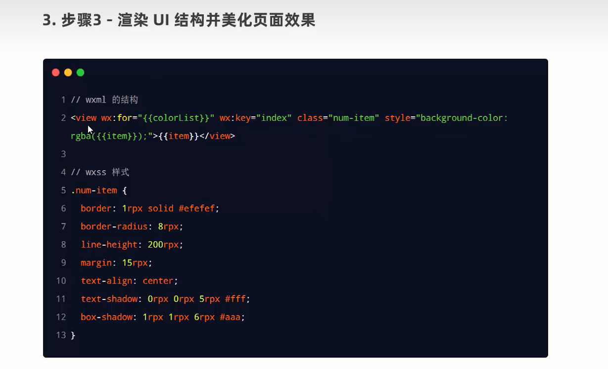

### 4.上拉触底
~~~ js

  /**
   * 页面上拉触底事件的处理函数
   */
  onReachBottom() {
    this.getColors()
  },
~~~

### 5.添加loading

~~~ js
wx.showLoading({
  title: '加载中',
})

setTimeout(function () {
  wx.hideLoading()
}, 2000)
~~~

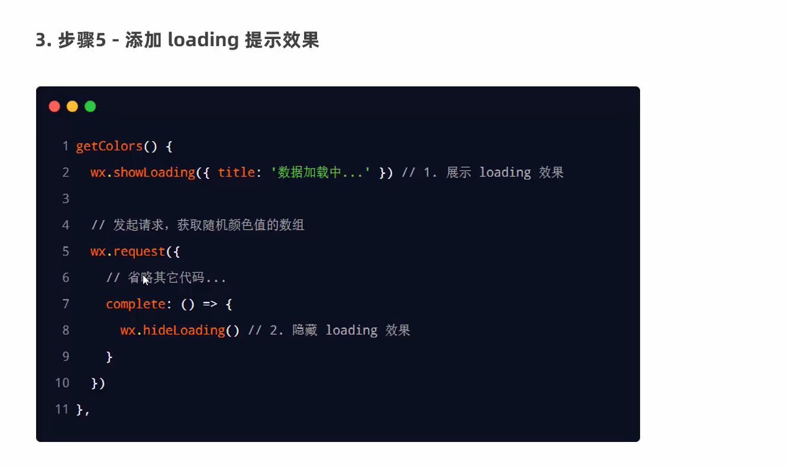

### 6.上拉触底节流
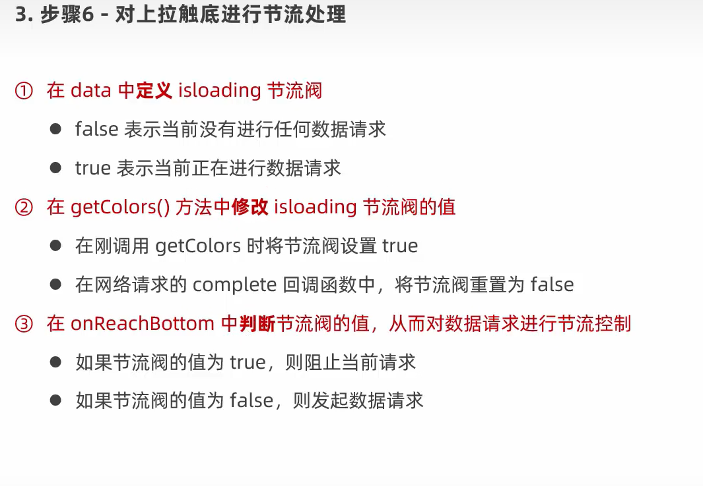

## 自定义编译
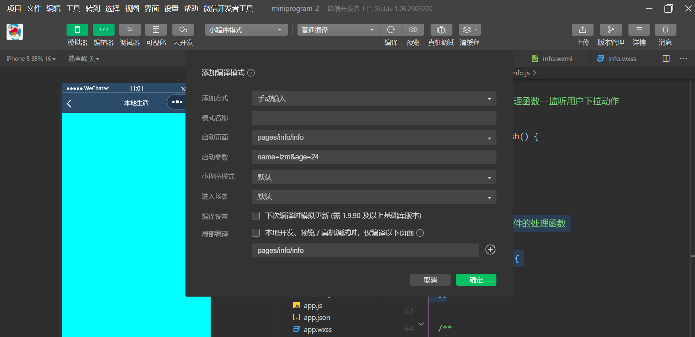

## 声明周期

### 应用声明周期函数
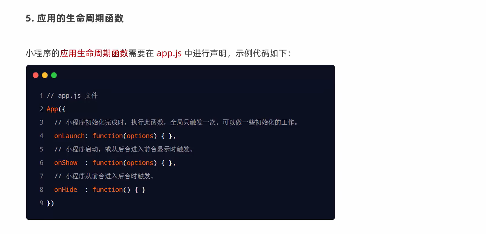

### 页面声明周期函数

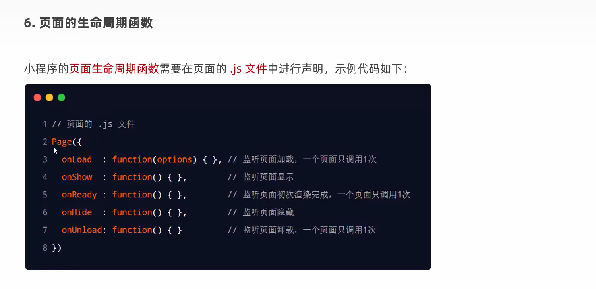

## wxs
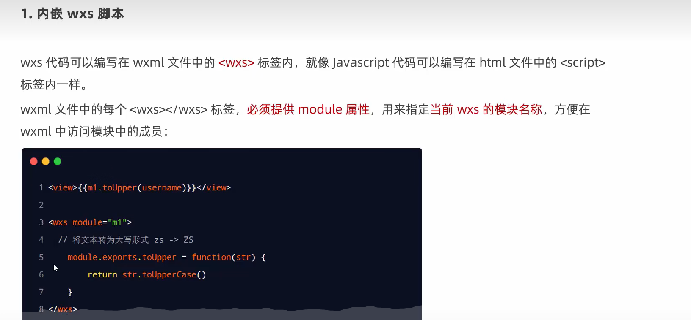

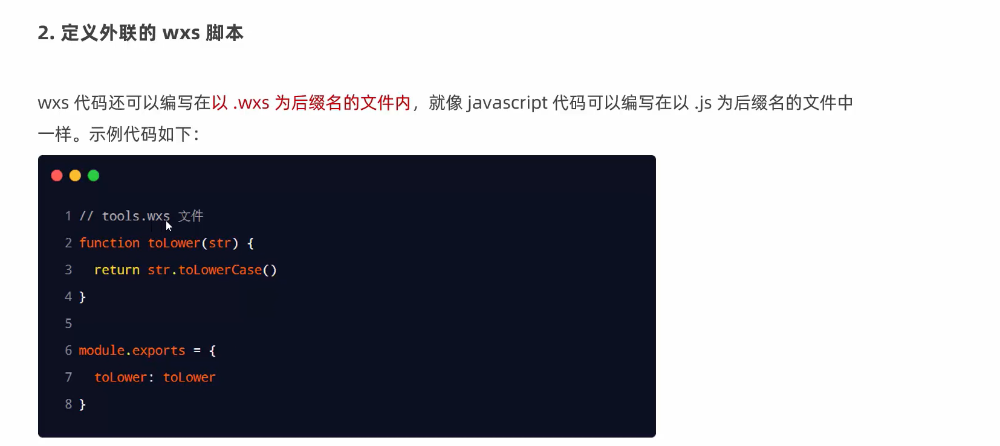

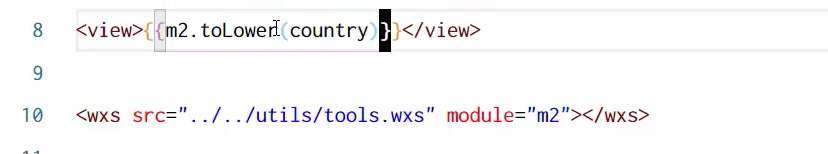
不能作为组件回调

## 案例
### 展示建模
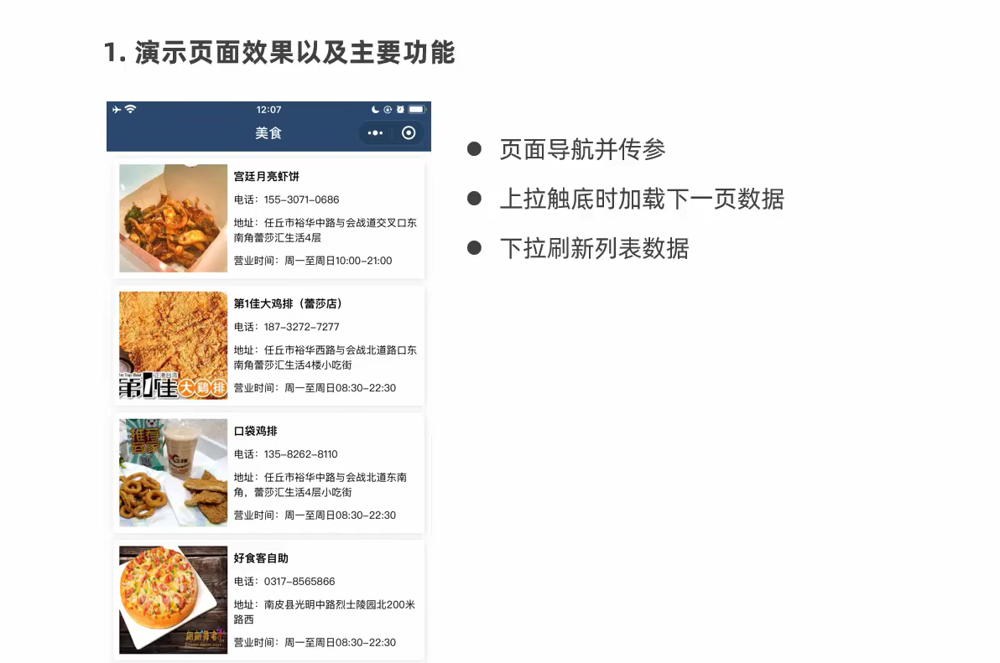

### 九宫格跳转
~~~html
<!-- 九宫格 -->
<view class="grid-list">
<navigator class="grid-item" wx:for="{{gridList}}" wx:key="id" url="/pages/shoplist/shoplist?id={{item.id}}&title={{item.name}}">
  <image src="{{item.icon}}"></image>
  <text>{{item.name}}</text>
</navigator>
</view>
~~~

### 跳转页面标题显示
~~~js
  /**
   * 页面的初始数据
   */
  data: {
    query : {}
  },

  /**
   * 生命周期函数--监听页面加载
   */
  onLoad(options) {
    this.setData({
      query : options
    })
  },

  /**
   * 生命周期函数--监听页面初次渲染完成
   */
  onReady() {
    wx.setNavigationBarTitle({
      title: this.data.query.title,
    })
  },
~~~

### 分页展示列表
~~~js
  data: {
    query : {},
    shopList:[],
    page:1,
    pageSize:10,
    total:0
  }
~~~

~~~js
getShopList(){
    wx.showLoading({
      title: '数据加载中...',
    })
    wx.request({
      url: 'https://www.escook.cn/categories/'+this.data.query.id+'/shops',
      method: 'GET',
      data : {
        _page : this.data.page,
        _limit: this.data.pageSize
      },
      success:(res)=>{
        console.log(res)
        this.setData({
          shopList : [... this.data.shopList,...res.data],
          total : res.header['X-Total-Count'] -0
        })
      },
      complete:()=>{
        wx.hideLoading()
      }
    })
  },getShopList(){
    this.setData({
      isLoading:true
    })
    wx.showLoading({
      title: '数据加载中...',
    })
    wx.request({
      url: 'https://www.escook.cn/categories/'+this.data.query.id+'/shops',
      method: 'GET',
      data : {
        _page : this.data.page,
        _limit: this.data.pageSize
      },
      success:(res)=>{
        console.log(res)
        this.setData({
          shopList : [... this.data.shopList,...res.data],
          total : res.header['X-Total-Count'] -0
        })
      },
      complete:()=>{
        wx.hideLoading()
        this.setData({
          isLoading:false
        })
      }
    })
  },
~~~

wxml
~~~html
<!--pages/shoplist/shoplist.wxml-->
<view class="show-item" wx:for="{{shopList}}" wx:key="id">
<view class="thumb">
<image src="{{item.images[0]}}"></image>
</view>
<view class="info">
<text class="shop-title">{{item.businessHours}}</text>
<text>{{item.name}}</text>
<text>{{item.phone}}</text>
<text>{{item.address}}</text>
</view>
</view>
~~~

~~~css
/* pages/shoplist/shoplist.wxss */
.show-item {
  display: flex;
  padding: 15rpx;
  border: 1rpx solid #efefef;
  margin: 15rpx;
  border-radius: 8rpx;
  box-shadow: 1rpx 1rpx 15rpx #dddddd;
}
.thumb image{
  width: 250rpx;
  height: 250rpx;
  display: block;
  margin-right: 15rpx;
}
.info{
  display: flex;
  flex-direction: column;
  justify-content: space-around;
  font-size: 24rpx;
}

.show-title{
  font-weight: bold;
}
~~~

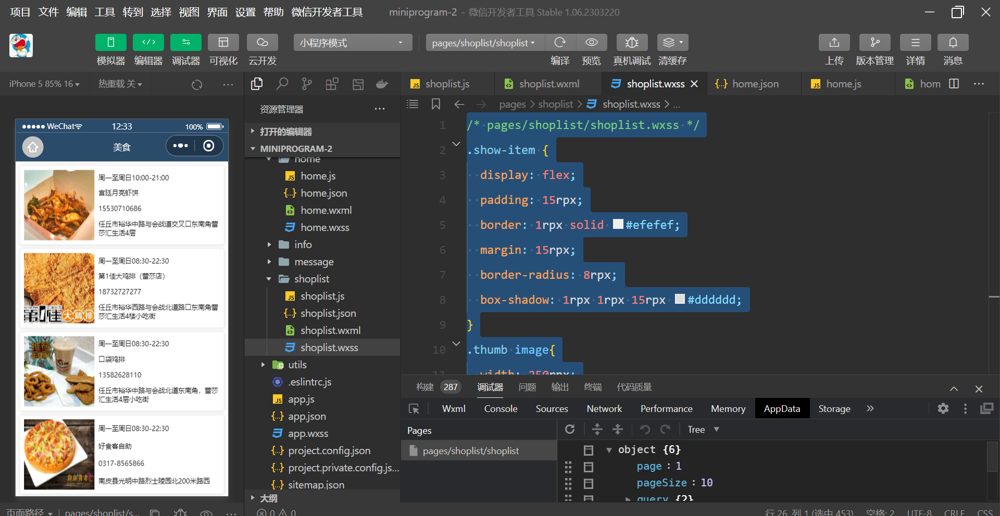

### 上拉处理

~~~js

  /**
   * 页面上拉触底事件的处理函数
   */
  onReachBottom() {
    if(this.data.isLoading) return
    this.setData({
      page:this.data.page+1
    })
    this.getShopList()
  },
~~~

### 判断下一页数据

~~~js
 /**
   * 页面上拉触底事件的处理函数
   */
  onReachBottom() {
    if(this.data.page*this.data.pageSize>=this.data.total){
      wx.showToast({
        title: '到顶了',
      })
      return
    }
    if(this.data.isLoading) return
    this.setData({
      page:this.data.page+1
    })
    this.getShopList()
  },
~~~

### 下拉刷新
~~~json
{
  "usingComponents": {},
  "enablePullDownRefresh": true,
  "backgroundColor": "#efefef",
  "backgroundTextStyle": "dark"
}
~~~

~~~js
  /**
   * 页面相关事件处理函数--监听用户下拉动作
   */
  onPullDownRefresh() {
    //需要重置数据
    this.setData({
      page:1,
      shopList:[],
      total:0
    })
    this.getShopList
  },
~~~

//数据完成关闭下拉刷新
~~~js
complete:()=>{
        wx.hideLoading()
        this.setData({
          isLoading:false
        })
        wx.stopPullDownRefresh()
      }
~~~

//按需关闭下拉
~~~js
 /**
   * 页面相关事件处理函数--监听用户下拉动作
   */
  onPullDownRefresh() {
    //需要重置数据
    this.setData({
      page:1,
      shopList:[],
      total:0
    })
    this.getShopList(()=>{
      wx.stopPullDownRefresh()
    })
  },
 getShopList(cb){
    ...
    complete:()=>{
        wx.hideLoading()
        this.setData({
          isLoading:false
        })
        // wx.stopPullDownRefresh()
        cb&&cb()
      }
 }
~~~

### wxs

~~~js
function splitPhone(str){
   if(str.length==null) return str
   var arr=str.split('')
   console.log(arr)
   arr.splice(3,0,'-')
   arr.splice(8,0,'-')
  return arr.join('')
}

module.exports={
  splitPhone:splitPhone
}
~~~

~~~html
<text>{{tools.splitPhone(item.phone)}}</text>

<wxs src="../../utils/tools.wxs" module="tools"></wxs>
~~~