##  [Vant Weapp](https://vant-contrib.gitee.io/vant-weapp/#/home)

### 初始化

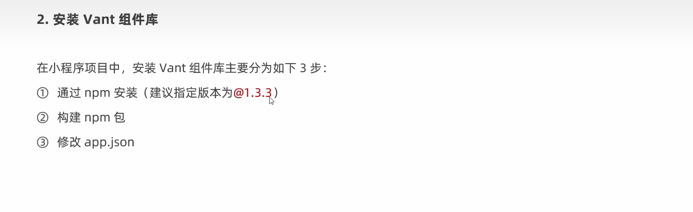

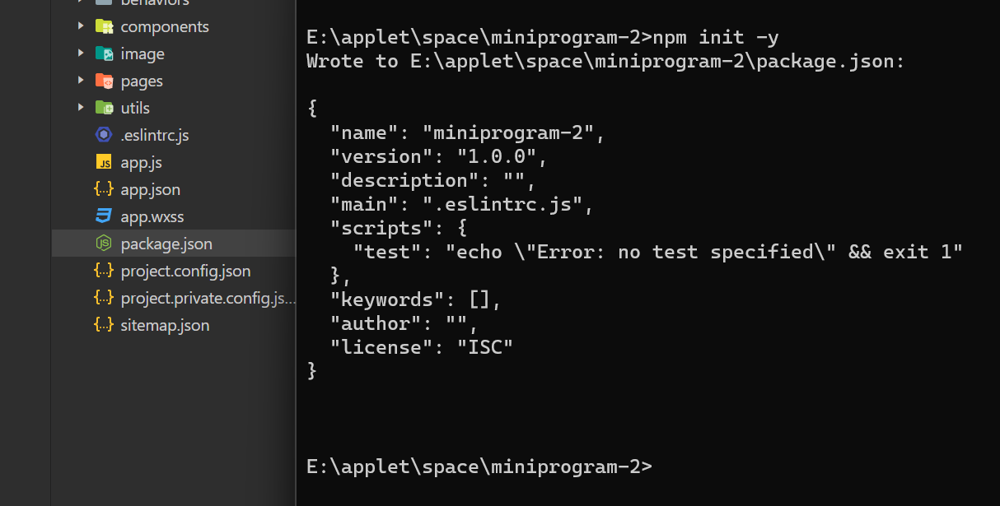

~~~html
npm i @vant/weapp@1.3.3 -S --production
~~~

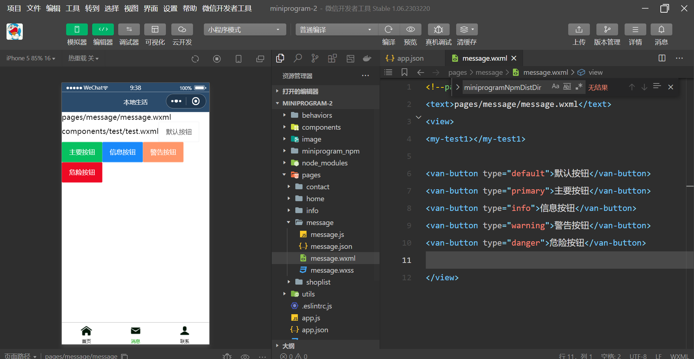

### Api Promise

~~~json
npm i --save miniprogram-api-promise@1.0.4
~~~
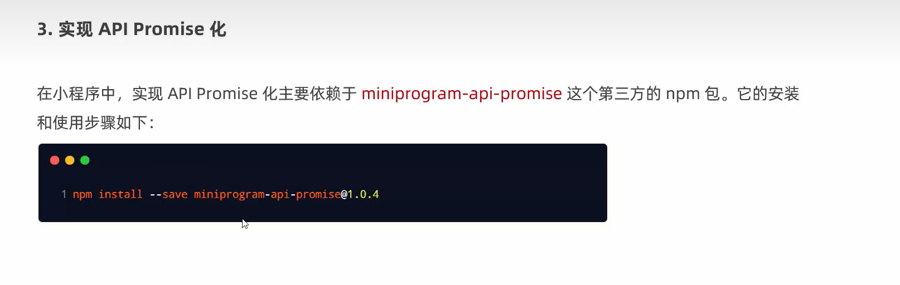

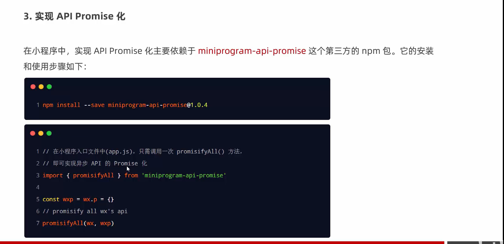

~~~js
import {promisifyAll}  from 'miniprogram-api-promise'
const wxp=wx.p={}

promisifyAll(wx,wxp)
~~~

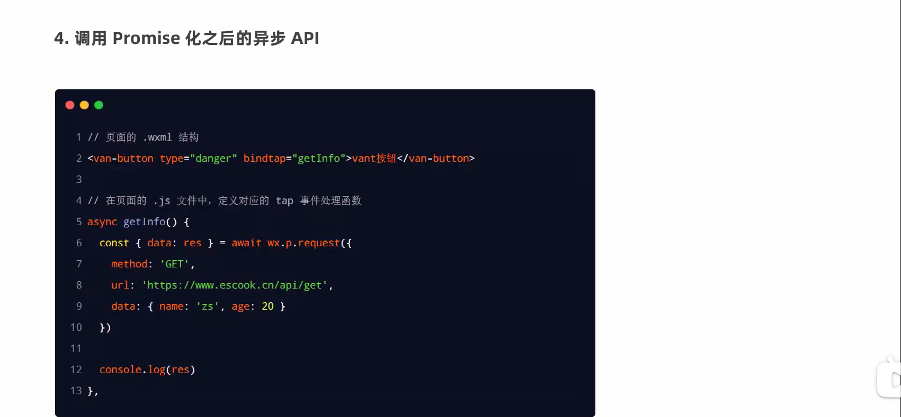

### 全局数据共享

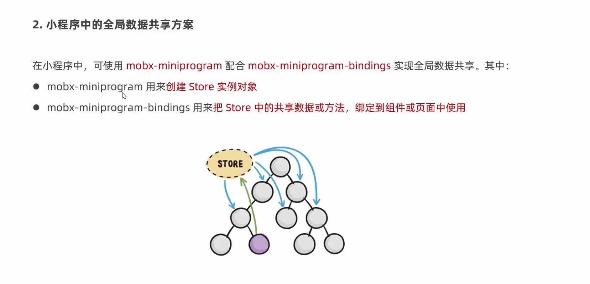

~~~html
npm i --save mobx-miniprogram@4.13.2 mobx-miniprogram-bindings@1.2.1
~~~

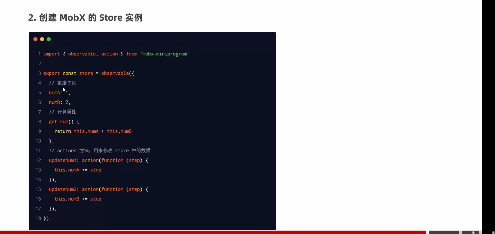

### store页面绑定
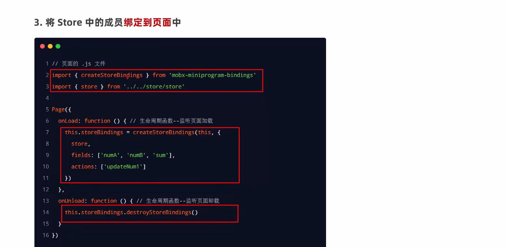

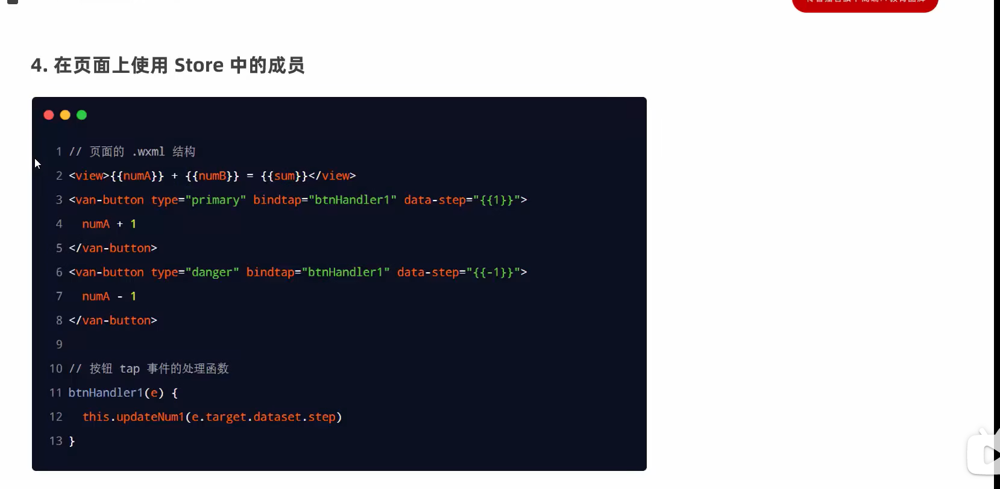

### store组件绑定
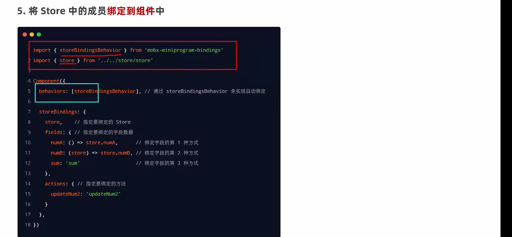

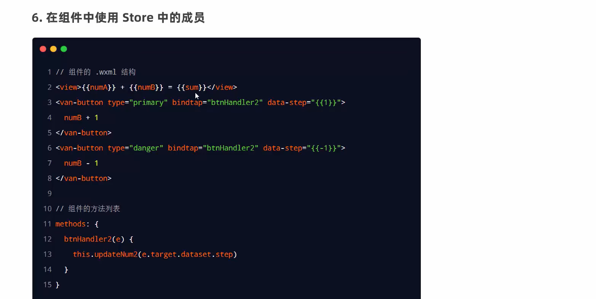

## 分包

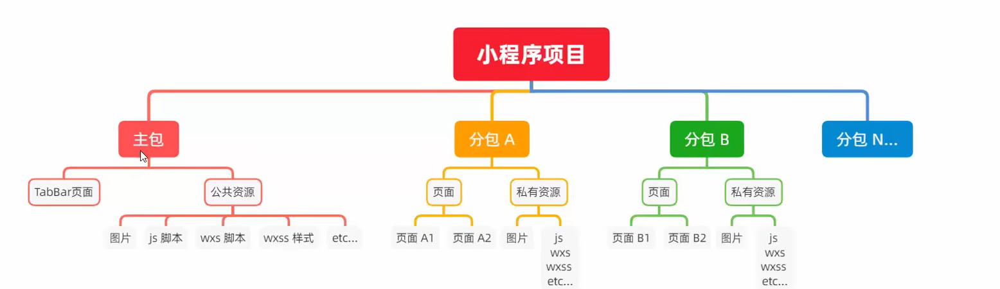

### 配置方法
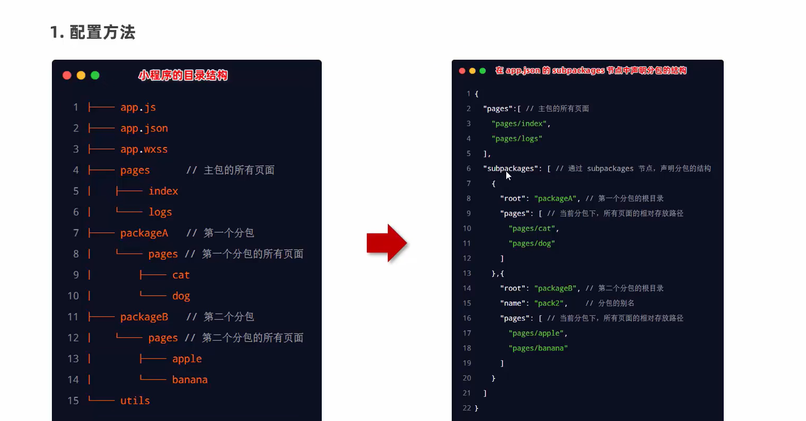

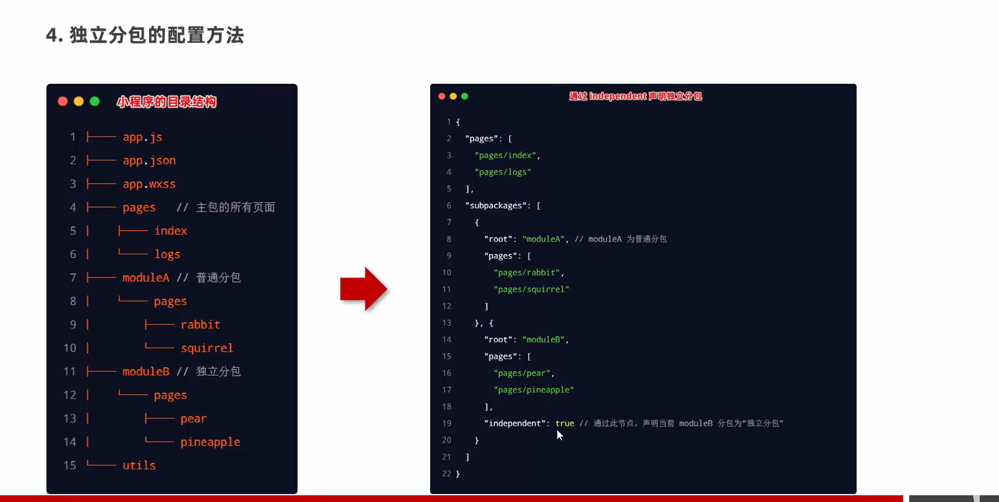
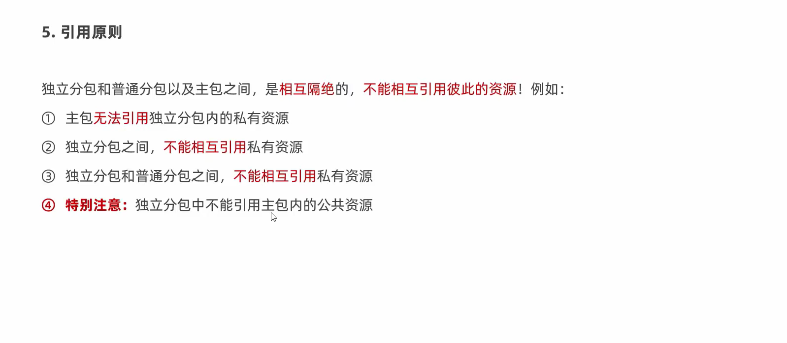

### 预下载
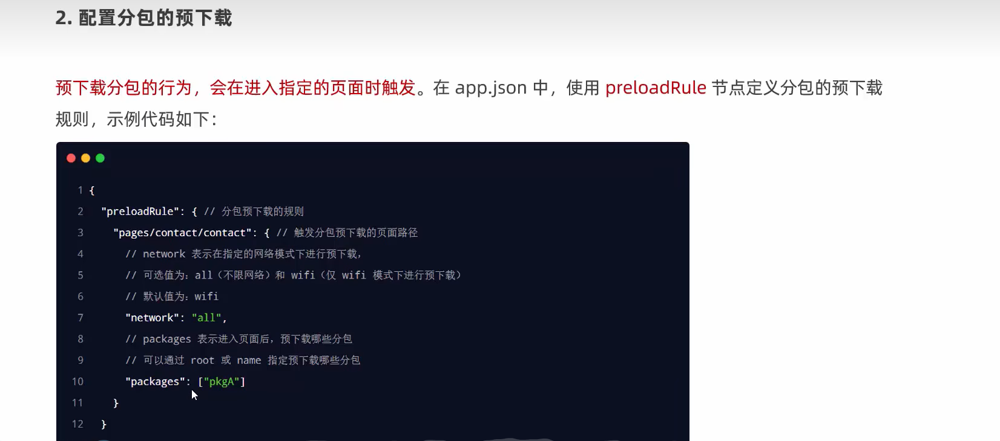

[项目](https://applet-base-api-t.itheima.net/docs-uni-shop/index.htm#%E9%A6%96%E9%A1%B5)