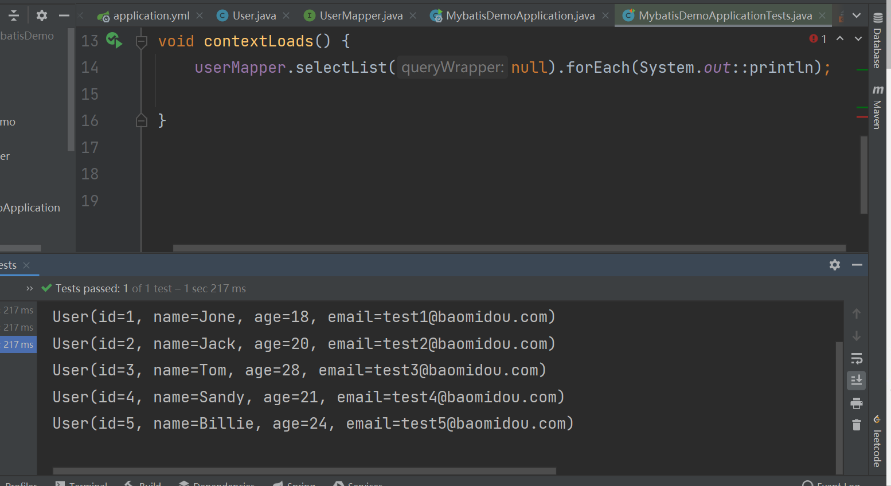
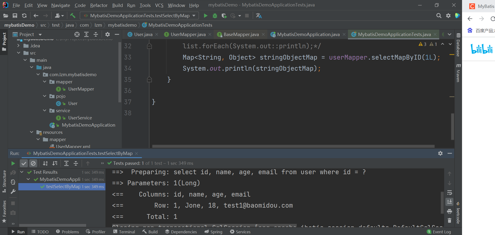
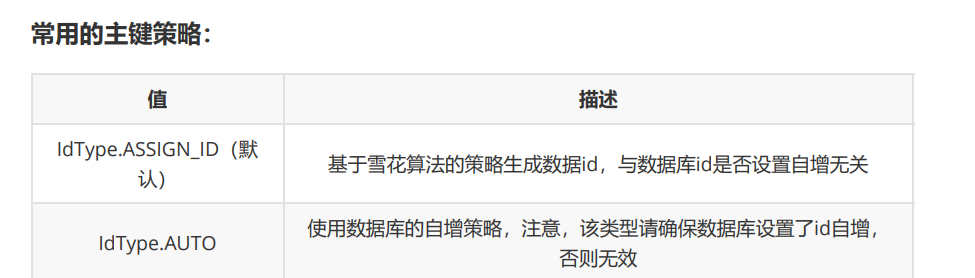
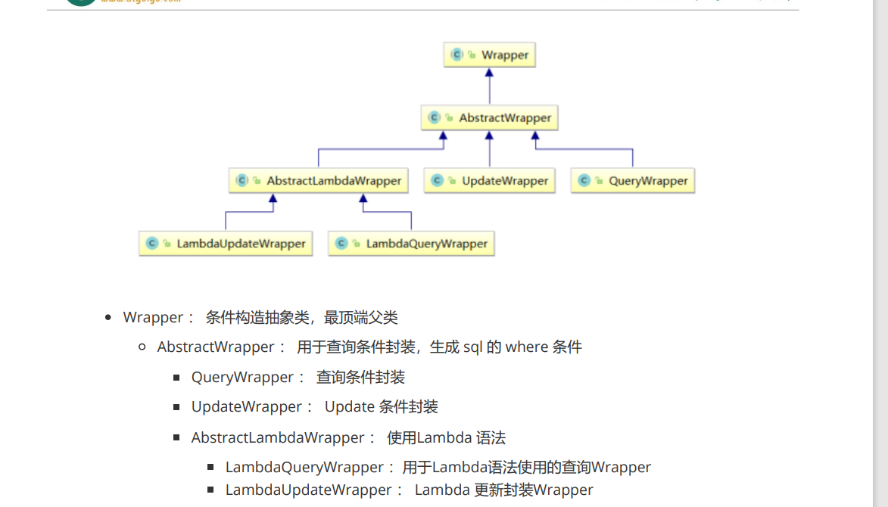
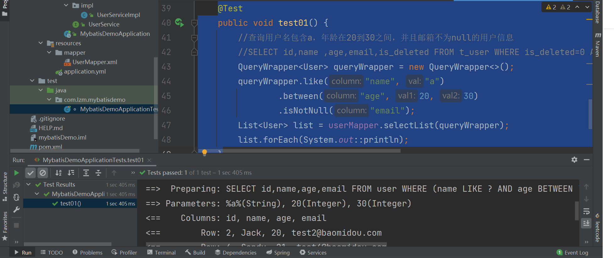
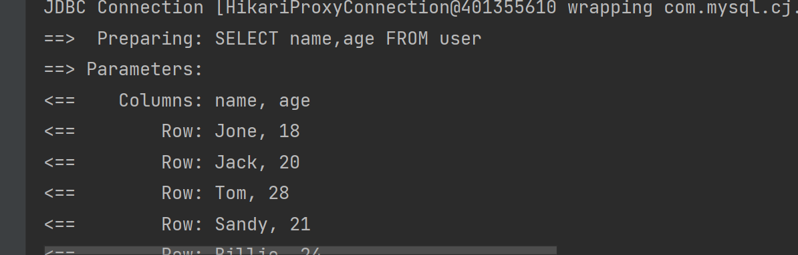
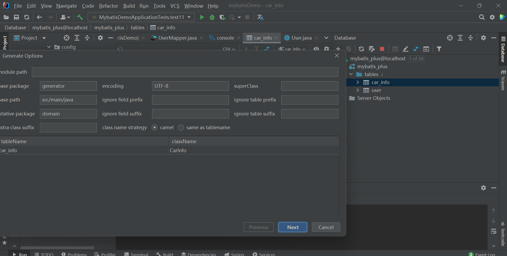
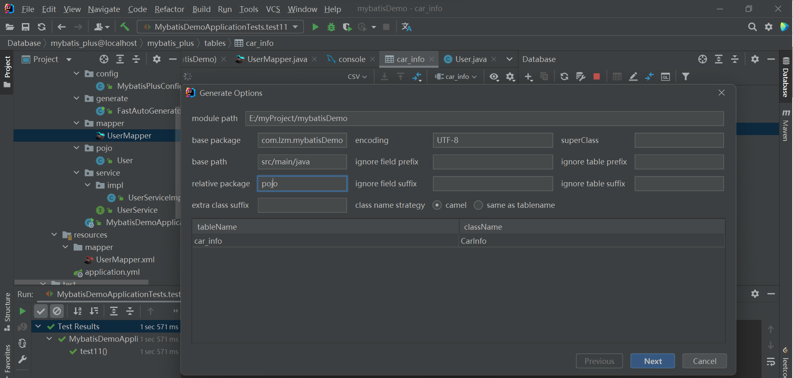
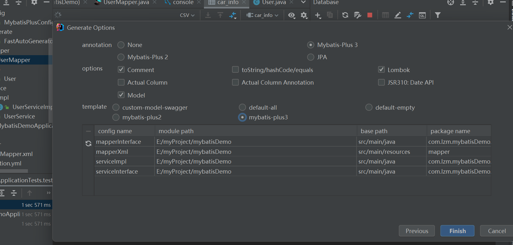

## 简介
[官网](https://www.baomidou.com/)

框架结构

## 配置项目
配置mysql
~~~mysql
CREATE DATABASE `mybatis_plus` /*!40100 DEFAULT CHARACTER SET utf8mb4 */;
use `mybatis_plus`;
CREATE TABLE `user` (
`id` bigint(20) NOT NULL COMMENT '主键ID',
`name` varchar(30) DEFAULT NULL COMMENT '姓名',
`age` int(11) DEFAULT NULL COMMENT '年龄',
`email` varchar(50) DEFAULT NULL COMMENT '邮箱',
PRIMARY KEY (`id`)
) ENGINE=InnoDB DEFAULT CHARSET=utf8;

INSERT INTO user (id, name, age, email) VALUES
(1, 'Jone', 18, 'test1@baomidou.com'),
(2, 'Jack', 20, 'test2@baomidou.com'),
(3, 'Tom', 28, 'test3@baomidou.com'),
(4, 'Sandy', 21, 'test4@baomidou.com'),
(5, 'Billie', 24, 'test5@baomidou.com');

~~~
配置依赖
~~~xml
 <dependency>
            <groupId>com.baomidou</groupId>
            <artifactId>mybatis-plus-boot-starter</artifactId>
            <version>3.5.3.1</version>
        </dependency>
        <dependency>
            <groupId>org.projectlombok</groupId>
            <artifactId>lombok</artifactId>
            <optional>true</optional>
        </dependency>
        <dependency>
            <groupId>mysql</groupId>
            <artifactId>mysql-connector-java</artifactId>
            <scope>runtime</scope>
        </dependency>
~~~
配置yml
~~~yml
spring:
  # 配置数据源信息
  datasource:
    # 配置数据源类型
    type: com.zaxxer.hikari.HikariDataSource
    # 配置连接数据库信息
    driver-class-name: com.mysql.cj.jdbc.Driver
    url: jdbc:mysql://localhost:3306/mybatis_plus?serverTimezone=GMT%2B8&characterEncoding=utf-8&useSSL=false
    username: root
    password: 123456
~~~

## demo编写

创建基础类
~~~java
package com.lzm.mybatisdemo.pojo;

import lombok.Data;

/**
 * @description:
 * @author: lzm
 * @create: 2023-05-17 11:13
 **/
@Data
public class User {
    private Long id;
    private String name;
    private Integer age;
    private String email;
}

~~~

创建mapper接口
~~~java
package com.lzm.mybatisdemo.mapper;

import com.baomidou.mybatisplus.core.mapper.BaseMapper;
import com.lzm.mybatisdemo.pojo.User;

public interface UserMapper extends BaseMapper<User> {
}

~~~

添加扫描接口注解
~~~java
@SpringBootApplication
@MapperScan("com.lzm.mybatisdemo.mapper")
public class MybatisDemoApplication {

    public static void main(String[] args) {
        SpringApplication.run(MybatisDemoApplication.class, args);
    }

}
~~~
测试

配置日志

~~~yml
# 配置MyBatis日志
mybatis-plus:
  configuration:
    log-impl: org.apache.ibatis.logging.stdout.StdOutImpl
~~~

## 基本crud
BaseMapper
~~~java
public interface BaseMapper<T> extends Mapper<T> {

    /**
     * 插入一条记录
     *
     * @param entity 实体对象
     */
    int insert(T entity);

    /**
     * 根据 ID 删除
     *
     * @param id 主键ID
     */
    int deleteById(Serializable id);

    /**
     * 根据实体(ID)删除
     *
     * @param entity 实体对象
     * @since 3.4.4
     */
    int deleteById(T entity);

    /**
     * 根据 columnMap 条件，删除记录
     *
     * @param columnMap 表字段 map 对象
     */
    int deleteByMap(@Param(Constants.COLUMN_MAP) Map<String, Object> columnMap);

    /**
     * 根据 entity 条件，删除记录
     *
     * @param queryWrapper 实体对象封装操作类（可以为 null,里面的 entity 用于生成 where 语句）
     */
    int delete(@Param(Constants.WRAPPER) Wrapper<T> queryWrapper);

    /**
     * 删除（根据ID或实体 批量删除）
     *
     * @param idList 主键ID列表或实体列表(不能为 null 以及 empty)
     */
    int deleteBatchIds(@Param(Constants.COLL) Collection<?> idList);

    /**
     * 根据 ID 修改
     *
     * @param entity 实体对象
     */
    int updateById(@Param(Constants.ENTITY) T entity);

    /**
     * 根据 whereEntity 条件，更新记录
     *
     * @param entity        实体对象 (set 条件值,可以为 null)
     * @param updateWrapper 实体对象封装操作类（可以为 null,里面的 entity 用于生成 where 语句）
     */
    int update(@Param(Constants.ENTITY) T entity, @Param(Constants.WRAPPER) Wrapper<T> updateWrapper);

    /**
     * 根据 ID 查询
     *
     * @param id 主键ID
     */
    T selectById(Serializable id);

    /**
     * 查询（根据ID 批量查询）
     *
     * @param idList 主键ID列表(不能为 null 以及 empty)
     */
    List<T> selectBatchIds(@Param(Constants.COLL) Collection<? extends Serializable> idList);

    /**
     * 查询（根据 columnMap 条件）
     *
     * @param columnMap 表字段 map 对象
     */
    List<T> selectByMap(@Param(Constants.COLUMN_MAP) Map<String, Object> columnMap);

    /**
     * 根据 entity 条件，查询一条记录
     * 
查询一条记录，例如 qw.last("limit 1") 限制取一条记录, 注意：多条数据会报异常

     *
     * @param queryWrapper 实体对象封装操作类（可以为 null）
     */
    default T selectOne(@Param(Constants.WRAPPER) Wrapper<T> queryWrapper) {
        List<T> list = this.selectList(queryWrapper);
        // 抄自 DefaultSqlSession#selectOne
        if (list.size() == 1) {
            return list.get(0);
        } else if (list.size() > 1) {
            throw new TooManyResultsException("Expected one result (or null) to be returned by selectOne(), but found: " + list.size());
        } else {
            return null;
        }
    }

    /**
     * 根据 Wrapper 条件，判断是否存在记录
     *
     * @param queryWrapper 实体对象封装操作类
     * @return 是否存在记录
     */
    default boolean exists(Wrapper<T> queryWrapper) {
        Long count = this.selectCount(queryWrapper);
        return null != count && count > 0;
    }

    /**
     * 根据 Wrapper 条件，查询总记录数
     *
     * @param queryWrapper 实体对象封装操作类（可以为 null）
     */
    Long selectCount(@Param(Constants.WRAPPER) Wrapper<T> queryWrapper);

    /**
     * 根据 entity 条件，查询全部记录
     *
     * @param queryWrapper 实体对象封装操作类（可以为 null）
     */
    List<T> selectList(@Param(Constants.WRAPPER) Wrapper<T> queryWrapper);

    /**
     * 根据 Wrapper 条件，查询全部记录
     *
     * @param queryWrapper 实体对象封装操作类（可以为 null）
     */
    List<Map<String, Object>> selectMaps(@Param(Constants.WRAPPER) Wrapper<T> queryWrapper);

    /**
     * 根据 Wrapper 条件，查询全部记录
     * 
注意： 只返回第一个字段的值

     *
     * @param queryWrapper 实体对象封装操作类（可以为 null）
     */
    List<Object> selectObjs(@Param(Constants.WRAPPER) Wrapper<T> queryWrapper);

    /**
     * 根据 entity 条件，查询全部记录（并翻页）
     *
     * @param page         分页查询条件（可以为 RowBounds.DEFAULT）
     * @param queryWrapper 实体对象封装操作类（可以为 null）
     */
    
> P selectPage(P page, @Param(Constants.WRAPPER) Wrapper<T> queryWrapper);

    /**
     * 根据 Wrapper 条件，查询全部记录（并翻页）
     *
     * @param page         分页查询条件
     * @param queryWrapper 实体对象封装操作类
     */
    
>> P selectMapsPage(P page, @Param(Constants.WRAPPER) Wrapper<T> queryWrapper);
}
~~~

~~~java
    @Test
    public void testSelectByMap() {
        //通过map条件查询用户信息
        //SELECT id,name,age,email FROM user WHERE name = ? AND age = ?
        Map<String, Object> map = new HashMap<>();
        map.put("age", 22);
        map.put("name", "admin");
        List<User> list = userMapper.selectByMap(map);
        list.forEach(System.out::println);
    }
~~~
自定义mapper
默认配置路径
~~~yml
mapper-locations: classpath*:/mapper/**/*.xml
~~~

mapper.java
~~~
public interface UserMapper extends BaseMapper<User> {
    /**
     * 根据id查询用户信息
     * @param id
     * @return
     */
   Map<String,Object> selectMapByID(Long id);
}
~~~
mapper.xml
~~~xml
<?xml version="1.0" encoding="UTF-8" ?>
<!DOCTYPE mapper PUBLIC "-//mybatis.org//DTD Mapper 3.0//EN" "http://mybatis.org/dtd/mybatis-3-mapper.dtd" >
<mapper namespace="com.lzm.mybatisdemo.mapper.UserMapper">
    <!--    Map<String,Object> selectMapByID(Long id);-->
    <select id="selectMapByID" resultType="map">
        select id, name, age, email
        from user
        where id = #{id}
    </select>
</mapper>

~~~

## service 
[service](https://www.baomidou.com/pages/49cc81/#service-crud-%E6%8E%A5%E5%8F%A3)

service
~~~java
package com.lzm.mybatisdemo.service;

import com.baomidou.mybatisplus.extension.service.IService;
import com.lzm.mybatisdemo.pojo.User;

public interface UserService extends IService<User> {
}
~~~
serviceImpl
~~~java
package com.lzm.mybatisdemo.service.impl;

import com.baomidou.mybatisplus.extension.service.impl.ServiceImpl;
import com.lzm.mybatisdemo.mapper.UserMapper;
import com.lzm.mybatisdemo.pojo.User;
import com.lzm.mybatisdemo.service.UserService;
import org.springframework.stereotype.Service;

@Service
public class UserServiceImpl extends ServiceImpl<UserMapper, User> implements UserService {
}
~~~

## 注解
1.@TableName
用于解决实体类类型的类名和要操作的表的表名不一致

全局配置
~~~yml
# 配置MyBatis日志
mybatis-plus:
  configuration:
    log-impl: org.apache.ibatis.logging.stdout.StdOutImpl
  global-config:
    db-config:
    # 配置MyBatis-Plus操作表的默认前缀
      table-prefix: t_
~~~

2.@TableId
在实体类中uid属性上通过@TableId将其标识为主键

通过@TableId注解的value属性，指定表中的主键字段，@TableId("uid")或
@TableId(value="uid")

~~~yml
# 配置MyBatis日志
mybatis-plus:
  configuration:
    log-impl: org.apache.ibatis.logging.stdout.StdOutImpl
  global-config:
    db-config:
    # 配置MyBatis-Plus操作表的默认前缀
      table-prefix: t_
      # 配置MyBatis-Plus的主键策略
      id-type: auto
~~~

3.@TableField
MyBatis-Plus会自动将下划线命名风格转化为驼峰命名风格,
例如实体类属性userName，表中字段user_name

例如实体类属性name，表中字段username
此时需要在实体类属性上使用@TableField("username")设置属性所对应的字段名

4.@TableLogic

[逻辑删除](https://www.baomidou.com/pages/6b03c5/#%E6%AD%A5%E9%AA%A4-1-%E9%85%8D%E7%BD%AEcom-baomidou-mybatisplus-core-config-globalconfig-dbconfig)

## 条件构造器

QueryWrapper  

~~~java

    @Test
    public void test01() {
        //查询用户名包含a，年龄在20到30之间，并且邮箱不为null的用户信息
        //SELECT id,name ,age,email,is_deleted FROM t_user WHERE is_deleted=0 AND (username LIKE ? AND age BETWEEN ? AND ? AND email IS NOT NULL)
        QueryWrapper<User> queryWrapper = new QueryWrapper<>();
        queryWrapper.like("name", "a")
                .between("age", 20, 30)
                .isNotNull("email");
        List<User> list = userMapper.selectList(queryWrapper);
        list.forEach(System.out::println);
    }
~~~

排序条件
~~~java
    @Test
    public void test02() {
        //按年龄降序查询用户，如果年龄相同则按id升序排列
        //SELECT id,name,age,email,is_deleted FROM t_user WHERE is_deleted=0 ORDER BY age DESC,id ASC
        QueryWrapper<User> queryWrapper = new QueryWrapper<>();
        queryWrapper
                .orderByDesc("age")
                .orderByAsc("id");
        List<User> users = userMapper.selectList(queryWrapper);
        users.forEach(System.out::println);
    }
~~~

删除条件

~~~java
    @Test
    public void test03() {
        //删除email为空的用户
        //DELETE FROM t_user WHERE (email IS NULL)
            QueryWrapper<User> queryWrapper = new QueryWrapper<>();
        queryWrapper.isNull("email");
        //条件构造器也可以构建删除语句的条件
        int result = userMapper.delete(queryWrapper);
        System.out.println("受影响的行数：" + result);
    } 
~~~

多条件优先级
~~~java
    @Test
    public void test04() {
        QueryWrapper<User> queryWrapper = new QueryWrapper<>();
        //将（年龄大于20并且用户名中包含有a）或邮箱为null的用户信息修改
        //UPDATE t_user SET age=?, email=? WHERE (username LIKE ? AND age > ? ORemail IS NULL)
        queryWrapper
                .like("username", "a")
                .gt("age", 20)
                .or()
                .isNull("email");
        User user = new User();
        user.setAge(18);
        user.setEmail("user@atguigu.com");
        int result = userMapper.update(user, queryWrapper);
        System.out.println("受影响的行数：" + result);
    }
~~~

~~~java
    @Test
    public void test15() {
        QueryWrapper<User> queryWrapper = new QueryWrapper<>();
        //将用户名中包含有a并且（年龄大于20或邮箱为null）的用户信息修改
        //UPDATE t_user SET age=?, email=? WHERE (username LIKE ? AND (age > ? ORemail IS NULL))
        //lambda表达式内的逻辑优先运算
        queryWrapper
                .like("username", "a")
                .and(i -> i.gt("age", 20).or().isNull("email"));
        User user = new User();
        user.setAge(18);
        user.setEmail("user@atguigu.com");
        int result = userMapper.update(user, queryWrapper);
        System.out.println("受影响的行数：" + result);
    }
~~~

查询一部分条件

~~~java
    @Test
    public void test05() {
        //查询用户信息的name和age字段
        //SELECT name,age FROM t_user
        QueryWrapper<User> queryWrapper = new QueryWrapper<>();
        queryWrapper.select("name", "age");
        //selectMaps()返回Map集合列表，通常配合select()使用，避免User对象中没有被查询到的列值为null
        List<Map<String, Object>> maps = userMapper.selectMaps(queryWrapper);
        maps.forEach(System.out::println);
    }
~~~

子查询
~~~java
    @Test
    public void test06() {
    //查询id小于等于3的用户信息
    //SELECT id,name AS name,age,email,is_deleted FROM t_user WHERE (id IN(select id from t_user where id <= 3))
        QueryWrapper<User> queryWrapper = new QueryWrapper<>();
        queryWrapper.inSql("id", "select id from user where id <= 3");
        List<User> list = userMapper.selectList(queryWrapper);
        list.forEach(System.out::println);
    }
~~~

updateWrapper
~~~java
 @Test
    public void test07() {
    //将（年龄大于20或邮箱为null）并且用户名中包含有a的用户信息修改
    //组装set子句以及修改条件
        UpdateWrapper<User> updateWrapper = new UpdateWrapper<>();
    //lambda表达式内的逻辑优先运算
        updateWrapper
                .set("age", 18)
                .set("email", "user@atguigu.com")
                .like("username", "a")
                .and(i -> i.gt("age", 20).or().isNull("email"));
        //这里必须要创建User对象，否则无法应用自动填充。如果没有自动填充，可以设置为null
        //UPDATE t_user SET username=?, age=?,email=? WHERE (username LIKE ? AND(age > ? OR email IS NULL))
        //User user = new User();
        //user.setName("张三");
        //int result = userMapper.update(user, updateWrapper);
        //UPDATE t_user SET age=?,email=? WHERE (username LIKE ? AND (age > ? ORemail IS NULL))
        int result = userMapper.update(null, updateWrapper);
        System.out.println(result);
    }
~~~

LambdaQueryWrapper

~~~java
@Test
    public void test09() {
        //定义查询条件，有可能为null（用户未输入）
        String username = "a";
        Integer ageBegin = 10;
        Integer ageEnd = 24;
        LambdaQueryWrapper<User> queryWrapper = new LambdaQueryWrapper<>();
        //避免使用字符串表示字段，防止运行时错误
        queryWrapper
                .like(StringUtils.isNotBlank(username), User::getName, username)
                .ge(ageBegin != null, User::getAge, ageBegin)
                .le(ageEnd != null, User::getAge, ageEnd);
        List<User> users = userMapper.selectList(queryWrapper);
        users.forEach(System.out::println);
    }
~~~

LambdaUpdateWrapper

~~~java
@Test
    public void test10() {
        //组装set子句
        LambdaUpdateWrapper<User> updateWrapper = new LambdaUpdateWrapper<>();
        updateWrapper
                .set(User::getAge, 18)
                .set(User::getEmail, "user@atguigu.com")
                .like(User::getName, "a")
                .and(i -> i.lt(User::getAge, 24).or().isNull(User::getEmail)); //lambda表达式内的逻辑优先运算
        User user = new User();
        int result = userMapper.update(user, updateWrapper);
        System.out.println("受影响的行数：" + result);
    }
~~~

## [分页插件](https://www.baomidou.com/pages/2976a3/#spring-boot)

~~~java
@Configuration
@MapperScan("com.lzm.mybatisdemo.mapper")
public class MybatisPlusConfig {

    /**
     * 新的分页插件,一缓和二缓遵循mybatis的规则,需要设置 MybatisConfiguration#useDeprecatedExecutor = false 避免缓存出现问题(该属性会在旧插件移除后一同移除)
     */
    @Bean
    public MybatisPlusInterceptor mybatisPlusInterceptor() {
        MybatisPlusInterceptor interceptor = new MybatisPlusInterceptor();
        interceptor.addInnerInterceptor(new PaginationInnerInterceptor(DbType.MYSQL));
        return interceptor;
    }
}
~~~

~~~java
@Test
    public void testPage() {
        //设置分页参数
        Page<User> page = new Page<>(1, 5);
        userMapper.selectPage(page, null);
        //获取分页数据
        List<User> list = page.getRecords();
        list.forEach(System.out::println);
        System.out.println("当前页：" + page.getCurrent());
        System.out.println("每页显示的条数：" + page.getSize());
        System.out.println("总记录数：" + page.getTotal());
        System.out.println("总页数：" + page.getPages());
        System.out.println("是否有上一页：" + page.hasPrevious());
        System.out.println("是否有下一页：" + page.hasNext());
    }
~~~

xml自定义分页
~~~java
/**
* 根据年龄查询用户列表，分页显示
* @param page 分页对象,xml中可以从里面进行取值,传递参数 Page 即自动分页,必须放在第一位
* @param age 年龄
* @return
*/
IPage<User> selectPageVo(@Param("page") Page<User> page, @Param("age") Integer age);
~~~

~~~xml
    <!--SQL片段，记录基础字段-->
    <sql id="BaseColumns">id,name,age,email</sql>

    <!--IPage<User> selectPageVo(Page<User> page, Integer age);-->
    <select id="selectPageVo" resultType="com.lzm.mybatisdemo.pojo.User">
        SELECT
        <include refid="BaseColumns"></include>
        FROM user
        WHERE age > #{age}
    </select>
~~~

~~~java
 @Test
    public void testSelectPageVo(){
        //设置分页参数
        Page<User> page = new Page<>(1, 5);
        userMapper.selectPageVo(page, 20);
        //获取分页数据
        List<User> list = page.getRecords();
        list.forEach(System.out::println);
        System.out.println("当前页："+page.getCurrent());
        System.out.println("每页显示的条数："+page.getSize());
        System.out.println("总记录数："+page.getTotal());
        System.out.println("总页数："+page.getPages());
        System.out.println("是否有上一页："+page.hasPrevious());
        System.out.println("是否有下一页："+page.hasNext());
    }
~~~

## 代码生成器
~~~xml
<dependency>
            <groupId>com.baomidou</groupId>
            <artifactId>mybatis-plus-generator</artifactId>
            <version>3.5.3.1</version>
        </dependency>
        <dependency>
            <groupId>org.freemarker</groupId>
            <artifactId>freemarker</artifactId>
            <version>2.3.31</version>
        </dependency>
~~~

~~~java
 public static void main(String[] args) {
        FastAutoGenerator.create("jdbc:mysql://127.0.0.1:3306/mybatis_plus?characterEncoding=utf-8&userSSL=false", "root", "123456")
                .globalConfig(builder -> {
                    builder.author("lzm") // 设置作者
                    //.enableSwagger() // 开启 swagger 模式
                            .fileOverride() // 覆盖已生成文件
                            .outputDir("D://mybatis_plus"); // 指定输出目录
                })
                .packageConfig(builder -> {
                    builder.parent("com.lzm.mybatisDemo") // 设置父包名
                            .moduleName("") // 设置父包模块名
                            .pathInfo(Collections.singletonMap(OutputFile.mapperXml, "D://mybatis_plus"));// 设置mapperXml生成路径
                })
                .strategyConfig(builder -> {
                    builder.addInclude("user") ;// 设置需要生成的表名
//                            .addTablePrefix("t_", "c_"); // 设置过滤表前缀
                })
                .templateEngine(new FreemarkerTemplateEngine()) // 使用Freemarker引擎模板，默认的是Velocity引擎模板
                .execute();
    }

~~~

## 多数据源

依赖
~~~xml
<dependency>
<groupId>com.baomidou</groupId>
<artifactId>dynamic-datasource-spring-boot-starter</artifactId>
<version>3.5.0</version>
</dependency>

~~~

~~~yml
spring:
  datasource:
    dynamic:
      primary: master #设置默认的数据源或者数据源组,默认值即为master
      strict: false #严格匹配数据源,默认false. true未匹配到指定数据源时抛异常,false使用默认数据源
      datasource:
        master:
         url: jdbc:mysql://localhost:3306/mybatis_plus?serverTimezone=GMT%2B8&characterEncoding=utf-8&useSSL=false
          username: root
          password: 123456
          driver-class-name:  com.mysql.cj.jdbc.Driver
        slave_1:
          url: jdbc:mysql://xx.xx.xx.xx:3307/dynamic
          username: root
          password: 123456
          driver-class-name:  com.mysql.cj.jdbc.Driver
~~~

~~~java
@DS("master") //指定所操作的数据源
@Service
public class UserServiceImpl extends ServiceImpl<UserMapper, User> implements
UserService {
}
~~~

## mybatisX

