## 简介

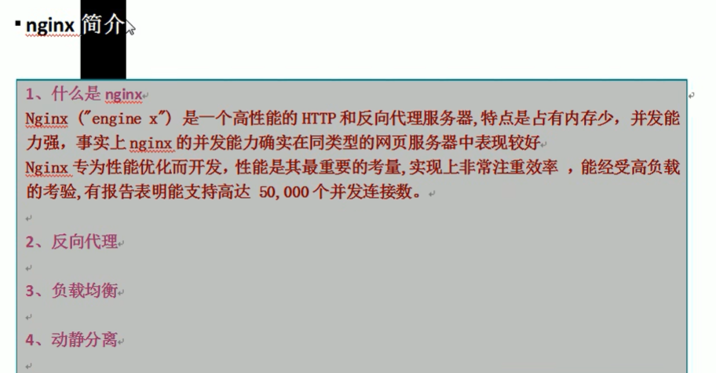

[官网](http://nginx.org/)

## 安装

### 安装 openssl 、zlib 、 gcc 依赖 
~~~json
yum -y install make zlib zlib-devel gcc-c++ libtool openssl openssl-devel
~~~
### 安装 pcre 依赖
wget http://downloads.sourceforge.net/project/pcre/pcre/8.37/pcre-8.37.tar.gz

解压压缩文件
使用命令 
~~~json
tar –xvf pcre-8.37.tar.gz
~~~

解压目录执行./configure 完成后, make &&make install
查看pcre依赖是否安装成功：pcre-config --version

### 安装 nginx
~~~json
tar -xvf nginx-1.24.0.tar.gz
 ./configure
 make && make install
~~~

安装完成进入目录 /usr/local/nginx/sbin/nginx 启动服务

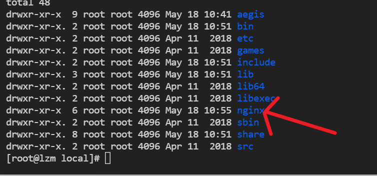

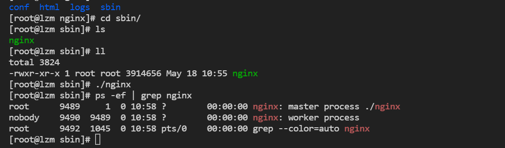

安装后，不能访问的，需要对防火墙进行设置
也可以直接关闭防火墙
~~~json
//关闭防火墙&&防火墙自启
systemctl stop firewalld && systemctl disable firewalld
~~~

~~~json
1.查看开放的端口

firewall-cmd --list-all

2.设置开放的端口号

firewall-cmd --add-service=http –permanent

firewall-cmd --add-port=80/tcp --permanent

3.设置之后需要重启防火墙

firewall-cmd --reload

~~~
安装成功界面

## Nginx常用命令
进入 nginx 目录中: 
~~~json
cd /usr/local/nginx/sbin
~~~
### 版本号
~~~
./nginx -v
~~~

### 启动nginx
~~~
启动nginx
./nginx
查看是否启动成功
ps -ef|grep nginx
~~~

### 停止
~~~
./nginx -s stop
~~~

### 重新加载nginx
~~~
./nginx -s reload
~~~

## 配置文件

位置
~~~json
/usr/local/nginx/conf/nginx.conf
~~~

文件内容:
~~~html
#user  nobody;
worker_processes  1;

#error_log  logs/error.log;
#error_log  logs/error.log  notice;
#error_log  logs/error.log  info;

#pid        logs/nginx.pid;

events {
    worker_connections  1024;
}

http {
    include       mime.types;
    default_type  application/octet-stream;

    #log_format  main  '$remote_addr - $remote_user [$time_local] "$request" '
    #                  '$status $body_bytes_sent "$http_referer" '
    #                  '"$http_user_agent" "$http_x_forwarded_for"';

    #access_log  logs/access.log  main;

    sendfile        on;
    #tcp_nopush     on;

    #keepalive_timeout  0;
    keepalive_timeout  65;

    #gzip  on;

    server {
        listen       80;
        server_name  localhost;

        #charset koi8-r;

        #access_log  logs/host.access.log  main;

        location / {
            root   html;
            index  index.html index.htm;
        }

        #error_page  404              /404.html;

        # redirect server error pages to the static page /50x.html
        #
        error_page   500 502 503 504  /50x.html;
        location = /50x.html {
            root   html;
        }

        # proxy the PHP scripts to Apache listening on 127.0.0.1:80
        #
        #location ~ \.php$ {
        #    proxy_pass   http://127.0.0.1;
        #}

        # pass the PHP scripts to FastCGI server listening on 127.0.0.1:9000
        #
        #location ~ \.php$ {
        #    root           html;
        #    fastcgi_pass   127.0.0.1:9000;
        #    fastcgi_index  index.php;
        #    fastcgi_param  SCRIPT_FILENAME  /scripts$fastcgi_script_name;
        #    include        fastcgi_params;
        #}

        # deny access to .htaccess files, if Apache's document root
        # concurs with nginx's one
        #
        #location ~ /\.ht {
        #    deny  all;
        #}
    }

    # another virtual host using mix of IP-, name-, and port-based configuration
    #
    #server {
    #    listen       8000;
    #    listen       somename:8080;
    #    server_name  somename  alias  another.alias;

    #    location / {
    #        root   html;
    #        index  index.html index.htm;
    #    }
    #}

    # HTTPS server
    #
    #server {
    #    listen       443 ssl;
    #    server_name  localhost;

    #    ssl_certificate      cert.pem;
    #    ssl_certificate_key  cert.key;

    #    ssl_session_cache    shared:SSL:1m;
    #    ssl_session_timeout  5m;

    #    ssl_ciphers  HIGH:!aNULL:!MD5;
    #    ssl_prefer_server_ciphers  on;

    #    location / {
    #        root   html;
    #        index  index.html index.htm;
    #    }
    #}

}
~~~

（1）全局块：配置服务器整体运行的配置指令
从配置文件开始到 events 块之间的内容，主要会设置一些影响 nginx 服务器整体运行的配置指令，主要包括配置运行 Nginx 服务器的用户（组）、允许生成的 worker process 数，进程 PID 存放路径、日志存放路径和类型以
及配置文件的引入等。

比如上面第一行配置的：
这是 Nginx 服务器并发处理服务的关键配置，worker_processes 值越大，可以支持的并发处理量也越多，但是会受到硬件、软件等设备的制约

（2）events 块：影响 Nginx 服务器与用户的网络连接 
events 块涉及的指令主要影响 Nginx 服务器与用户的网络连接，常用的设置包括是否开启对多 work process下的网络连接进行序列化，是否允许同时接收多个网络连接，选取哪种事件驱动模型来处理连接请求，每个 workprocess 可以同时支持的最大连接数等。
上述例子就表示每个 work process 支持的最大连接数为 1024.这部分的配置对 Nginx 的性能影响较大，在实际中应该灵活配置

（3）http 块
这算是 Nginx 服务器配置中最频繁的部分，代理、缓存和日志定义等绝大多数功能和第三方模块的配置都在这里。
需要注意的是：http 块也可以包括 http 全局块、server 块。
http 全局块
配置的指令包括文件引入、MIME-TYPE 定义、日志自定义、连接超时时间、单链接请求数上限等。

server 块 
这块和虚拟主机有密切关系，虚拟主机从用户角度看，和一台独立的硬件主机是完全一样的，该技术的产生是为了节省互联网服务器硬件成本。每个 http 块可以包括多个 server 块，而每个 server 块就相当于一个虚拟主机。而每个 server 块也分为全局 server 块，以及可以同时包含多个 locaton 块。

## nginx反向代理
1、实现效果
打开浏览器，在浏览器地址栏输入地址ip，跳转到 liunx 系统 [tomcat](https://tomcat.apache.org/download-10.cgi) 主页面中

2、准备工作
~~~json
1.在 liunx 系统安装 tomcat，使用默认端口 8080
tomcat 安装文件放到 liunx 系统中，解压
进入 tomcat 的 bin 目录中，./startup.sh 启动 tomcat 服务器

2.对外开放访问的端口 
firewall-cmd --add-port=8080/tcp --permanent
firewall-cmd –reload

查看已经开放的端口号
firewall-cmd --list-all

3.在 windows 系统中通过浏览器访问 tomcat 服务器
~~~
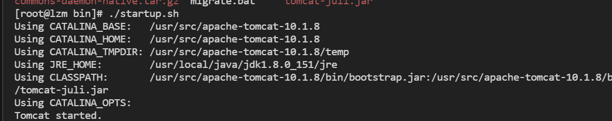

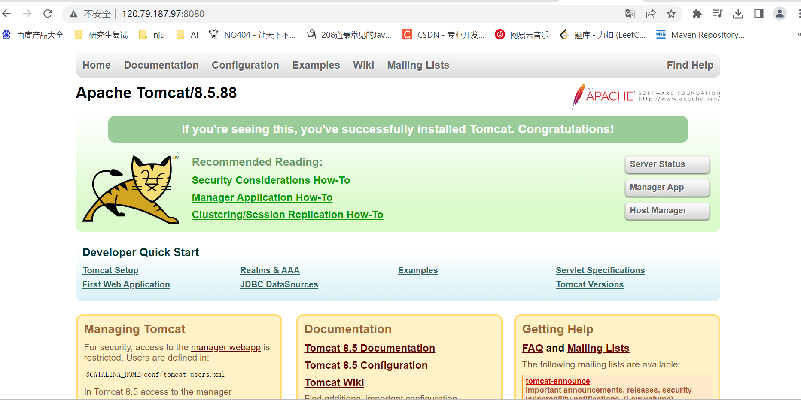

3.在 nginx 进行请求转发的配置（反向代理配置）
~~~json
proxy_pass http://127.0.0.1:8080;
~~~
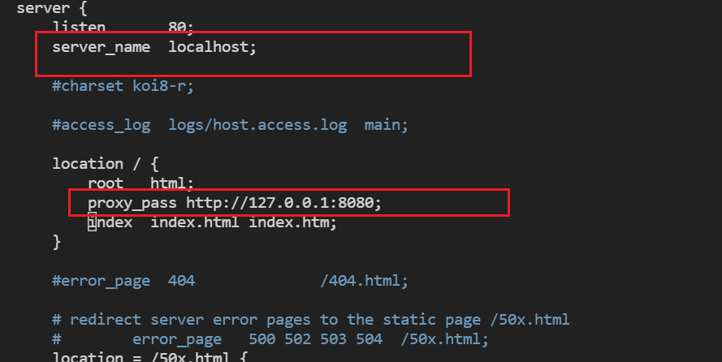

## Nginx 反向代理实例 2

1、实现效果
使用 nginx 反向代理，根据访问的路径跳转到不同端口的服务中

nginx 监听端口为 9001，

访问 http://192.168.17.129:9001/edu/ 直接跳转到 127.0.0.1:8080

访问 http:// 192.168.17.129:9001/vod/ 直接跳转到 127.0.0.1:8081

2、准备工作
（1）准备两个 tomcat 服务器，一个 8080 端口，一个 8081 端口
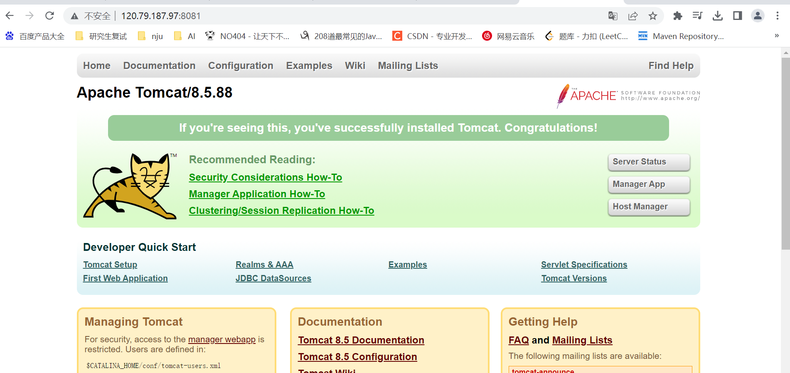

（2）创建文件夹和测试页面
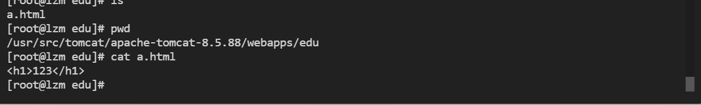

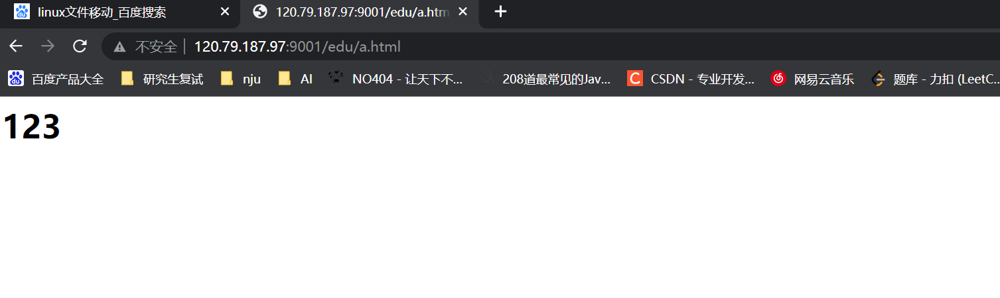

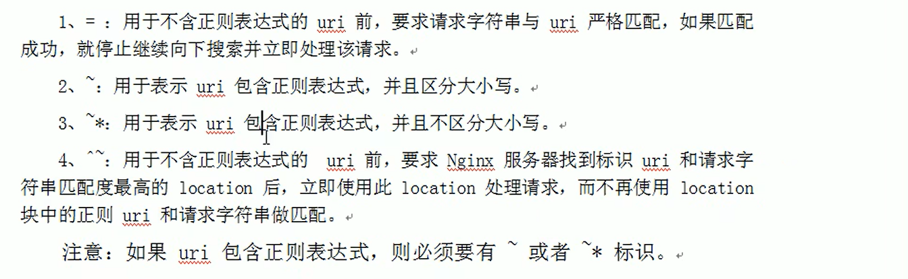

配置server

~~~json
    server {
        listen       9001;
        server_name  localhost;

       location ~ /edu/ {
           proxy_pass http://127.0.0.1:8080;
        }

        location ~ /vod/ {
           proxy_pass http://127.0.0.1:8081;
        }
    }
~~~
## 负载均衡
1、实现效果 
（1）浏览器地址栏输入地址 http://XXXX/edu/a.html，负载均衡效果，平均 8080和 8081 端口中

2、准备工作
（1）准备两台 tomcat 服务器，一台 8080，一台 8081

（2）在两台 tomcat 里面 webapps 目录中，创建名称是 edu 文件夹，在 edu 文件夹中创建页面 a.html，用于测试

3、在 nginx 的配置文件中进行负载均衡的配置
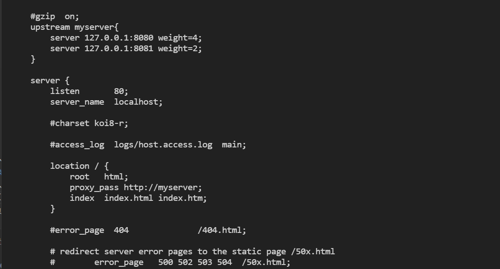

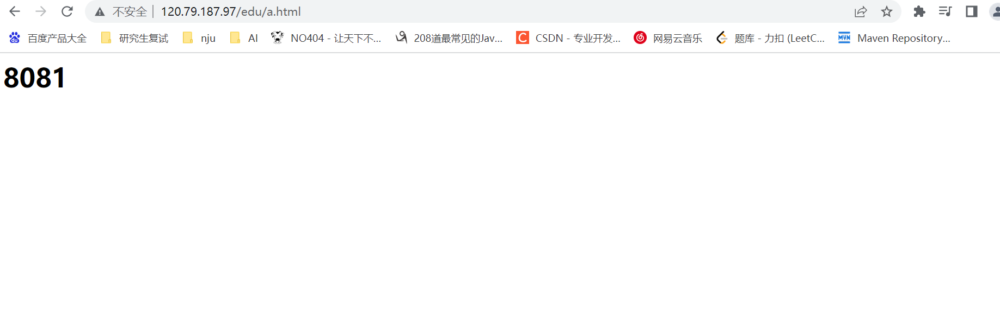
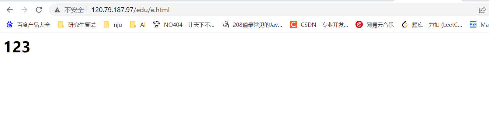

4、nginx 分配服务器策略
第一种 轮询（默认）
每个请求按时间顺序逐一分配到不同的后端服务器，如果后端服务器 down 掉，能自动剔除。

第二种 weight
weight 代表权重默认为 1,权重越高被分配的客户端越多

第三种 ip_hash
每个请求按访问 ip 的 hash 结果分配，这样每个访客固定访问一个后端服务器

第四种 fair（第三方）
按后端服务器的响应时间来分配请求，响应时间短的优先分配。

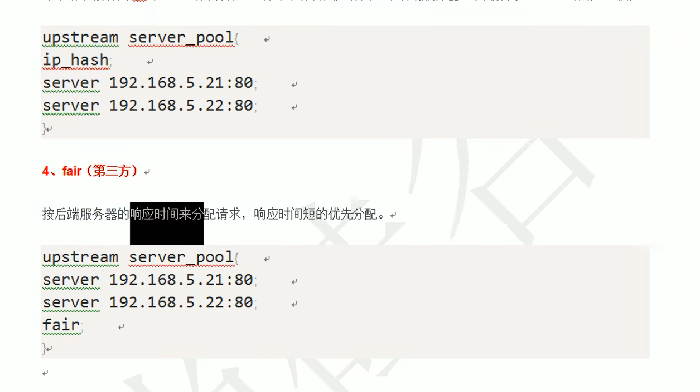

## 动静分离
~~~json
  location /html/ {
            root /learn/nginx/;
            #proxy_pass http://myserver;
            index  index.html index.htm;
        }
        location /image/ {
            root /learn/nginx/;
           #proxy_pass http://127.0.0.1:8081;
           autoindex on;
        }
~~~

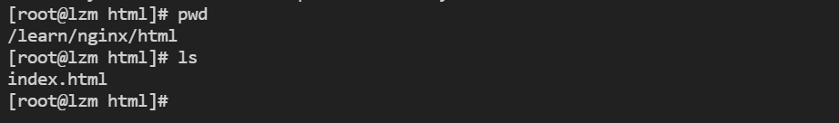

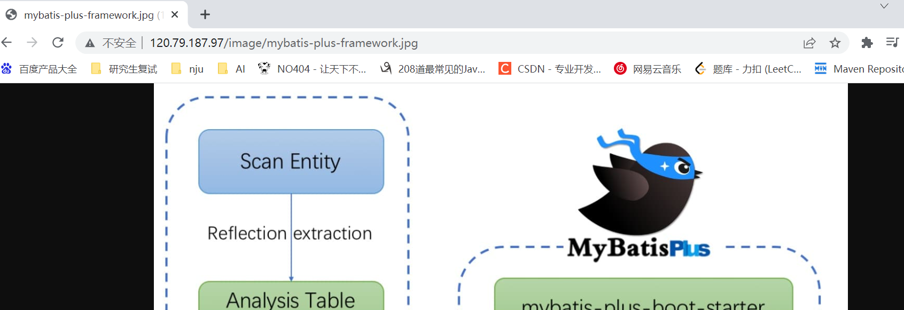

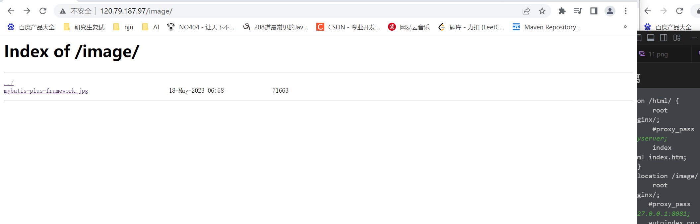

## 高可用

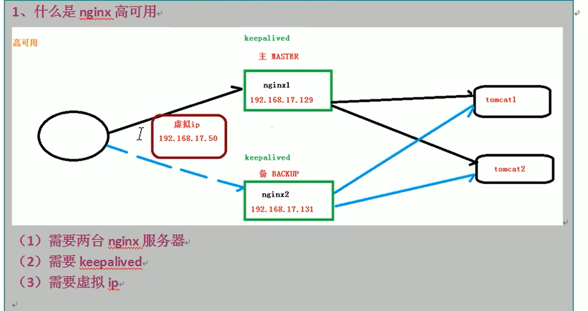