## 简介
[学习视频](https://www.bilibili.com/video/BV1WY4y1H7d3)

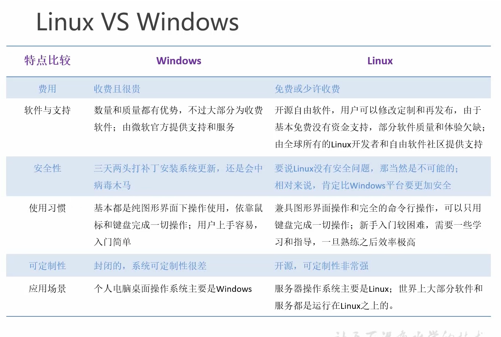

[下载](http://isoredirect.centos.org/centos/7/isos/x86_64/)

[镜像](https://mirrors.aliyun.com/centos/)

## Linux目录结构
Linux 的一切资源都挂载在 / 节点下

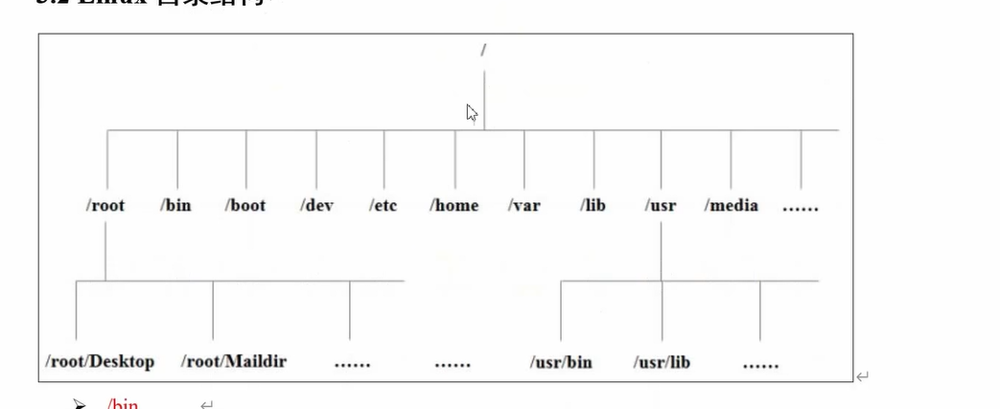
~~~json
/bin：Binary（二进制）的缩写，该目录存放着最经常使用的命令。
/boot： 启动 Linux 时使用的一些核心文件，包括一些连接文件以及镜像文件。（不要动）
/dev ： Device（设备）的缩写, 存放的是外部设备（访问设备的方式和访问文件的方式是相同的）。
/etc： 用来存放所有的系统管理所需要的配置文件和子目录。
/home：用户的主目录。每个用户都有一个自己的目录，一般该目录名是以用户的账号命名的。
/lib：系统最基本的动态连接共享库。其作用类似于 Windows 里的 DLL 文件。（不要动）
/lost+found：一般情况下是空的，当系统非法关机后，这里就存放了一些文件。（存放突然关机的一些文件）
/media：系统会自动识别一些设备，例如U盘、光驱等等，当识别后，会把识别的设备挂载到这个目录下。
/mnt：供用户临时挂载别的文件系统，我们可以将光驱挂载在该目录上，然后进入该目录就可以查看光驱里的内容了。  （把一些本地的文件挂载在这个文件下）
/opt：主机额外安装软件所摆放的目录。比如安装一个 Oracle 数据库就可以放到这个目录下。默认是空的。
/proc：虚拟的目录，它是系统内存的映射，可以通过直接访问这个目录来获取系统信息。（不用管）
/root：系统管理员，也称作超级权限者的用户主目录。
/sbin：s 就是 super user 的意思，这里存放的是系统管理员使用的系统管理程序。
/srv：服务启动之后需要提取的数据。
/sys：这是 Linux2.6 内核的一个很大的变化。该目录下安装了 2.6 内核中新出现的一个文件系统 sysfs。
/tmp：用来存放临时文件。
/usr：用户的应用程序和文件都放在这个目录下，类似于 Windows 下的 program files 目录。
    /bin： 系统用户使用的应用程序。
    /sbin： 超级用户使用的比较高级的管理程序和系统守护程序。
    /src： 内核源代码默认的放置目录。
/var：存放着在不断扩充着的东西，一般将那些经常被修改的目录放在这个目录下。包括各种日志文件。
/run：一个临时文件系统，存储系统启动以来的信息。当系统重启时，这个目录下的文件应该被删掉或清除。
/www: 存放服务器网站相关的资源，环境，网站的项目
~~~

## 命令

### vim文本普通模式
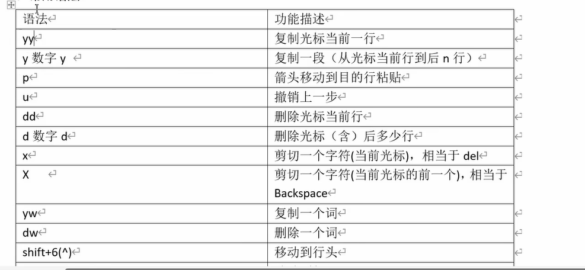
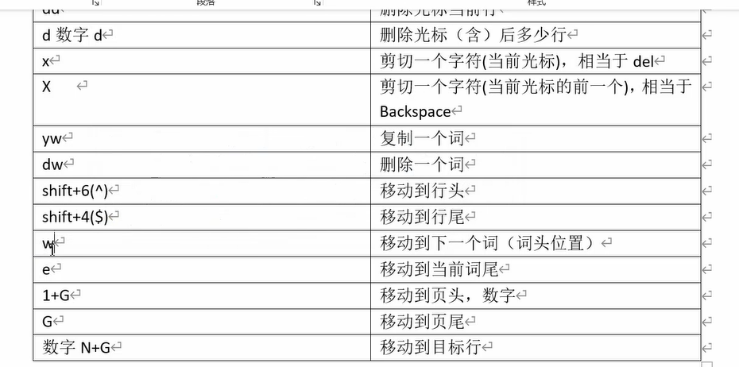

### vim 命令模式 
~~~json 
set nu
set nonu
~~~

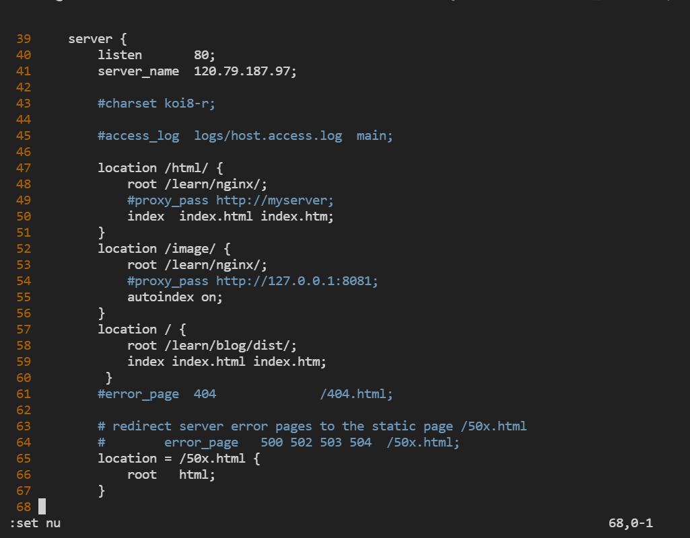

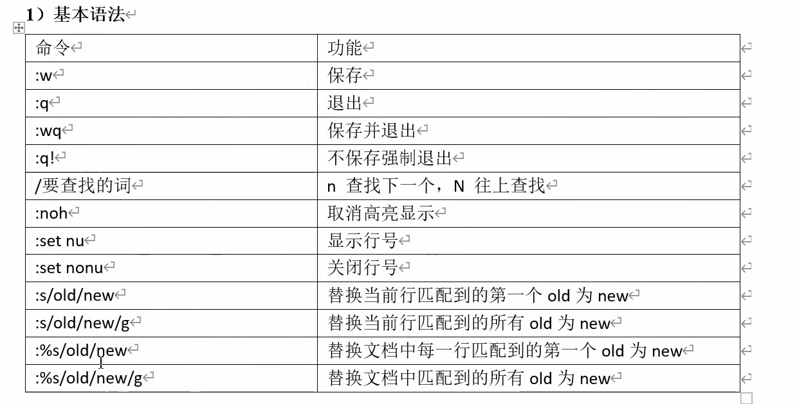

## 网络配置
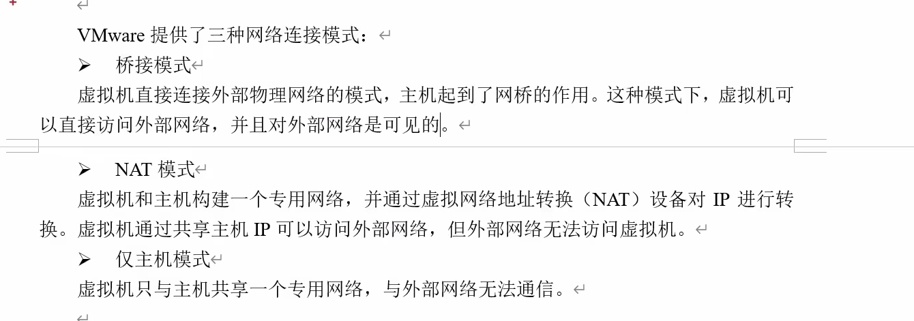

虚拟机配置地址
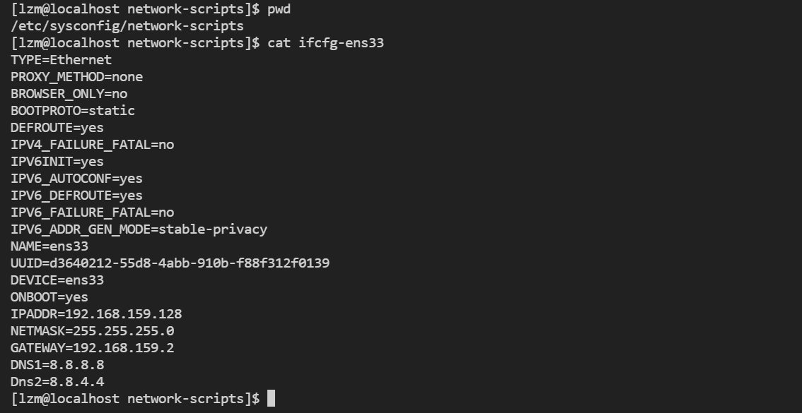

网络重启
~~~json
service network restart
systemctl restart network
~~~

修改主机名
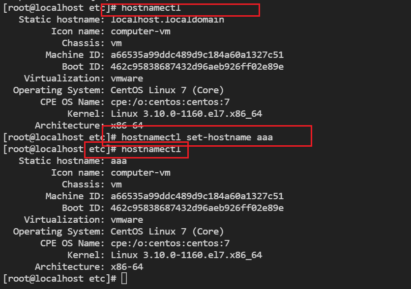

主机名映射
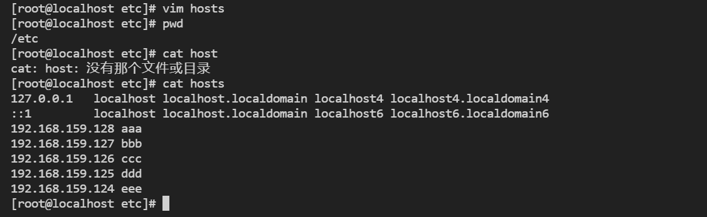

## 系统管理

防火墙命令
~~~json
systemctl status firewalld

systemctl stop|start firewalld

systemctl disable|enable firewalld

~~~

关机
~~~json
sync # 将数据由内存同步到硬盘中。
 
shutdown # 关机指令，你可以man shutdown 来看一下帮助文档。例如你可以运行如下命令关机：
 
shutdown –h 10 # 这个命令告诉大家，计算机将在10分钟后关机
 
shutdown –h now # 立马关机
 
shutdown –h 20:25 # 系统会在今天20:25关机
 
shutdown –h +10 # 十分钟后关机
 
shutdown –r now # 系统立马重启
 
shutdown –r +10 # 系统十分钟后重启
 
reboot # 就是重启，等同于 shutdown –r now
 
halt # 关闭系统，等同于shutdown –h now 和 poweroff
~~~

### 工具

~~~json
清屏  clear

文档查看 man eg: man ls

查看历史命令  history

使用说明  --help
~~~

## 文件目录命令

### 目录管理
~~~json
显示当前目录 pwd

列出目录 ls 
    -a：全部的文件，连同隐藏文件（开头为 . 的文件） 一起列出来（常用）。
    -l：长数据串列出，包含文件的属性与权限等等数据（常用）。
    -i：显示文件的 inode 节点信息

切换目录 cd

创建目录 mkdir

删除目录 rmdir
递归删除多个目录-p参数
~~~

### 文件管理

~~~json
创建文件  touch /vim

复制文件或目录 cp 来源(source) 目的(destination)
-r 递归复制 

删除文件或目录 rm
    -f ：就是 force 的意思，忽略不存在的文件，不会出现警告信息；  强制删除
    -i ：互动模式，在删除前会询问使用者是否动作
    -r ：递归删除啊！最常用在目录的删除了！这是非常危险的选项！！！

移动文件或者目录 mv  （重命名）

文件内容查看
cat 由第一行开始显示文件内容   用来读取文章，或者读取配置文件
tac 从最后一行开始显示，可以看出 tac 是 cat 的倒着写！
nl 显示的时候，顺道输出行号！     看代码
more 一页一页的显示文件内容（空格翻页，enter向下看一行，：f显示行号）
less 与 more 类似，但是比 more 更好的是，他可以往前翻页！（空格翻页，上下键翻页，退出 q命令，查找字符串 / 向下查询的字符 ？向上查询 n搜寻下一个 N向上）
head 只看头几行  -n控制行数
tail 只看尾巴几行  -n控制行数
tail -f (实时跟踪文件)

输出内容到控制台 echo -e "hello\nworld"
~~~
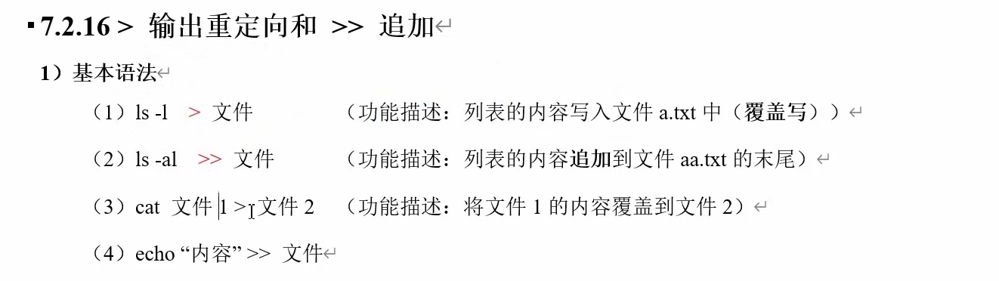

~~~json
硬链接 ln   软链接 ln-s  
硬链接：A---B，假设B是A的硬链接，那么他们两个指向了同一个文件！允许一个文件拥有多个路径，用户可以通过这种机制建立硬链接到一些重要文件上，防止误删！

软链接：类似Window下的快捷方式，删除的源文件，快捷方式也访问不了！
~~~

### 用户权限
~~~json
添加账号 useradd (admin)

查看账号 id (admin)

删除帐号 userdel (admin)

修改帐号 usermod

用户的密码设置  passwd + 用户

切换用户：su username 

从普通用户切换到root用户，还可以使用命令：sudo su
#表示超级用户，也就是root用户

~~~
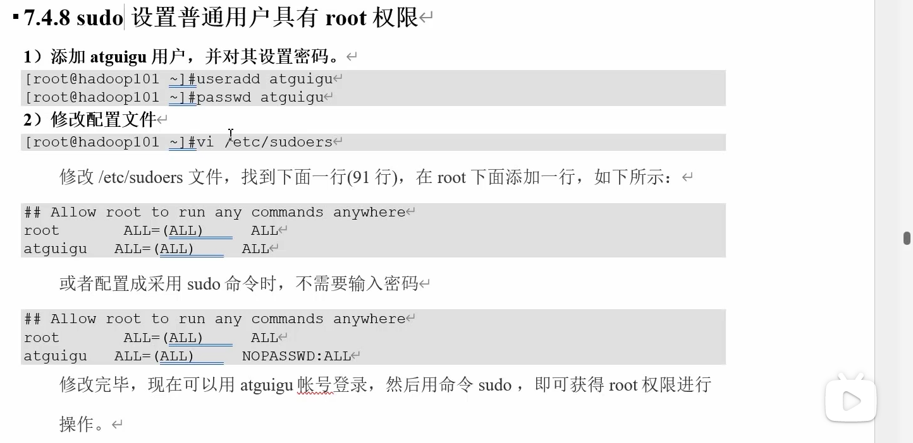

用户组
~~~json
每个用户都有一个用户组，系统可以对一个用户组中的所有用户进行集中管理（开发、测试、运维、root）。不同Linux 系统对用户组的规定有所不同，

用户组的管理涉及用户组的添加、删除和修改。组的增加、删除和修改实际上就是对/etc/group文件的更新。

创建一个用户组 groupadd命令
    -m： 自动创建者用户的主目录 /home/xiaohe
    -G:   给用户分配组！ 

删除用户组，使用groupdel命令

修改用户组的权信息和名字  groupmod -g -n
# 此命令将组group2的组标识号修改为102。
groupmod -g 102 group2
 
# 将组group2的标识号改为10000，组名修改为group3。
groupmod –g 10000 -n group3 group

切换组   newgrp

~~~

### 文件权限
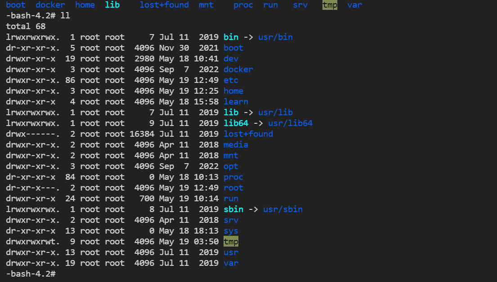

在Linux中第一个字符代表这个文件是目录、文件或链接文件等等：

当为[ d ]则是目录

当为[ - ]则是文件；

若是[ l ]则表示为链接文档 ( link file )；

若是[ b ]则表示为装置文件里面的可供储存的接口设备 ( 可随机存取装置 )；

若是[ c ]则表示为装置文件里面的串行端口设备，例如键盘、鼠标 （一次性读取装置 ）

接下来的字符中，以三个为一组，且均为『rwx』 的三个参数的组合。

其中，[ r ]代表可读(read)、[ w ]代表可写(write)、[ x ]代表可执行(execute)。

要注意的是，这三个权限的位置不会改变，如果没有权限，就会出现减号[ - ]而已。

第0位确定文件类型，第1-3位确定属主（该文件的所有者）拥有该文件的权限。第4-6位确定属组（所有者的同组用户）拥有该文件的权限，第7-9位确定其他用户拥有该文件的权限

chmod [-R] xyz 文件或目录
-R：递归更改文件属组，就是在更改某个目录文件的属组时，如果加上-R的参数，那么该目录下的所有文件的属组都会更改。

## 查找
find
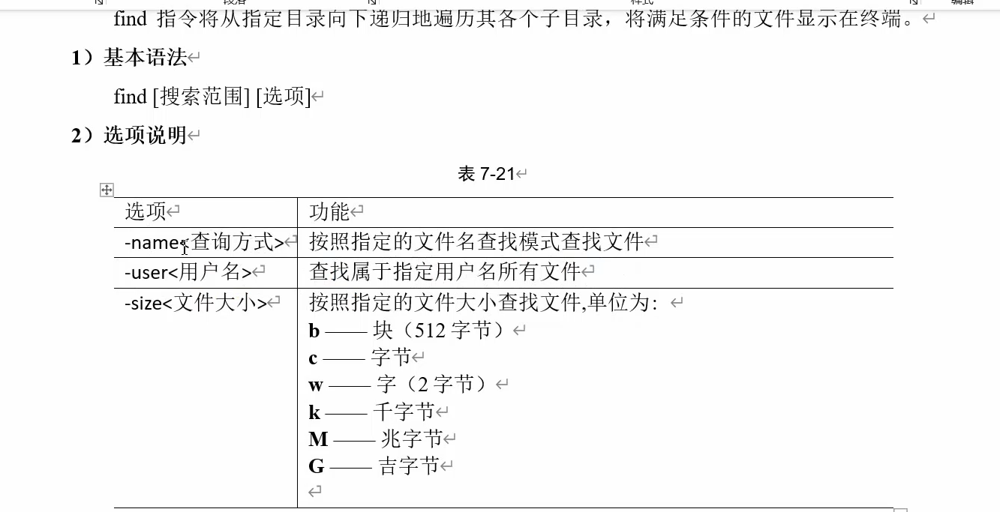
locate
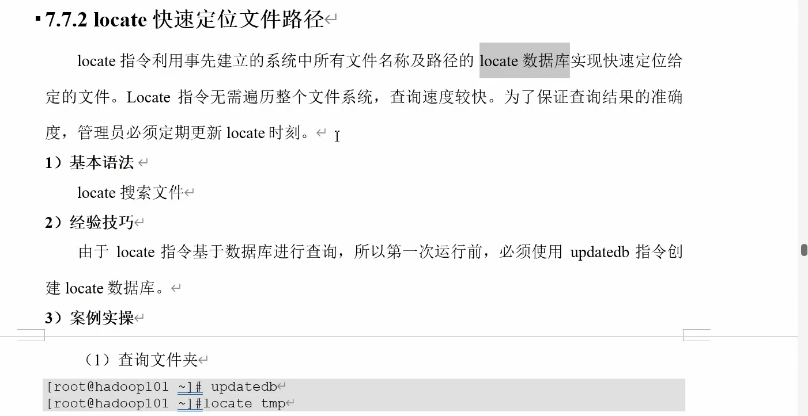
grep
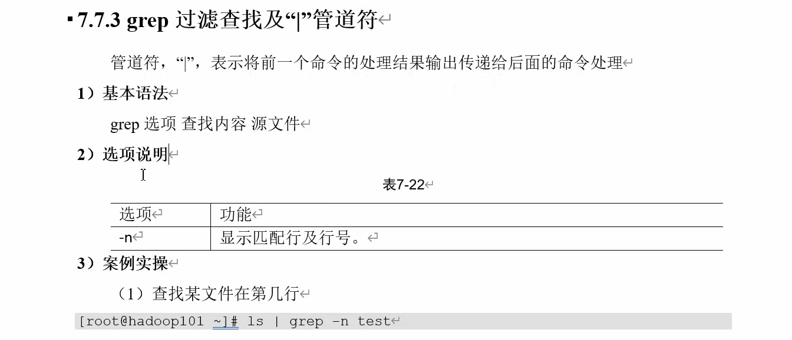
~~~json
ls | grep -n server nginx.conf
~~~
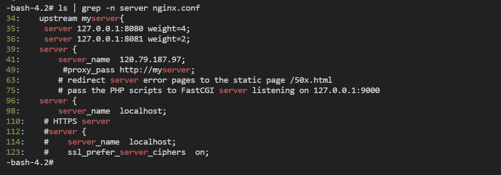

## 压缩
gzip
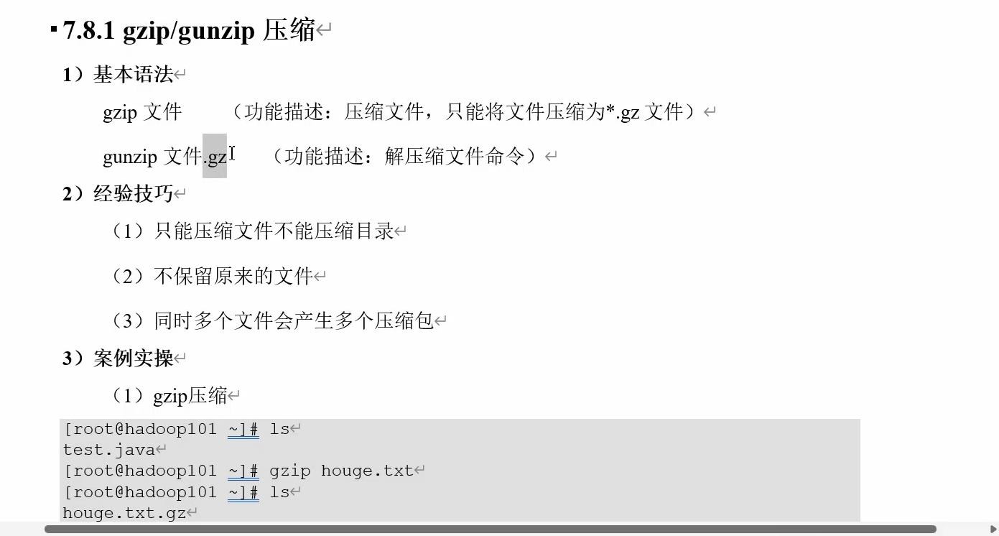

unzip
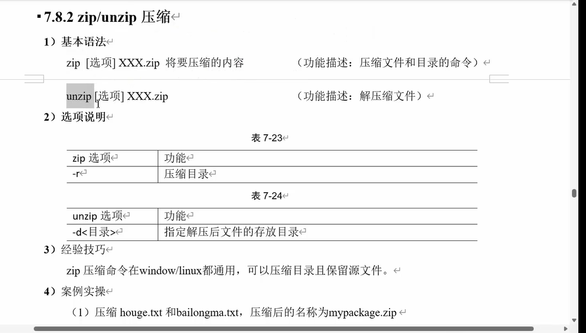

tar
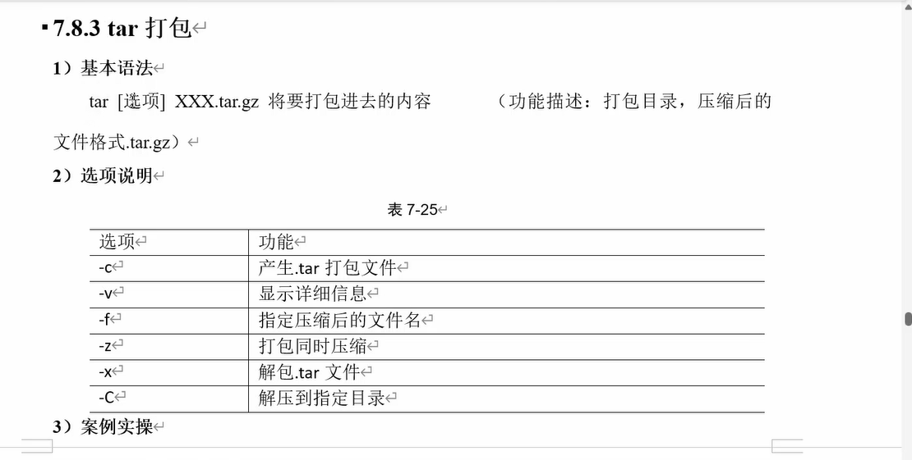
~~~json
// 打包
tar -zcvf temp.tar.gz  nginx/
// 解压(到目录)
tar -xvf temp.tar.gz (-C xxx)
~~~

## 磁盘管理
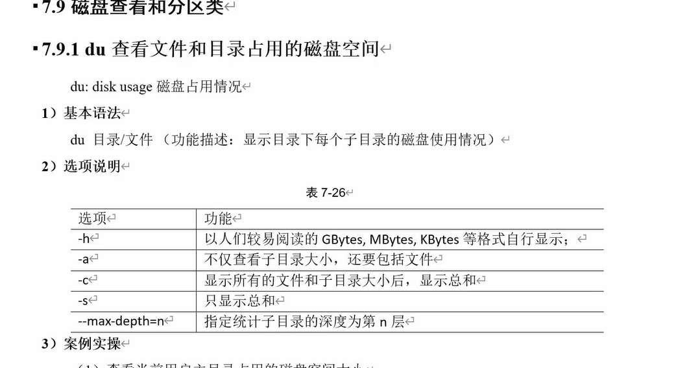
~~~json
查看文件总容量
ls -lh 

du -sh 总和
du --max-depth=1 -ah 子目录大小
~~~

查看磁盘使用情况

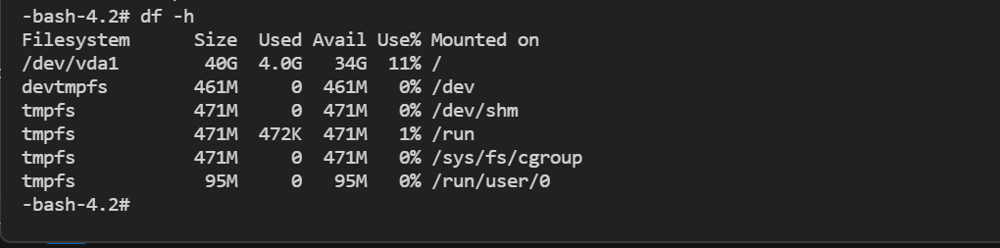

内存使用情况
~~~
free -h
~~~

设备挂载情况
~~~json
lsblk -f
~~~

## 进程管理
~~~json
ps 查看当前系统正在执行的各种进程的信息 

选项与参数：

-a ：显示当前终端运行的所有进程信息(当前的进程一个)
-u :  以用户的信息显示进程
-x :  显示后台运行进程的参数！  java -jar web.jar -xx:

ps - aux | grep

ps-ef： 可以查看到父进程的信息

进程树
 pstree -pu
        -p 显示父id

        u  显示用户组

 kill -9 进程的id       

~~~
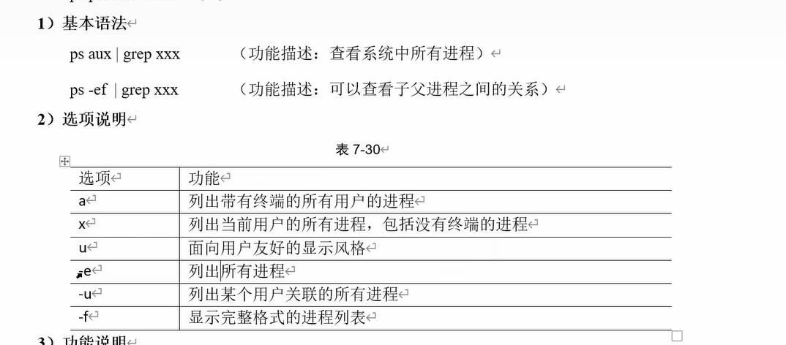

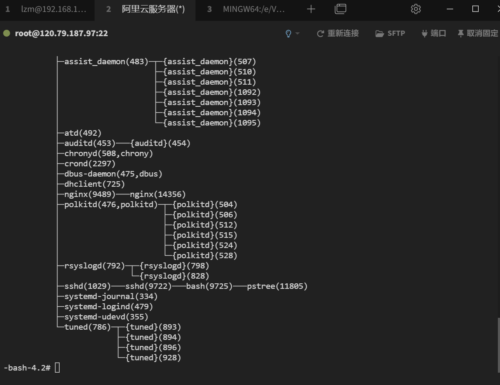