## 简介
Gradle 是一款Google 推出的基于 JVM、通用灵活的项目构建工具，支持 Maven，JCenter 多种第三方仓库;支持传递性依赖管理、废弃了繁杂的xml 文件，转而使用简洁的、支持多种语言(例如：java、groovy 等)的 build 脚本文件
[官网地址] (https://gradle.org/)

## 常见的构建工具
Ant: 2000 年 Apache 推出的纯Java 编写构建工具，通过 xml[build.xml]文件管理项目优点：使用灵活，速度快(快于 gradle 和 maven)，
缺点：Ant 没有强加任何编码约定的项目目录结构,开发人员需编写繁杂XML 文件构建指令,对开发人员是一个挑战。
Maven: 2004 年Apache 组织推出的再次使用xml 文件[pom.xml]管理项目的构建工具。
优点: 遵循一套约定大于配置的项目目录结构，使用统一的GAV 坐标进行依赖管理,侧重于包管理。缺点：项目构建过程僵化,配置文件编写不够灵活、不方便自定义组件,构建速度慢于 gradle。
Gradle: 2012 年Google 推出的基于Groovy 语言的全新项目构建工具，集合了Ant 和 Maven 各自的优势。
优点：集 Ant 脚本的灵活性+Maven 约定大于配置的项目目录优势,支持多种远程仓库和插件,侧重于大项目构建。缺点：学习成本高、资料少、脚本灵活、版本兼容性差等。

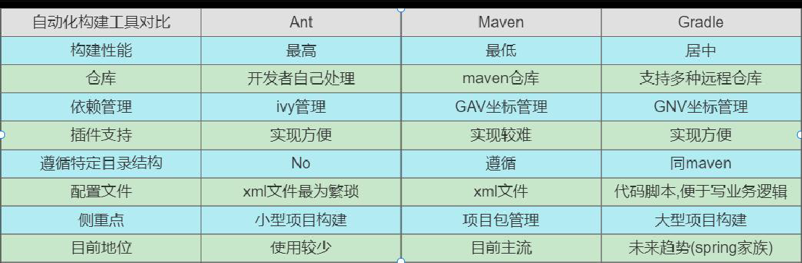

## 安装
### 安装说明
~~~json
Gradle官网：https://gradle.org/
Gradle官方下载安装教程页面：https://gradle.org/install/
Gradle官方用户手册：https://docs.gradle.org/current/userguide/userguide.html
~~~
SpringBoot 官方文档明确指出,目前SpringBoot 的 Gradle 插件需要gradle6.8 版本及以上，所以我们这里选择 7.x 版本。
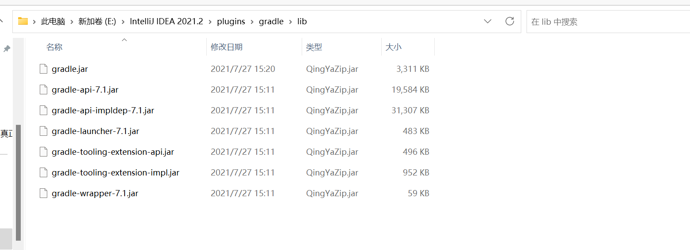

具体参考文档:https://docs.spring.io/spring-boot/docs/2.5.0/gradle-plugin/reference/htmlsingle/#getting-started
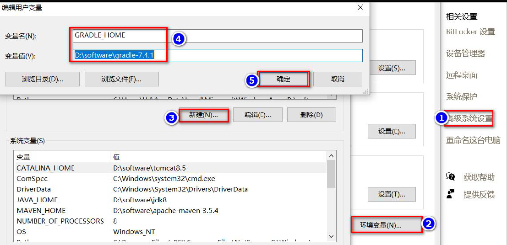

特别注意：这里我们接着再配置一个GRADLE_USER_HOME 环境变量:
GRADLE_USER_HOME 相当于配置Gradle 本地仓库位置和 Gradle Wrapper 缓存目录。
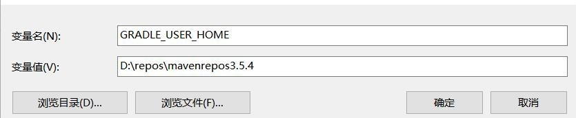
## Gradle项目目录结构
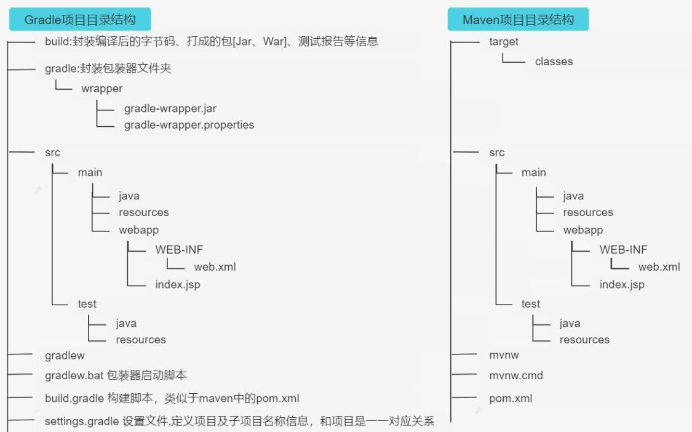

## 创建第一个项目

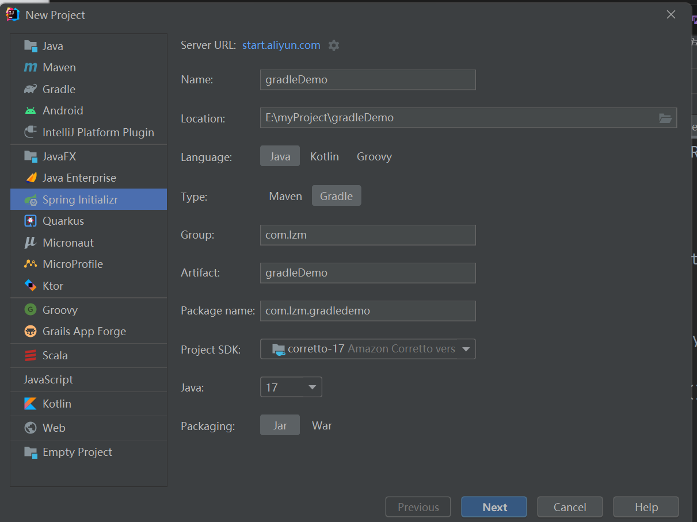

### Gradle 中的常用指令
Gradle 常用命令说明:
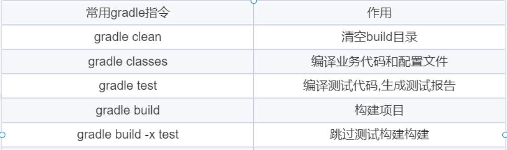

### 修改maven 下载源
Gradle 自带的Maven 源地址是国外的，该Maven 源在国内的访问速度是很慢的，除非使用了特别的手段。一般情况下，我们建议使用国内的第三方开放的Maven 源或企业内部自建Maven 源。
认识init.d 文件夹
我们可以在gradle 的init.d 目录下创建以.gradle 结尾的文件，.gradle 文件可以实现在build 开始之前执行，所以你可以在
这个文件配置一些你想预先加载的操作。
在init.d 文件夹创建init.gradle 文件

~~~xml
allprojects {
    repositories {
        mavenLocal()
        maven { name "Alibaba" ; url "https://maven.aliyun.com/repository/public" } 
        maven { name "Bstek" ; url "https://nexus.bsdn.org/content/groups/public/" } 
        mavenCentral()
    }
    
    buildscript {
        repositories {
            maven { name "Alibaba" ; url 'https://maven.aliyun.com/repository/public' } 
            maven { name "Bstek" ; url 'https://nexus.bsdn.org/content/groups/public/' } 
            maven { name "M2" ; url 'https://plugins.gradle.org/m2/' }
        }
    }
}
~~~
仓库地址说明

mavenLocal(): 指定使用maven本地仓库，而本地仓库在配置maven时settings文件指定的仓库位置。如E:/repository，gradle 查找jar包顺序如下：USER_HOME/.m2/settings.xml >> M2_HOME/conf/settings.xml >> USER_HOME/.m2/repository

maven { url 地址}，指定maven仓库，一般用私有仓库地址或其它的第三方库【比如阿里镜像仓库地址】。阿里云仓库地址请参考：https://developer.aliyun.com/mvn/guide

mavenCentral()：这是Maven的中央仓库，无需配置，直接声明就可以使用。

总之, gradle可以通过指定仓库地址为本地maven仓库地址和远程仓库地址相结合的方式，避免每次都会去远程仓库下载依赖库。这种方式也有一定的问题，如果本地maven仓库有这个依赖，就会从直接加载本地依赖，如果本地仓库没有该依赖，那么还是会从远程下载。但是下载的jar不是存储在本地maven仓库中，而是放在自己的缓存目录中，默认在USER_HOME/.gradle/caches目录,当然如果我们配置过GRADLE_USER_HOME环境变量，则会放在GRADLE_USER_HOME/caches目录,那么可不可以将gradle caches指向maven repository。我们说这是不行的，caches下载文件不是按照maven仓库中存放的方式。

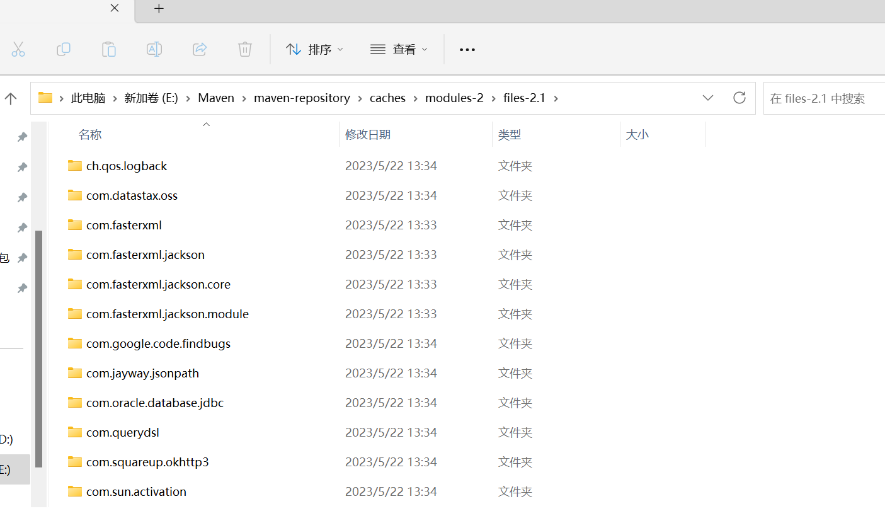

### Wrapper 包装器
radle Wrapper 实际上就是对 Gradle 的一层包装，用于解决实际开发中可能会遇到的不同的项目需要不同版本的 Gradle
问题。例如：把自己的代码共享给其他人使用，可能出现如下情况:
1. 对方电脑没有安装 gradle
2. 对方电脑安装过 gradle，但是版本太旧了
这时候，我们就可以考虑使用 Gradle Wrapper 了。这也是官方建议使用 Gradle Wrapper 的原因。实际上有了 Gradle Wrapper 之后，我们本地是可以不配置 Gradle 的,下载Gradle 项目后，使用 gradle 项目自带的wrapper 操作也是可以的。
那如何使用Gradle Wrapper 呢？
项目中的gradlew、gradlew.cmd脚本用的就是wrapper中规定的gradle版本。参见源码
而我们上面提到的gradle指令用的是本地gradle,所以gradle指令和gradlew指令所使用的gradle版本有可能是不一样的。
gradlew、gradlew.cmd的使用方式与gradle使用方式完全一致，只不过把gradle指令换成了gradlew指令。
当然,我们也可在终端执行 gradlew 指令时，指定指定一些参数,来控制 Wrapper 的生成，比如依赖的版本等，如下：
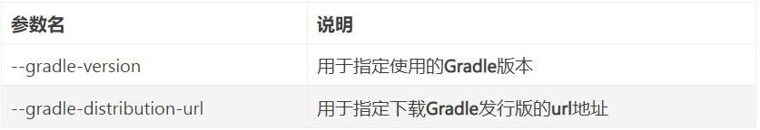
GradleWrapper 的执行流程：
1. 当我们第一次执行 ./gradlew build 命令的时候，gradlew 会读取 gradle-wrapper.properties 文件的配置信息
2. 准确的将指定版本的 gradle 下载并解压到指定的位置(GRADLE_USER_HOME目录下的wrapper/dists目录中)
3. 并构建本地缓存(GRADLE_USER_HOME目录下的caches目录中),下载再使用相同版本的gradle就不用下载了4.之后执行的 ./gradlew 所有命令都是使用指定的 gradle 版本
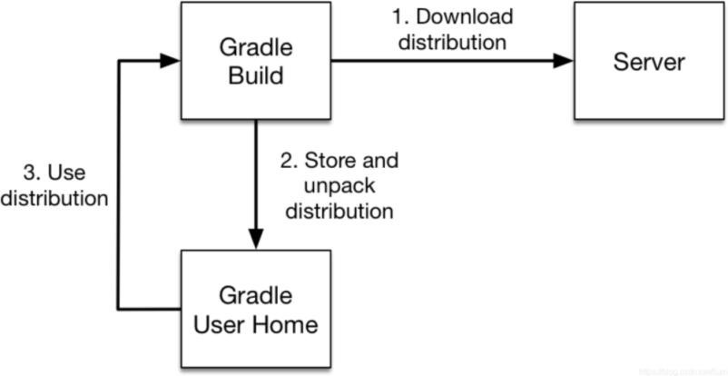

gradle-wrapper.properties 文件解读:
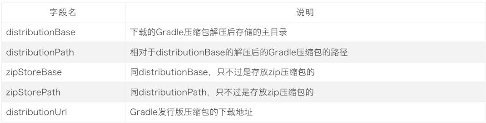

## Groovy

在某种程度上，Groovy 可以被视为Java 的一种脚本化改良版,Groovy 也是运行在 JVM 上，它可以很好地与 Java 代码及其相关库进行交互操作。它是一种成熟的面向对象编程语言，既可以面向对象编程，又可以用作纯粹的脚本语言。大多数有效的 Java 代码也可以转换为有效的 Groovy 代码，Groovy 和 Java 语言的主要区别是：完成同样的任务所需的Groovy 代码比 Java 代码更少

● 功能强大，例如提供了动态类型转换、闭包和元编程（metaprogramming）支持
● 支持函数式编程，不需要main 函数
● 默认导入常用的包
● 类不支持 default 作用域,且默认作用域为public。
● Groovy 中基本类型也是对象，可以直接调用对象的方法。
● 支持DSL（Domain Specific Languages 领域特定语言）和其它简洁的语法，让代码变得易于阅读和维护。
● Groovy 是基于Java 语言的，所以完全兼容Java 语法,所以对于java 程序员学习成本较低。详细了解请参考：http://www.groovy-lang.org/documentation.html

###  安装
下载地址: https://groovy.apache.org/download.html
解压配置环境变量：
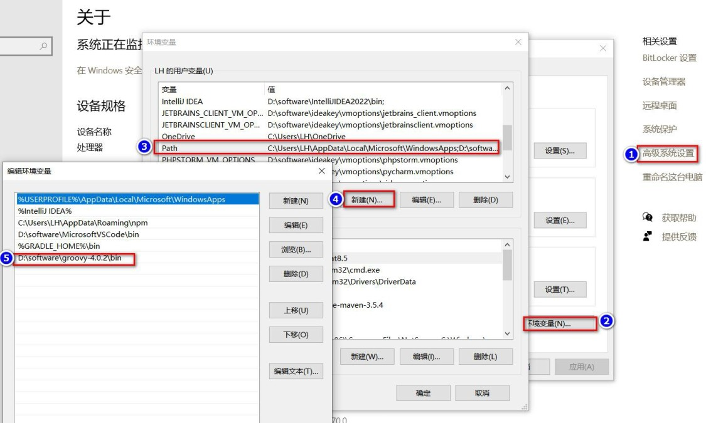

### 基本语法
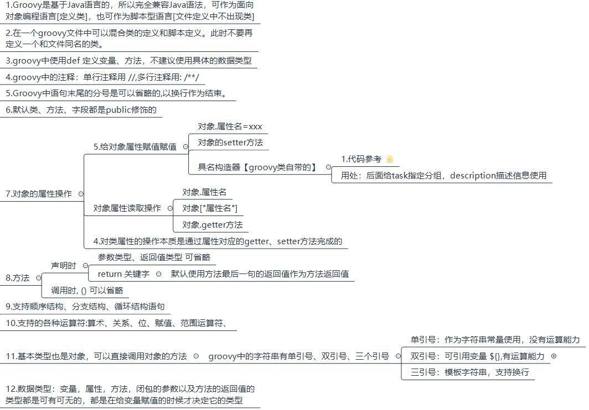