## 简介
spring是一个开源的轻量级Java开发应用框架，可以简化企业级应用开发。Spring解决了开发者在JavaEE开发
中遇到的许多常见的问题，提供了功能强大IOC、AOP及Web MVC等功能。是当前企业中Java开发几乎不能
缺少的框架之一。Spring的生态及其完善，不管是Spring哪个领域的解决方案都是依附于在Spring 
Framework基础框架的。

[官网](www.spring.io)

# IOC

## IoC、DI和AOP
面试题：IoC 和 DI 的关系？
首先，先回答IoC和DI的是什么：
IoC： Inversion of Control，控制反转，将Bean的创建权由原来程序反转给第三方
DI：Dependency Injection，依赖注入，某个Bean的完整创建依赖于其他Bean（或普通参数）的注入
其次，在回答IoC和DI的关系：
第一种观点：IoC强调的是Bean创建权的反转，而DI强调的是Bean的依赖关系，认为不是一回事
第二种观点：IoC强调的是Bean创建权的反转，而DI强调的是通过注入的方式反转Bean的创建权，认为DI
是IoC的其中一种实现方式。

AOP，Aspect Oriented Programming，面向切面编程，是对面向对象编程OOP的升华。OOP是纵向对一个
事物的抽象，一个对象包括静态的属性信息，包括动态的方法信息等。而AOP是横向的对不同事物的抽象，属
性与属性、方法与方法、对象与对象都可以组成一个切面，而用这种思维去设计编程的方式叫做面向切面编程。

三种思想总结
1）IoC控制反转，是将程序创建Bean的权利反转给第三方；
2）DI依赖注入，某个完整Bean需要依赖于其他Bean（或属性）的注入；
3）AOP面向切面编程，用横向抽取方法（属性、对象等）思想，组装成一个功能性切面

## BeanFactory和ApplicationContext
### 流程简介
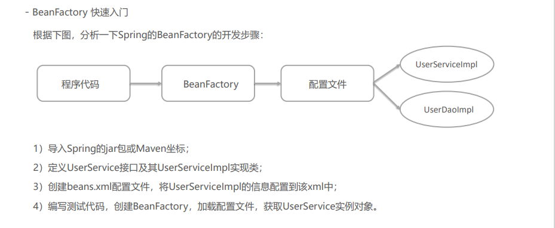

1）导入Spring的jar包或Maven坐标
~~~xml
<!--Spring核心-->
<dependency>
    <groupId>org.springframework</groupId>
    <artifactId>spring-context</artifactId>
    <version>5.3.7</version>
</dependency>
~~~

2）定义UserService接口及其UserServiceImpl实现类
~~~java
public interface UserService {}
public class UserServiceImpl implements UserService {}
~~~

3）创建beans.xml配置文件，将UserServiceImpl的信息配置到该xml中
~~~xml
<bean id="userService" class="com.itheima.service.impl.UserServiceImpl"></bean>
~~~

4）编写测试代码，创建BeanFactory，加载配置文件，获取UserService实例对象

~~~java
//创建BeanFactory
DefaultListableBeanFactory beanFactory = new DefaultListableBeanFactory();
//创建读取器
XmlBeanDefinitionReader reader = new XmlBeanDefinitionReader(beanFactory);
//加载配置文件
reader.loadBeanDefinitions("beans.xml");
//获取Bean实例对象
UserDao userService = (UserService) beanFactory.getBean("userService");
~~~

~~~html
上面使用BeanFactory完成了IoC思想的实现，下面去实现以下DI依赖注入：
1）定义UserDao接口及其UserDaoImpl实现类；
2）修改UserServiceImpl代码，添加一个setUserDao(UserDao userDao)用于接收注入的对象；
3）修改beans.xml配置文件，在UserDaoImpl的<bean>中嵌入<property>配置注入；
4）修改测试代码，获得UserService时，setUserService方法执行了注入操作。
~~~

1）定义UserDao接口及其UserDaoImpl实现类
~~~java
public interface UserDao {}
public class UserDaoImpl implements UserDao {}
~~~

2）修改UserServiceImpl代码，添加一个setUserDao(UserDao userDao)用于接收注入的对象
~~~java
public class UserServiceImpl implements UserService {
    public void setUserDao(UserDao userDao) {
        System.out.println(userDao);
    }
}
~~~

3）定义UserDao接口及其UserDaoImpl实现类
~~~xml
<bean id="userService" class="com.itheima.service.impl.UserServiceImpl">
    <property name="userDao" ref="userDao"/>
</bean>
~~~
4）编写测试代码，创建BeanFactory，加载配置文件，获取UserService实例对象

~~~java
//创建BeanFactory
DefaultListableBeanFactory beanFactory = new DefaultListableBeanFactory();
//创建读取器
XmlBeanDefinitionReader reader = new XmlBeanDefinitionReader(beanFactory);
//加载配置文件
reader.loadBeanDefinitions("beans.xml");
//获取Bean实例对象
UserDao userService = (UserService) beanFactory.getBean("userService");
~~~

ApplicationContext 称为Spring容器，内部封装了BeanFactory，比BeanFactory功能更丰富更强大，使用
ApplicationContext 进行开发时，xml配置文件的名称习惯写成applicationContext.xml

~~~java
//创建ApplicationContext,加载配置文件，实例化容器
ApplicationContext applicationContext = 
new ClassPathxmlApplicationContext("applicationContext.xml");
//根据beanName获得容器中的Bean实例
UserService userService = (UserService) applicationContext.getBean("userService");
System.out.println(userService)
~~~ 

### BeanFactory与ApplicationContext的关系
~~~html
1）BeanFactory是Spring的早期接口，称为Spring的Bean工厂，ApplicationContext是后期更高级接口，称之为Spring 容器；
2）ApplicationContext在BeanFactory基础上对功能进行了扩展，例如：监听功能、国际化功能等。BeanFactory的API更偏向底层，ApplicationContext的API大多数是对这些底层API的封装；
3）Bean创建的主要逻辑和功能都被封装在BeanFactory中，ApplicationContext不仅继承了BeanFactory，而且ApplicationContext内部还维护着BeanFactory的引用，所以，ApplicationContext与BeanFactory既有继承关系，又有融合关系。
4）Bean的初始化时机不同，原始BeanFactory是在首次调用getBean时才进行Bean的创建，而ApplicationContext则
是配置文件加载，容器一创建就将Bean都实例化并初始化好。

ApplicationContext除了继承了BeanFactory外，还继承了ApplicationEventPublisher（事件发布器）、
ResouresPatternResolver（资源解析器）、MessageSource（消息资源）等。但是ApplicationContext的核心功
能还是BeanFactory。

BeanFactory方式时，当调用getBean方法时才会把需要的Bean实例创建，即延迟加载；而
ApplicationContext是加载配置文件，容器创建时就将所有的Bean实例都创建好了，存储到一个单例池中，当调用getBean时直接从单例池中获取Bean实例返回

~~~
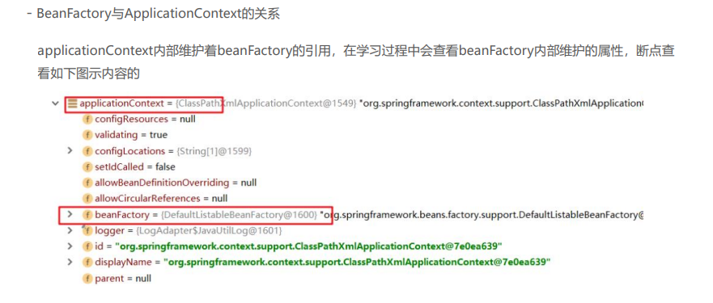

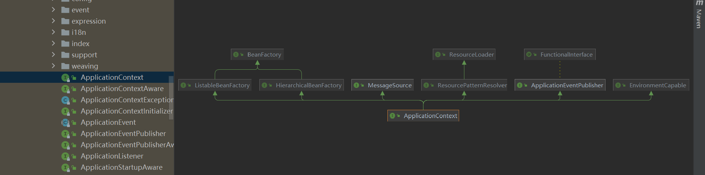

### ApplicationContext的继承体系
只在Spring基础环境下，即只导入spring-context坐标时，此时ApplicationContext的继承体系

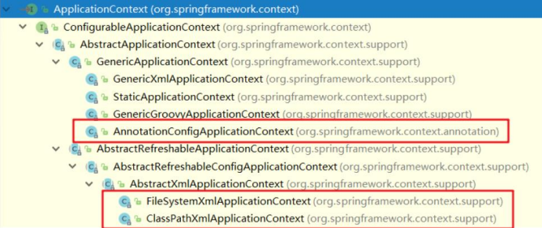

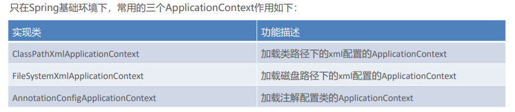

如果Spring基础环境中加入了其他组件解决方案，如web层解决方案，即导入spring-web坐标，此时
ApplicationContext的继承体系
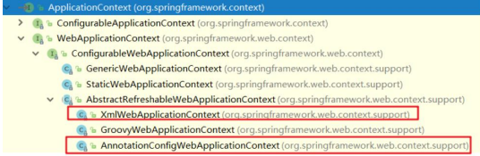

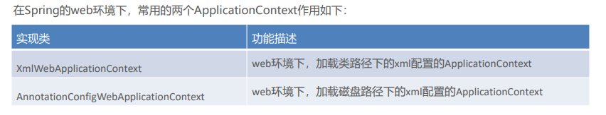

## 基于xml方式的Bean的配置

### springBean配置详解
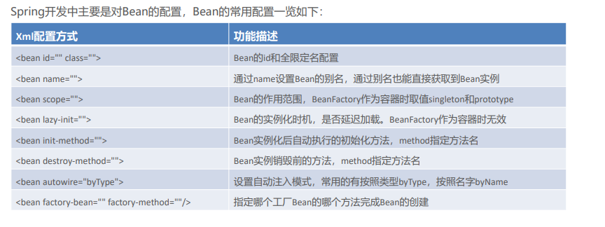

### 1）Bean的基础配置
~~~xml
<bean id="userDao" class="com.itheima.dao.impl.UserDaoImpl"/>
~~~
此时存储到Spring容器（singleObjects单例池）中的Bean的beanName是userDao，值是UserDaoImpl对象，可以根据beanName获取Bean实例
~~~java
applicationContext.getBean("userDao");
~~~
如果不配置id，则Spring会把当前Bean实例的全限定名作为beanName
~~~java
applicationContext.getBean("com.itheima.dao.impl.UserDaoImpl");
~~~
### 2）Bean的别名配置
~~~xml
<bean id="userDao" name="aaa,bbb" class="com.itheima.dao.impl.UserDaoImpl"/>
~~~
此时多个名称都可以获得UserDaoImpl实例对象

~~~java
applicationContext.getBean("userDao");
applicationContext.getBean("aaa");
applicationContext.getBean("bbb")
~~~
### 3）Bean的范围配置
默认情况下，单纯的Spring环境Bean的作用范围有两个：Singleton和Prototype
- singleton：单例，默认值，Spring容器创建的时候，就会进行Bean的实例化，并存储到容器内部的单例池中，每次getBean时都是从单例池中获取相同的Bean实例；
- prototype：原型，Spring容器初始化时不会创建Bean实例，当调用getBean时才会实例化Bean，每次
getBean都会创建一个新的Bean实例

当scope设置为singleton时，获得两次对象打印结果是一样的
~~~xml
<bean id="userDao" class="com.itheima.dao.impl.UserDaoImpl" scope="singleton"/>
~~~

~~~java
Object userDao = applicationContext.getBean("userDao");
Object userDao2 = applicationContext.getBean("userDao");
System.out.println(userDao); //com.itheima.dao.impl.UserDaoImpl@631330c
System.out.println(userDao2); //com.itheima.dao.impl.UserDaoImpl@631330c
~~~

当scope设置为prototype时，获得两次对象打印结果是不一样的

~~~xml
<bean id="userDao" class="com.itheima.dao.impl.UserDaoImpl" scope="prototype"/>
~~~
~~~java
Object userDao = applicationContext.getBean("userDao");
Object userDao2 = applicationContext.getBean("userDao");
System.out.println(userDao); //com.itheima.dao.impl.UserDaoImpl@4d50efb8
System.out.println(userDao2); //com.itheima.dao.impl.UserDaoImpl@7e2d773b
~~~

通过断点调试，观察可以发现单例池中不存在 userDao 实例，但是 userDao的信息已经被存储到
beanDefinitionMap中.

### 4）Bean的延迟加载
当lazy-init设置为true时为延迟加载，也就是当Spring容器创建的时候，不会立即创建Bean实例，等待用到时在创建Bean实例并存储到单例池中去，后续在使用该Bean直接从单例池获取即可，本质上该Bean还是单例的.
~~~xml
<bean id="userDao" class="com.itheima.dao.impl.UserDaoImpl" lazy-init="true"/>
~~~
### 5）Bean的初始化和销毁方法配置

Bean在被实例化后，可以执行指定的初始化方法完成一些初始化的操作，Bean在销毁之前也可以执行指定的销毁方法完成一些操作，初始化方法名称和销毁方法名称通.
~~~xml
<bean id="userDao" class="com.itheima.dao.impl.UserDaoImpl" init-method="init" 
destroy-method="destroy"/>
~~~

~~~java
public class UserDaoImpl implements UserDao {
    public UserDaoImpl() { System.out.println("UserDaoImpl创建了..."); }
    public void init(){ System.out.println("初始化方法..."); }
    public void destroy(){ System.out.println("销毁方法..."); 
}
}
~~~
扩展：除此之外，我们还可以通过实现 InitializingBean 接口，完成一些Bean的初始化操作，如下：
~~~java
public class UserDaoImpl implements UserDao, InitializingBean {
public UserDaoImpl() {System.out.println("UserDaoImpl创建了...");}
public void init(){System.out.println("初始化方法...");}
public void destroy(){System.out.println("销毁方法...");}
//执行时机早于init-method配置的方法
public void afterPropertiesSet() throws Exception {
System.out.println("InitializingBean..."); 
}
}
~~~
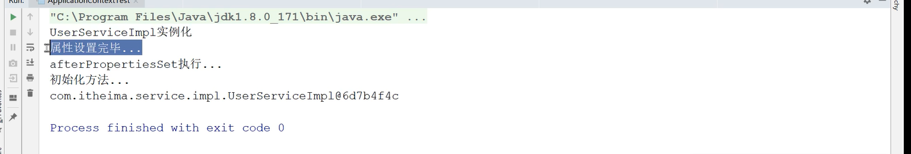

### 6）Bean的实例化配置
Spring的实例化方式主要如下两种：
- 构造方式实例化：底层通过构造方法对Bean进行实例化
- 工厂方式实例化：底层通过调用自定义的工厂方法对Bean进行实例

构造方式实例化Bean又分为无参构造方法实例化和有参构造方法实例化，Spring中配置的< bean >几乎都是无参构造该方式，此处不在赘述。下面讲解有参构造方法实例化Bean

~~~java
//有参构造方法
public UserDaoImpl(String name){
}
~~~
有参构造在实例化Bean时，需要参数的注入，通过< constructor-arg>标签，嵌入在< bean>标签内部提供构造参数，如下：

~~~xml
<bean id="userDao" class="com.itheima.dao.impl.UserDaoImpl">
<constructor-arg name="name" value="haohao"/>
</bean>
~~~

工厂方式实例化Bean，又分为如下三种：
- 静态工厂方法实例化Bean
- 实例工厂方法实例化Bean
- 实现FactoryBean规范延迟实例化Bean

静态工厂方法实例化Bean，其实就是定义一个工厂类，提供一个静态方法用于生产Bean实例，在将该工厂类及其静态方法配置给Spring即可

~~~java
//工厂类
public class UserDaoFactoryBean {
    //静态工厂方法
    public static UserDao getUserDao(String name){
    //可以在此编写一些其他逻辑代码
    return new UserDaoImpl();
    }
}
~~~

静态工厂方法实例化Bean，其实就是定义一个工厂类，提供一个静态方法用于生产Bean实例，在将该工厂类及其静态方法配置给Spring即可
~~~xml
<bean id="userDao" class="com.itheima.factory.UserDaoFactoryBean" factory-method="getUserDao">
<constructor-arg name="name" value="haohao"/>
</bean>
~~~

实例工厂方法，也就是非静态工厂方法产生Bean实例，与静态工厂方式比较，该方式需要先有工厂对象，在用工厂对象去调用非静态方法，所以在进行配置时，要先配置工厂Bean，在配置目标Bean
~~~java
对象去调用非静态方法，所以在进行配置时，要先配置工厂Bean，在配置目标Bean
//工厂类
public class UserDaoFactoryBean2 {
//非静态工厂方法
public UserDao getUserDao(String name){
//可以在此编写一些其他逻辑代码
return new UserDaoImpl();
}
}
~~~

实例工厂方法，也就是非静态工厂方法产生Bean实例，与静态工厂方式比较，该方式需要先有工厂对象，在用工厂对象去调用非静态方法，所以在进行配置时，要先配置工厂Bean，在配置目标Bean

~~~xml
<!-- 配置实例工厂Bean -->
<bean id="userDaoFactoryBean2" class="com.itheima.factory.UserDaoFactoryBean2"/>
<!-- 配置实例工厂Bean的哪个方法作为工厂方法 -->
<bean id="userDao" factory-bean="userDaoFactoryBean2" factory-method="getUserDao">
<constructor-arg name="name" value="haohao"/>
</bean>
~~~

上面不管是静态工厂方式还是非静态工厂方式，都是自定义的工厂方法，Spring提供了FactoryBean的接口规范，FactoryBean接口定义如下：
~~~java
public interface FactoryBean<T> {
    String OBJECT_TYPE_ATTRIBUTE = "factoryBeanObjectType";
    T getObject() throws Exception; //获得实例对象方法
    Class<?> getObjectType(); //获得实例对象类型方法
    default boolean isSingleton() {
    return true;
    }
}
~~~

定义工厂实现FactoryBean
~~~java
public class UserDaoFactoryBean3 implements FactoryBean<UserDao> {
    public UserDao getObject() throws Exception {
    return new UserDaoImpl();
    }
    public Class<?> getObjectType() {
    return UserDao.class;
    }
}
~~~

配置FactoryBean交由Spring管理即可
~~~xml
<bean id="userDao" class="com.itheima.factory.UserDaoFactoryBean3"/>
~~~

通过Spring容器根据beanName可以正常获得UserDaoImpl
~~~java
ApplicationContext applicationContext =
new ClassPathxmlApplicationContext("applicationContext.xml");
Object userDao = applicationContext.getBean("userDao");
System.out.println(userDao);
~~~

通过断点观察发现Spring容器创建时，FactoryBean被实例化了，并存储到了单例池singletonObjects中，但是getObject() 方法尚未被执行，UserDaoImpl也没被实例化，当首次用到UserDaoImpl时，才调用getObject() ，
此工厂方式产生的Bean实例不会存储到单例池singletonObjects中，会存储到 factoryBeanObjectCache 缓存池中，并且后期每次使用到userDao都从该缓存池中返回的是同一个userDao实例

### 7）Bean的依赖注入配置
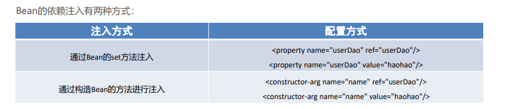

依赖注入的数据类型有如下三种：
- 普通数据类型，例如：String、int、boolean等，通过value属性指定。
- 引用数据类型，例如：UserDaoImpl、DataSource等，通过ref属性指定。
- 集合数据类型，例如：List、Map、Properties等注入 List< T > 集合 – 普通数据

~~~java
void setStrList(List<String> strList){
    strList.forEach(str->{
    System.out.println(str);
});
}
<property name="strList">
    <list>
    <value>haohao</value>
    <value>miaomiao</value>
    </list>
</property>

~~~
注入 List< T > 集合 – 引用数据
~~~java
public void setObjList(List<UserDao> objList){
    objList.forEach(obj->{
    System.out.println(obj);
});
}
~~~

~~~xml
<property name="objList">
    <list>
        <bean class="com.itheima.dao.impl.UserDaoImpl"></bean>
        <bean class="com.itheima.dao.impl.UserDaoImpl"></bean>
        <bean class="com.itheima.dao.impl.UserDaoImpl"></bean>
    </list>
</property>
~~~

也可以直接引用容器中存在的Bean
~~~xml
<!--配置UserDao-->
<bean id="userDao" class="com.itheima.dao.impl.UserDaoImpl"/>
<bean id="userDao2" class="com.itheima.dao.impl.UserDaoImpl"/>
<bean id="userDao3" class="com.itheima.dao.impl.UserDaoImpl"/>
<!--配置UserService-->
<bean id="userService" class="com.itheima.service.impl.UserServiceImpl">
<property name="objList">
    <list>
        <ref bean="userDao"></ref>
        <ref bean="userDao2"></ref>
        <ref bean="userDao3"></ref>
    </list>
</property>
</bean>
~~~

注入 Set< T > 集合
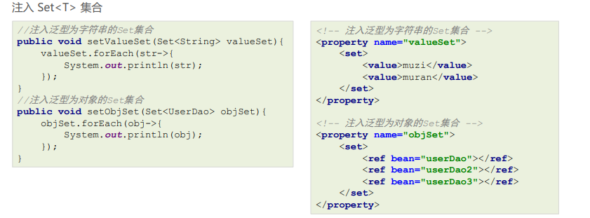

注入 Map< K,V > 集合
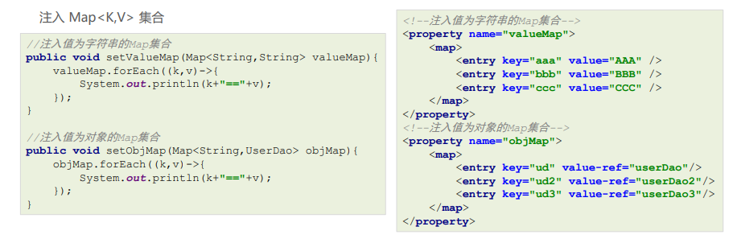

注入 Properties 键值对
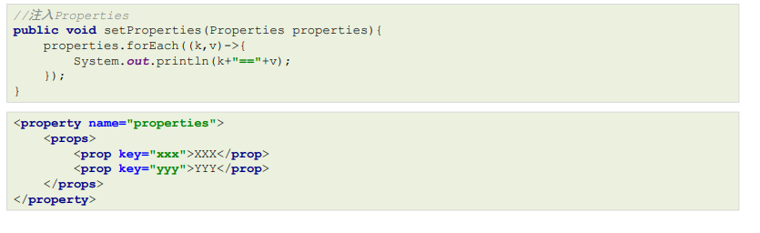

自动装配方式
如果被注入的属性类型是Bean引用的话，那么可以在< bean> 标签中使用 autowire 属性去配置自动注入方式，属
性值有两个：
- byName：通过属性名自动装配，即去匹配 setXxx 与 id="xxx"（name="xxx"）是否一致；
- byType：通过Bean的类型从容器中匹配，匹配出多个相同Bean类型时，报错。

~~~xml
<bean id="userService" class="com.itheima.service.impl.UserServiceImpl" 
autowire="byType">
~~~

###  8）Spring的其他配置标签
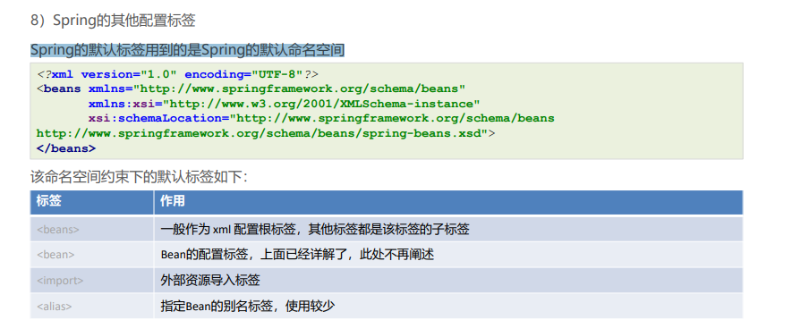

~~~xml
<beans>标签，除了经常用的做为根标签外，还可以嵌套在根标签内，使用profile属性切换开发环境
<!-- 配置测试环境下，需要加载的Bean实例 -->
<beans profile="test">
</beans>
<!-- 配置开发环境下，需要加载的Bean实例 -->
<beans profile="dev">
</beans>
~~~

可以使用以下两种方式指定被激活的环境：
- 使用命令行动态参数，虚拟机参数位置加载 -Dspring.profiles.active=test
- 使用代码的方式设置环境变量 System.setProperty("spring.profiles.active","test")

## Spring的get方法
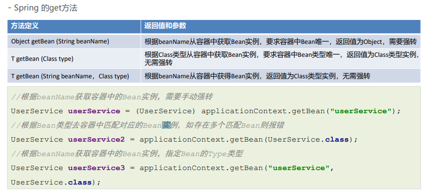
##  Spring 配置非自定义Bean

- Spring 配置非自定义Bean
以上在 xml 中配置的Bean都是自己定义的，例如：UserDaoImpl，UserServiceImpl。但是，在实际开发中有些
功能类并不是我们自己定义的，而是使用的第三方jar包中的，那么，这些Bean要想让Spring进行管理，也需要对
其进行配置
配置非自定义的Bean需要考虑如下两个问题：
- 被配置的Bean的实例化方式是什么？无参构造、有参构造、静态工厂方式还是实例工厂方式；
- 被配置的Bean是否需要注入必要属性
1）配置 Druid 数据源交由Spring管理
导入Druid坐标

~~~xml
<!-- mysql驱动 -->
<dependency>
    <groupId>mysql</groupId>
    <artifactId>mysql-connector-java</artifactId>
    <version>5.1.49</version>
</dependency>
<!-- druid数据源 -->
<dependency>
    <groupId>com.alibaba</groupId>
    <artifactId>druid</artifactId>
    <version>1.1.23</version>
</dependency>
~~~
配置 Druid 数据源交由Spring管理
配置 DruidDataSource

~~~xml
<!--配置 DruidDataSource数据源-->
<bean class="com.alibaba.druid.pool.DruidDataSource">
    <!--配置必要属性-->
    <property name="driverClassName" value="com.mysql.jdbc.Driver"/>
    <property name="url" value="jdbc://localhost:3306/mybatis"/>
    <property name="username" value="root"/>
    <property name="password" value="root"/>
</bean>
~~~

## Bean 实例化的基本流程
Spring容器在进行初始化时，会将xml配置的< bean >的信息封装成一个BeanDefinition对象，所有的
BeanDefinition存储到一个名为beanDefinitionMap的Map集合中去，Spring框架在对该Map进行遍历，使用反射创建Bean实例对象，创建好的Bean对象存储在一个名为singletonObjects的Map集合中，当调用getBean方法时则最终从该Map集合中取出Bean实例对象返回。

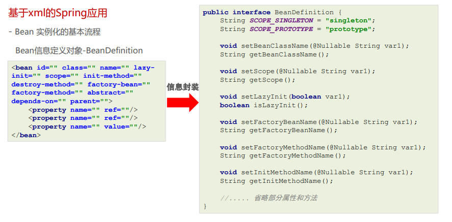

Bean 实例化的基本流程
DefaultListableBeanFactory对象内部维护着一个Map用于存储封装好的BeanDefinitionMap

~~~java
public class DefaultListableBeanFactory extends ... implements ... {
    //存储<bean>标签对应的BeanDefinition对象
    //key:是Bean的beanName，value:是Bean定义对象BeanDefinition
    private final Map<String, BeanDefinition> beanDefinitionMap;
}
~~~
Spring框架会取出beanDefinitionMap中的每个BeanDefinition信息，反射构造方法或调用指定的工厂方法生成Bean实例对象，所以只要将BeanDefinition注册到beanDefinitionMap这个Map中，Spring就会进行对应的Bean的实例化操作

Bean实例及单例池singletonObjects， beanDefinitionMap中的BeanDefinition会被转化成对应的Bean实例对象，存储到单例池singletonObjects中去，在DefaultListableBeanFactory的上四级父类
DefaultSingletonBeanRegistry中，维护着singletonObjects，源码如下

~~~java
public class DefaultSingletonBeanRegistry extends ... implements ... {
    //存储Bean实例的单例池
    ////key:是Bean的beanName，value:是Bean的实例对象
    private final Map<String, Object> singletonObjects = new ConcurrentHashMap(256);
}
~~~
~~~json
Bean 实例化的基本流程
- 加载xml配置文件，解析获取配置中的每个<bean>的信息，封装成一个个的BeanDefinition对象;
 将BeanDefinition存储在一个名为beanDefinitionMap的Map<String,BeanDefinition>中;
- ApplicationContext底层遍历beanDefinitionMap，创建Bean实例对象;
- 创建好的Bean实例对象，被存储到一个名为singletonObjects的Map<String,Object>中;
- 当执行applicationContext.getBean(beanName)时，从singletonObjects去匹配Bean实例返回。
~~~
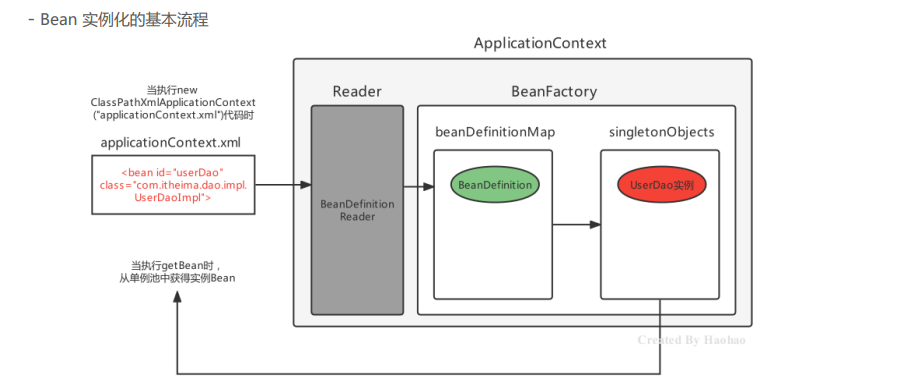

## spring的后处理器
Spring的后处理器是Spring对外开发的重要扩展点，允许我们介入到Bean的整个实例化流程中来，以达到动态注册
BeanDefinition，动态修改BeanDefinition，以及动态修改Bean的作用。Spring主要有两种后处理器：
- BeanFactoryPostProcessor：Bean工厂后处理器，在BeanDefinitionMap填充完毕，Bean实例化之前执行；
- BeanPostProcessor：Bean后处理器，一般在Bean实例化之后，填充到单例池singletonObjects之前执行。

Bean工厂后处理器 – BeanFactoryPostProcessor
BeanFactoryPostProcessor是一个接口规范，实现了该接口的类只要交由Spring容器管理的话，那么Spring就会回调该接口的方法，用于对BeanDefinition注册和修改的功能。

### BeanFactoryPostProcessor
~~~java
public interface BeanFactoryPostProcessor {
    void postProcessBeanFactor(ConfigurableListableBeanFactory beanFactory);
}

public class MyBeanFactoryPostProcessor implements BeanFactoryPostProcessor {
    @Override
    public void postProcessBeanFactory(ConfigurableListableBeanFactory beanFactory) 
    throws BeansException{
        "MyBeanFactoryPostProcessor执行了...");
    }
}
~~~

postProcessBeanFactory 参数本质就是 DefaultListableBeanFactory，拿到BeanFactory的引用，自然就可以对beanDefinitionMap中的BeanDefinition进行操作了 ，例如对UserDaoImpl的BeanDefinition进行修改操作

~~~java
    public class MyBeanFactoryPostProcessor implements BeanFactoryPostProcessor {
        public void postProcessBeanFactory(ConfigurableListableBeanFactory beanFactory)
                throws BeansException {
            BeanDefinition userDaoBD = beanFactory.getBeanDefinition(“userDao”);//获得UserDao定义对象
            userDaoBD.setBeanClassName("com.itheima.dao.impl.UserDaoImpl2"); //修改class
            //userDaoBD.setInitMethodName(methodName); //修改初始化方法
            //userDaoBD.setLazyInit(true); //修改是否懒加载
            //... 省略其他的设置方式 ...
        }
    }
~~~

上面已经对指定的BeanDefinition进行了修改操作，下面对BeanDefiition进行注册操作
~~~java
public class MyBeanFactoryPostProcessor implements BeanFactoryPostProcessor {
        @Override
        public void postProcessBeanFactory(ConfigurableListableBeanFactory configurableListableBeanFactory)
                throws BeansException {
            //强转成子类DefaultListableBeanFactory
            if (configurableListableBeanFactory instanceof DefaultListableBeanFactory) {
                DefaultListableBeanFactory beanFactory = (DefaultListableBeanFactory)
                        configurableListableBeanFactory;
                BeanDefinition beanDefinition = new RootBeanDefinition();
                beanDefinition.setBeanClassName("com.itheima.dao.UserDaoImpl2");
                //进行注册操作
                beanFactory.registerBeanDefinition("userDao2", beanDefinition);
            }
        }
    }
~~~    

Spring 提供了一个BeanFactoryPostProcessor的子接口BeanDefinitionRegistryPostProcessor专门用于注册BeanDefinition操作

~~~java
public class MyBeanFactoryPostProcessor2 implements BeanDefinitionRegistryPostProcessor {
        @Override
        public void postProcessBeanFactory(ConfigurableListableBeanFactory
                                                   configurableListableBeanFactory) throws BeansException {
        }

        @Override
        public void postProcessBeanDefinitionRegistry(BeanDefinitionRegistry beanDefinitionRegistry)
                throws BeansException {
            BeanDefinition beanDefinition = new RootBeanDefinition();
            beanDefinition.setBeanClassName("com.itheima.dao.UserDaoImpl2");
            beanDefinitionRegistry.registerBeanDefinition("userDao2", beanDefinition);
        }
    }
~~~

### BeanPostProcessor
Bean被实例化后，到最终缓存到名为singletonObjects单例池之前，中间会经过Bean的初始化过程，例如：属性的填充、初始方法init的执行等，其中有一个对外进行扩展的点BeanPostProcessor，我们称为Bean后处理。跟上面的Bean工厂后处理器相似，它也是一个接口，实现了该接口并被容器管理的BeanPostProcessor，会在流程节点上被Spring自动调用
~~~java
    public interface BeanPostProcessor {
        @Nullable
        //在属性注入完毕，init初始化方法执行之前被回调
        default Object postProcessBeforeInitialization(Object bean, String beanName) throws
                BeansException {
            return bean;
        }

        @Nullable
        //在初始化方法执行之后，被添加到单例池singletonObjects之前被回调
        default Object postProcessAfterInitialization(Object bean, String beanName) throws
                BeansException {
            return bean;
        }
    }
~~~
~~~java
    public class MyBeanPostProcessor implements BeanPostProcessor {
        /* 参数： bean是当前被实例化的Bean，beanName是当前Bean实例在容器中的名称
        返回值：当前Bean实例对象 */
        public Object postProcessBeforeInitialization(Object bean, String beanName) throws BeansException {
            System.out.println("BeanPostProcessor的before方法...");
            return bean;
        }

        /* 参数： bean是当前被实例化的Bean，beanName是当前Bean实例在容器中的名称
        返回值：当前Bean实例对象 */
        public Object postProcessAfterInitialization(Object bean, String beanName) throws BeansException {
            System.out.println("BeanPostProcessor的after方法...");
            return bean;
        }
    }
~~~
对Bean方法进行执行时间日志增强
要求如下：
- Bean的方法执行之前控制台打印当前时间；
- Bean的方法执行之后控制台打印当前时间。

~~~java
public Object postProcessAfterInitialization(Object bean, String beanName) throws BeansException {
        //对Bean进行动态代理，返回的是Proxy代理对象
        Object proxyBean = Proxy.newProxyInstance(bean.getClass().getClassLoader(),
                bean.getClass().getInterfaces(),
                (Object proxy, Method method, Object[] args) -> {
                    long start = System.currentTimeMillis();
                    System.out.println("开始时间：" + new Date(start));
                    //执行目标方法
                    Object result = method.invoke(bean, args);
                    long end = System.currentTimeMillis();
                    System.out.println("结束时间：" + new Date(end));
                    return result;
                });
        //返回代理对象
        return proxyBean;
    }
~~~
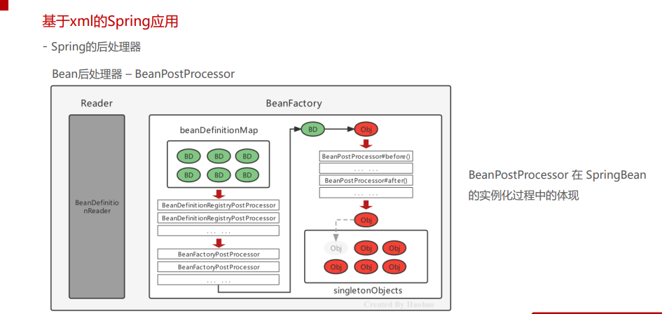

## Spring Bean的生命周期
### 概览
Spring Bean的生命周期是从 Bean 实例化之后，即通过反射创建出对象之后，到Bean成为一个完整对象，最终存储
到单例池中，这个过程被称为Spring Bean的生命周期。Spring Bean的生命周期大体上分为三个阶段：
- Bean的实例化阶段：Spring框架会取出BeanDefinition的信息进行判断当前Bean的范围是否是singleton的，是否不是延迟加载的，是否不是FactoryBean等，最终将一个普通的singleton的Bean通过反射进行实例化；
- Bean的初始化阶段：Bean创建之后还仅仅是个"半成品"，还需要对Bean实例的属性进行填充、执行一些Aware接口方法、执行BeanPostProcessor方法、执行InitializingBean接口的初始化方法、执行自定义初始化init方法等。该阶段是Spring最具技术含量和复杂度的阶段，Aop增强功能，后面要学习的Spring的注解功能等、
spring高频面试题Bean的循环引用问题都是在这个阶段体现的；
- Bean的完成阶段：经过初始化阶段，Bean就成为了一个完整的Spring Bean，被存储到单例池singletonObjects中去了，即完成了Spring Bean的整个生命周期.

### 初始化
由于Bean的初始化阶段的步骤比较复杂，所以着重研究Bean的初始化阶段
Spring Bean的初始化过程涉及如下几个过程：
- Bean实例的属性填充
- Aware接口属性注入
- BeanPostProcessor的before()方法回调
- InitializingBean接口的初始化方法afterPropertiesSet回调
- 自定义初始化方法init回调
- BeanPostProcessor的after()方法回调

### Bean实例属性填充
Bean实例属性填充
BeanDefinition 中有对当前Bean实体的注入信息通过属性propertyValues进行了存储

Spring在进行属性注入时，会分为如下几种情况：
- 注入普通属性，String、int或存储基本类型的集合时，直接通过set方法的反射设置进去；
- 注入单向对象引用属性时，从容器中getBean获取后通过set方法反射设置进去，如果容器中没有，则先创建被
注入对象Bean实例（完成整个生命周期）后，在进行注入操作；
- 注入双向对象引用属性时，就比较复杂了，涉及了循环引用（循环依赖）问题，下面会详细阐述解决方案。
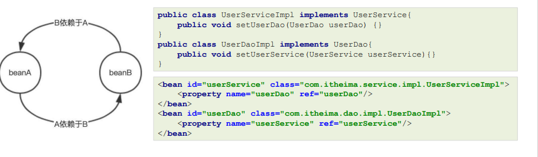

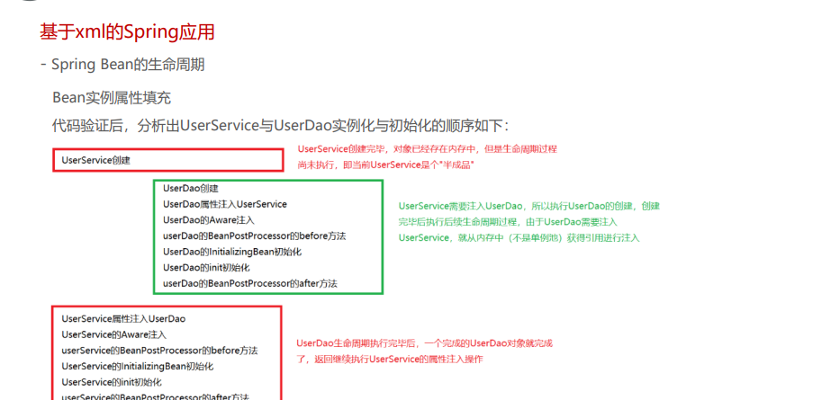
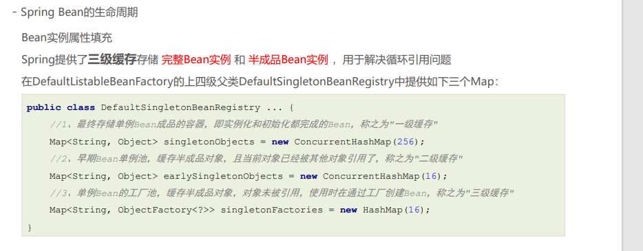

- Spring Bean的生命周期
Bean实例属性填充
UserService和UserDao循环依赖的过程结合上述三级缓存描述一下
- UserService 实例化对象，但尚未初始化，将UserService存储到三级缓存；
- UserService 属性注入，需要UserDao，从缓存中获取，没有UserDao；
- UserDao实例化对象，但尚未初始化，将UserDao存储到到三级缓存；
- UserDao属性注入，需要UserService，从三级缓存获取UserService，UserService从三级缓存移入二级缓存；
- UserDao执行其他生命周期过程，最终成为一个完成Bean，存储到一级缓存，删除二三级缓存；
- UserService 注入UserDao；
- UserService执行其他生命周期过程，最终成为一个完成Bean，存储到一级缓存，删除二三级缓存
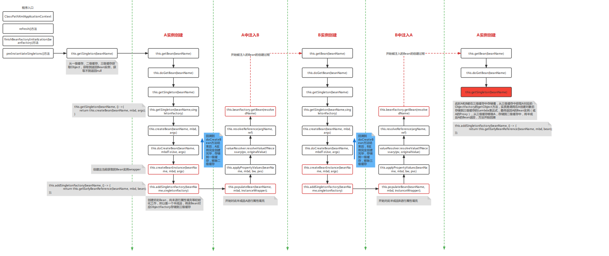

[label](../../.vuepress/public/background/spring/%E4%B8%89%E7%BA%A7%E7%BC%93%E5%AD%98%E6%BA%90%E7%A0%81%E5%89%96%E6%9E%90%E6%B5%81%E7%A8%8B.pdf)

### 常用的Aware接口
Aware接口是一种框架辅助属性注入的一种思想，其他框架中也可以看到类似的接口。框架具备高度封装性，我们接触到的一般都是业务代码，一个底层功能API不能轻易的获取到，但是这不意味着永远用不到这些对象，如果用到了，就可以使用框架提供的类似Aware的接口，让框架给我们注入该对象。
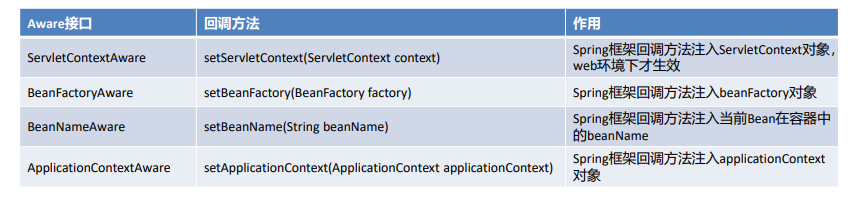

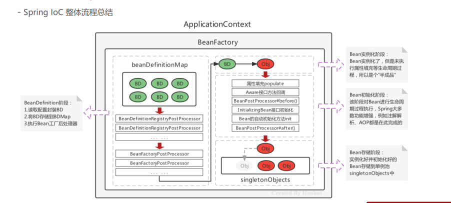

## AOP 
动态代理技术，在运行期间，对目标对象的方法进行增强，代理对象同名方法内可以执行原有逻辑的同时嵌入执行其他增强逻辑或其他对象的方法。

~~~java

//自定义增强类
public class MyAdvice {
    public void beforeAdvice(){
    System.out.println("beforeAdvice ...");
    }
    public void afterAdvice(){
    System.out.println("afterAdvice ...");
    }
}

public class MockAopBeanPostProcessor implements BeanPostProcessor, ApplicationContextAware {
    private ApplicationContext applicationContext;//注入Spring容器对象

    public Object postProcessAfterInitialization(Object bean, String beanName) throws BeansException {
        MyAdvice myAdvice = applicationContext.getBean(MyAdvice.class);//获得Advice对象
        String packageName = bean.getClass().getPackage().getName();
        if ("com.itheima.service.impl".equals(packageName)) {
            //对Bean进行动态代理，返回的是Proxy代理对象
            Object proxyBean = Proxy.newProxyInstance(
                    bean.getClass().getClassLoader(),
                    bean.getClass().getInterfaces(),
                    (Object proxy, Method method, Object[] args) -> {
                        myAdvice.beforeAdvice();//执行Advice的before方法
                        Object result = method.invoke(bean, args);//执行目标
                        myAdvice.afterAdvice();//执行Advice的after方法
                        return result;
                    });
            //返回代理对象
            return proxyBean;
        }
        return bean;
    }

    public void setApplicationContext(ApplicationContext applicationContext) throws BeansException {
        this.applicationContext = applicationContext;
    }
~~~

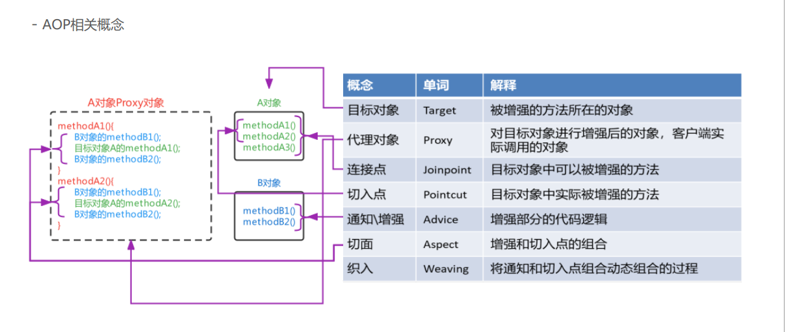

## 基于xml配置的AOP

1、导入AOP相关坐标；
2、准备目标类、准备增强类，并配置给Spring管理；
3、配置切点表达式（哪些方法被增强）；
4、配置织入（切点被哪些通知方法增强，是前置增强还是后置增强）。

1、导入AOP相关坐标
Spring-context坐标下已经包含spring-aop的包了，所以就不用额外导入了
~~~xml
<dependency>
    <groupId>org.aspectj</groupId>
    <artifactId>aspectjweaver</artifactId>
    <version>1.9.6</version>
</dependency>
~~~

2、准备目标类、准备增强类，并配置给Spring管理

~~~java
public interface UserService {
    void show1();
    void show2();
}
public class UserServiceImpl implements UserService {
    public void show1() {
    System.out.println("show1...");
    }
    public void show2() {
    System.out.println("show2...");
    }
}

public class MyAdvice {
    public void beforeAdvice(){
    System.out.println("beforeAdvice");
    }
    public void afterAdvice(){
    System.out.println("afterAdvice");
    }
}
~~~

~~~xml
<!--配置目标类,内部的方法是连接点-->
<bean id="userService" class="com.itheima.service.impl.UserServiceImpl"/>
<!--配置通知类,内部的方法是增强方法-->
<bean id=“myAdvice" class="com.itheima.advice.MyAdvice"/>
~~~
3、配置切点表达式（哪些方法被增强）
4、配置织入（切点被哪些通知方法增强，是前置增强还是后置增强）
~~~xml
<aop:config>
    <!--配置切点表达式,对哪些方法进行增强-->
    <aop:pointcut id="myPointcut" expression="execution(void 
    com.itheima.service.impl.UserServiceImpl.show1())"/>
    <!--切面=切点+通知-->
    <aop:aspect ref="myAdvice">
    <!--指定前置通知方法是beforeAdvice-->
    <aop:before method="beforeAdvice" pointcut-ref="myPointcut"/>
    <!--指定后置通知方法是afterAdvice-->
    <aop:after-returning method="afterAdvice" pointcut-ref="myPointcut"/>
    </aop:aspect>
</aop:config>
~~~

切点表达式举几个例子方便理解
~~~xml
//表示访问修饰符为public、无返回值、在com.itheima.aop包下的TargetImpl类的无参方法show
execution(public void com.itheima.aop.TargetImpl.show())
//表述com.itheima.aop包下的TargetImpl类的任意方法
execution(* com.itheima.aop.TargetImpl.*(..))
//表示com.itheima.aop包下的任意类的任意方法
execution(* com.itheima.aop.*.*(..))
//表示com.itheima.aop包及其子包下的任意类的任意方法
execution(* com.itheima.aop..*.*(..))
//表示任意包中的任意类的任意方法
execution(* *..*.*(..)
~~~

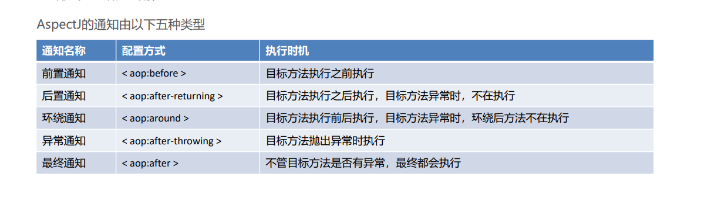

~~~java
public void around(ProceedingJoinPoint joinPoint) throws Throwable {
    //环绕前
    System.out.println("环绕前通知");
    //目标方法
    joinPoint.proceed();
    ///环绕后
    System.out.println("环绕后通知");
}
<aop:around method="around" pointcut-ref="myPointcut">
~~~
通知方法在被调用时，Spring可以为其传递一些必要的参数
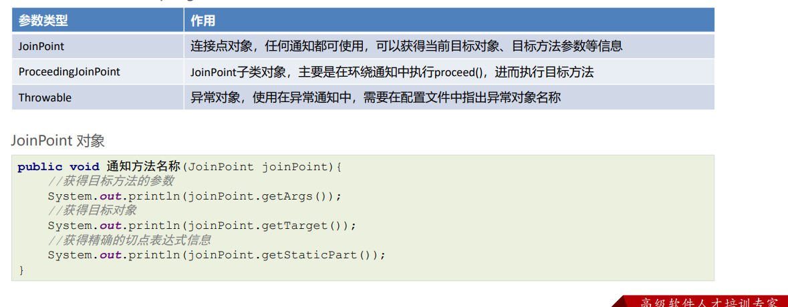

~~~ProceedingJoinPoint对象
public Object around(ProceedingJoinPoint joinPoint) throws Throwable {
    System.out.println(joinPoint.getArgs());//获得目标方法的参数
    System.out.println(joinPoint.getTarget());//获得目标对象
    System.out.println(joinPoint.getStaticPart());//获得精确的切点表达式信息
    Object result = joinPoint.proceed();//执行目标方法
    return result;//返回目标方法返回值
}
~~~

Throwable对象
~~~java
public void afterThrowing(JoinPoint joinPoint,Throwable th){
    //获得异常信息
    System.out.println("异常对象是："+th+"异常信息是："+th.getMessage());
}

<aop:after-throwing method="afterThrowing" pointcut-ref="myPointcut" throwing="th"/>
~~~

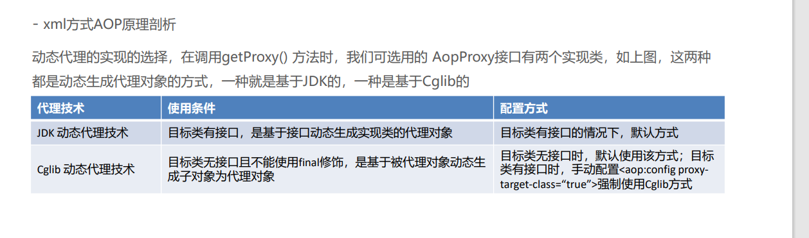